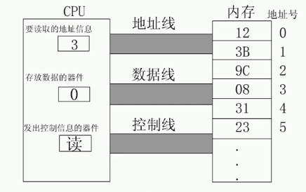
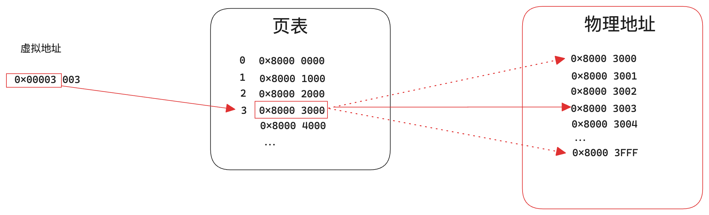
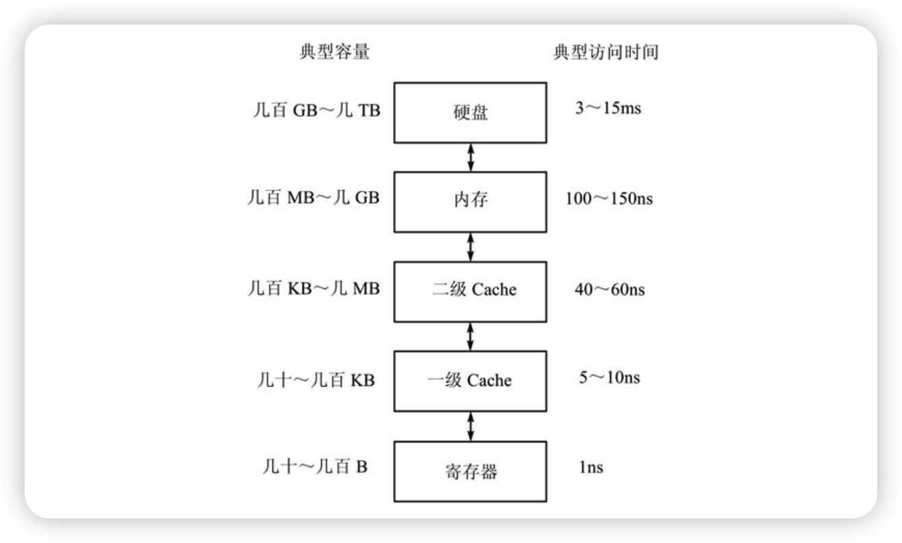

# 计算机体系结构组成

## 冯诺依曼体系结构

**Von Neumann体系结构**又称为**冯·诺依曼体系结构**，是由匈牙利裔美国数学家兼计算机科学家约翰·冯·诺伊曼（John von Neumann）所提出的一种计算机设计模型，是如今现代计算机采用的组织模型，无论是嵌入式系统、PC还是服务器都是采用该结构。

冯诺依曼结构的主要部件:

- 运算器
- 控制器
- 存储器
- 输入设备
- 输出设备

更多的详细信息可以自行查阅更多资料。

## 计算机的组成结构

上面介绍了现代计算机的体系结构模型，下面我们来详细了解一下一台现代计算机的详细构成。

### CPU(处理器)

**CPU(Central Processing Unit)**中央处理器，或简称为处理器，是计算机的核心大脑，负责**执行指令**以及各种**运算**。

### RAM(存储器)

RAM全称**Ranadom Access Memory(随机访问存储器)**也叫**主存**或**内存**，它可以随时读写（刷新时除外），而且速度很快，通常作为操作系统或其他正在运行中的程序的临时数据存储介质;

这里的随机指的是，CPU可以任意访问RAM中的任何数据，无需按照顺序访问，具体是根据地址(address)来访问。缺点是一旦断电后，所有的数据会全部丢失。

它也是计算机程序与硬盘等外部存储设备之间沟通的桥梁，计算机程序中所有的运行都是在内存中完成的。

### 存储设备

例如硬盘驱动器（HDD）、固态硬盘（SSD）、闪存驱动器等，用于永久存储数据和程序。

### 输入设备

例如鼠标、键盘、触摸板等设备，用于向计算机输入指令和数据。

### 输出设备

例如显示器、扬声器、打印机等设备，用于从计算机中获取输出内容。

### 显卡

显卡(图形处理器)，主要负责将计算机输出的信息输出到显示器上，负责图像、图形和视频的生成和显式。显卡可以加速图形的渲染和处理，使计算机能够更快处理复杂图形。高性能的显卡能够提供更高的分辨率和更流畅的显示效果。

### 主板

主板用于将计算机的所有硬件连接到一起，像上面提到的这些设备都是需要安装在主板上面的，以及对这些硬件进行供电。

## CPU组成详解

**CPU(Central Processing Unit)**中央处理器，或简称为处理器，是计算机的核心大脑，负责**执行指令**以及各种**运算**。CPU总是周而复始地做同一件事: 从内存中取指令，然后解释执行，再执行它，然后继续取下一条执行，再解释再执行...

为什么说CPU是计算机的大脑呢？因为CPU中包含了**冯·诺依曼体系结构**中提出的**运算器**、**控制器**等核心单元，不仅如此，CPU中还添加了许多后续提出的功能单元。

CPU的核心功能单元包含如下几部分:

- **控制器**

  控制器又称为**控制单元(Control Unit)**，负责控制指令的执行顺序。协调运算器与寄存器完成程序的指令执行的整个过程，从而扮演指挥者的角色，确保以正确的顺序执行;

  控制器的工作流程为：从内存中取指令、翻译指令、分析指令，然后根据指令的内存向有关部件发送控制命令，控制相关部件执行指令所包含的操作。

- **运算器**

  运算器的主要部件就是**算术逻辑单元(ALU)**，主要功能就是在控制信号的作用下，完成加、减、乘、除等算术运算以及与、或、非、异或等逻辑运算以及移位、补位等运算。

- **寄存器**

  寄存器是CPU内部的**高速存储器**，像内存一样可以存取数据，但比访问内存快得多。寄存器的数量有很多，不同的寄存器用于存储不同的数据。

  随后的几章我们会详细介绍x86的寄存器eax、esp、eip等，有些寄存器只能用于某种特定的用途，比如eip用作程序计数器，这称为特殊寄存器（Special-purpose Register），而另外一些寄存器可以用在各种运算和读写内存的指令中，比如eax寄存器，这称为通用寄存器（General-purpose Register）。

- **程序计数器**

  程序计数器(PC)是一种特殊寄存器，保存着CPU取下一条指令的地址，CPU按程序计数器保存的地址去内存中取指令然后解释执行，这时程序计数器保存的地址会自动加上该指令的长度，指向内存中的下一条指令。

- **指令译码器**

  CPU取上来的指令由若干个字节组成，这些字节中有些位表示内存地址，有些位表示寄存器编号，有些位表示这种指令做什么操作，是加减乘除还是读写内存，指令译码器负责解释这条指令的含义。

- **总线**

  **总线(Bus)**其实就是一些物理电路，是计算机中的各种硬件之间传输信息的通信桥梁，它是由导线组成的传输线束，并且只能用于二进制传。

  数据总线越多，那么传输的功效就越大，通常我们说的32位系统和64位系统，指的就是数据总线和地址总线的数量。

  并且按照计算机所传输的信息种类，总线共可以划分为三个种类:

  - **控制总线**

    控制总线用于传输各种控制信号，例如读信号、写信号和中断信号等。信号可以发出也可以接收，所以是双向传输的。

    控制总线的数量和位数没有关系，它们的数量取决于 CPU 的设计、架构和所需的控制信号。

  - **数据总线**

    数据总线用于传输数据，例如将数据从存储器中读取到寄存器，或者将数据从寄存器写回到存储器，都是通过数据总线来传输，因此也是双向传输;

    数据总线的宽度决定了一次最多可以传输的数据量: 例如32位系统有32个总线，所以可以一次性传输32bit(4字节)的数据，又称为字长(Word)。

  - **地址总线**

    地址总线用于传输内存地址信息，而且通常是单向传输，只有CPU能向存储器或者IO设备发送。例如CPU读取内存的数据之前，要先将数据的地址从地址总线发送到存储器。

    地址总线的宽度决定了CPU的寻址能力，也就是内存地址的范围大小: 例如32位总线可以寻址的内存地址为 2^32 (约4GB)。

  最后还要说明一点，本节所说的地址线、数据线是指CPU的内总线，是直接和CPU的执行单元相连的，内总线经过MMU和总线接口的转换之后引出到芯片引脚才是外总线，外地址线和外数据线的位数都有可能和内总线不同，例如32位处理器的外地址总线可寻址的空间可以大于4GB。

下面以一次CPU读取内存数据的流程为例，简述总线之间的工作原理:

1. CPU通过**地址总线**将要读取数据的内存地址发送给存储器;
2. CPU通过**控制总线**对存储器发出读取信号,通知其要进行读操作;
3. 存储器接收到CPU通过**地址总线**发送的数据内存地址，根据该地址信息找到对应的存储单元，并准备将数据通过**数据总线**发送到CPU;
4. 存储器接收到CPU通过**控制总线**发来的读取信号，存储器开始将数据通过**数据总线**传输给CPU;




## 虚拟内存管理

我们先来看一个简单的例子:

```c
// hello.c

#include <stdio.h>
#include <unistd.h>

int age = 2;
int main(void) {
    printf("address: %p, value: %d \n",&age,age);
  	sleep(9999);
    return 0;
}
```

然后进行编译，同时运行两个该程序:

```bash
$ gcc hello.c -o hello

执行第一个程序
$ ./hello
address: 0x60103c, value: 2


在执行第二个程序
$ ./hello
address: 0x60103c, value: 2 
```

你会发现这两个进程中的`age`全局变量内存地址是完全相同的，这是为什么呢？难道这两个变量共享同一个地址？那当然是不可能的!

### MMU

现代操作系统普遍采用**虚拟内存管理(Virtual Memory Management)**机制，这需要CPU中的**内存管理单元(Memory Management Unit)**提供支持。

首先引入两个概念: **虚拟地址**和**物理地址**。

- 如果如果处理器没有MMU，或者有MMU但没有启用，CPU执行单元发出的内存地址将直接传到芯片引脚上，被内存芯片(以下称为物理内存)接收，这称为物理地址(Physical Address，PA);
- 如果处理器启用了MMU，CPU执行单元发出的内存地址将被MMU截获，从CPU到MMU的地址称为虚拟地址（Virtual Address，VA），而MMU将这个地址翻译成另一个地址发到CPU芯片的外部地址引脚上，也就是将VA映射成PA;

简单点来说，在应用程序中所看到的内存地址都是**虚拟地址(VA)**，当我们访问该地址时，CPU会通过MMU无感知地转换成真正的**物理地址(PA)**，也就是存放数据的真正内存地址;

### 页和页表

虚拟地址到物理地址之间的转换过程，MMU是通过**页表(Page Table)**来实现的，所谓页表也就是虚拟地址和物理地址之间的关系映射表。每个进程都有自己的**页表**，记录着当前进程的虚拟空间与物理空间之间的关系映射。

页表中的每一个元素称之为**页(Page)**，一页表示的是一段连续物理内存地址。通常在32位处理器上一页表示为**4KB**的连续地址空间。

如下图所示:



虚拟地址的高20位表示该虚拟地址在页表中的位置,低12位表示物理内存的真正字节位;

上图中的转换流程:

1. 虚拟地址的高20位为`0x00003`，表示当前虚拟地址的**页**在**页表**中的索引位。也就是要映射到的物理地址的起始位置，所以找到了该虚拟地址对应**页**的起始位置`0x8000_3000`;
2. 虚拟地址的高12位为`003`，表示当前虚拟地址在**页**中的偏移量。(页的起始位置 + 该偏移量 = 物理地址)，所以找到了具体的物理地址`0x8000_3003`;

操作系统和MMU是这样配合的:

- 操作系统在初始化或分配、释放内存时会执行一些指令在物理内存中填写页表，然后用指令设置MMU，告诉MMU页表在物理内存中的什么位置。
- 设置好之后，CPU每次执行访问内存的指令都会自动引发MMU做查表和地址转换操作，地址转换操作由硬件自动完成，不需要用指令控制MMU去做。

通常操作系统把虚拟地址空间划分为用户空间和内核空间，例如x86平台的Linux系统虚拟地址空间是0x00000000～0xffffffff，前3GB（0x00000000～0xbfffffff）是用户空间，后1GB（0xc0000000～0xffffffff）是内核空间。用户程序加载到用户空间，在用户模式下执行，不能访问内核中的数据，也不能跳转到内核代码中执行。这样可以保护内核，如果一个进程访问了非法地址，顶多这一个进程崩溃，而不会影响到内核和整个系统的稳定性。

### 虚拟地址空间构成

TODO


### 补充(进程)

既然在这里提到了虚拟内存，那我们就来补充一下关于**进程**和**线程**的区别:

首先，进程其实本质上就是一个线程或多个线程的组成，可以认为线程就是进程的基本组成单元。那为什么又有进程和线程之分呢？其实最大的原因就在于我们刚刚提到的MMU。

MMU虚拟内存管理本质上就是`将一或多个线程进行隔离，使其成为不同的线程组，实现内存的隔离，所以又称为进程`。


## 缓存(Cache)

硬盘、内存、CPU寄存器，还有本节要讲的Cache，这些都是存储器，计算机为什么要有这么多种存储器呢？这些存储器各自有什么特点？这是本节要讨论的问题。

由于硬件技术的限制，我们可以制造出容量很小但很快的存储器，也可以制造出容量很大但很慢的存储器，但鱼和熊掌不能兼得，不可能制造出访问速度又快容量又大的存储器。因此，现代计算机都把存储器分成若干级，称为Memory Hierarchy。

这些存储器可以按照离 CPU 由近到远(由快到慢)的顺序排列:

**CPU寄存器** --> **一级Cache** --> **二级Cache** --> **内存** --> **硬盘**

如下图所示:



也就是说离CPU越近的存储器容量越小，但是处理速度越快。下面是不同存储器的详细介绍:

### 寄存器

寄存器(Register)位于CPU的执行单元。

CPU的寄存器通常只有几个到几十个，每个寄存器的容量取决于CPU的字长(Word)，所以一共只有几十到几百字节的容量。

寄存器”就是一和数字电路的名字，它由一组触发器(Flip-flop)组成，每个触发器保存一位的数据，可以做存取和移位等操作。计算机掉电时寄存器中保存的数据会丢失。

寄存器是访问速度最快的存储器，典型的访问时间是几纳秒。

使用哪个寄存器和如何使用寄存器，都是由机器指令所决定。

### 缓存

缓存(Cache)和MMU一样，位于CPU核中。缓存通常分为多级缓存，例如常见的三级缓存架构分为: **一级缓存(L1)**、**二级缓存(L2)**和**三级缓存(L3)**。级别越小的缓存，越靠近CPU执行单元，意味着速度越快且缓存容量越小。

**Cache Line**可以简单理解为CPU Cache中的最小存储单位。目前主流的CPU Cache的Cache Line大小都是32 ~ 256字节;

- **L1 一级缓存**

  L1缓存是最接近CPU执行单元的，它容量最小，速度最快。每个CPU核中都有两个L1缓存: 分别为**数据缓存(L1d)**和**指令缓存(L1i)**。

  L1是CPU的每个物理核独享的。

- **L2 二级缓存**

  L2缓存位于L1缓存和主内存之间，它的容量更大一些，例如256K，速度要慢一些。

  L2缓存就是L1缓存的缓冲器：一级缓存制造成本很高因此它的容量有限，二级缓存的作用就是存储那些CPU处理时需要用到、一级缓存又无法存储的数据。

  L2是物理核独占，逻辑核共享。

- **L3 三级缓存**

  L3缓存位于L2缓存和主内存之间,它是缓存容量最大的一块，例如12MB，同时也是最慢的一级。它是CPU的所有核共享的一级，L3缓存和内存可以看作是L2缓存的缓冲器，它们的容量递增，但单位制造成本却递减。

这些缓存层级的设计旨在利用更快的存储设备来存储最常用的数据和指令，以减少CPU访问主内存的次数，从而加快计算机的运行速度。

Cache 和内存都是由RAM (Randomxcess Memory)组成的，可以根据地址随机访问，计算机掉电时 RAM 中保存的数据会丢失。不同的是，Cache通常由 SRAM(Static RAM,静态 RAM)组成，而内存通常由DRAM (DynamicRAM,动态 RAM)组成。DRAM 电路比 SRAM 简单，存储容量可以做得更大，但DRAM 的访问速度比SRAM慢。

