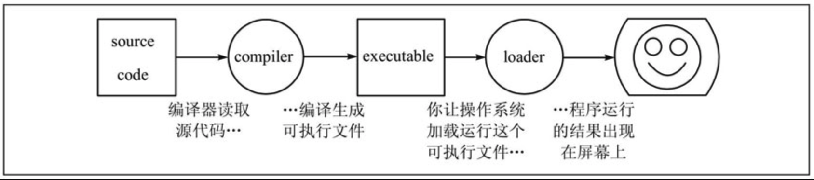

# 第1章 程序的基本概念
## 1.1 程序和编程语言
程序（Program）告诉计算机应该如何完成一个计算任务，这里的计算可以是数学运算（如解方程），也可以是符号运算（如查找和替换文档中的某个单词）。

从根本上说，计算机是由数字电路组成的运算机器，只能对数字进行运算，程序之所以能进行符号运算，是因为符号在计算机内部也是用数字表示的。此外，程序还可以处理声音和图像。声音和图像在计算机内部必然也是用数字表示的，这些数字经过专门的硬件设备转换成人可以听到的声音和看到的图像。

一个程序通常由一系列指令组成，指令是指示计算机进行某种运算的命令，通常包括如下几种:

- **输入指令(Input)**：表示计算机从键盘、鼠标、文件等设备中获取数据;
- **输出指令(Output)**：把数据显示到屏幕，或者发送到其他设备中;
- **运算指令**：执行最基本的数学运算（加减乘除）和数据存取;
- **分支指令**：判断某个条件，根据不同的结果执行不同的后续指令;
- **循环指令**：执行最基本的数学运算（加减乘除）和数据存取;

对于程序来说，有上面这几类指令就足够了。你曾用过的任何一个程序，不管它有多么复杂，都是由这几类指令组成的。

编程语言分为 **低级语言** 和 **高级语言**: 

`机器语言`和 `汇编语言`属于低级语言，直接用计算机指令编写程序；

而`C`、`C++`、`Java`、`Python`等属于高级语言，用语句（Statement）编写程序，语句是计算机指令的抽象表示。

举个栗子: 同样一个语句可以用C语言、汇编语言或机器语言表示:

| 编程语言 | 表示形式                                                     |
| -------- | ------------------------------------------------------------ |
| C语言    | a = b +1;                                                    |
| 汇编语言 | mov 0x804a01c, %eax<br />add $0x1, %eax<br />mov %eax, 0x804a018 |
| 机器语言 | a1 1c a0 04 08<br />83 c0 01<br />a3 18 a0 04 08             |

计算机只能对数字进行运算，符号、声音、图像在计算机内部都要用数字表示，指令也不例外，表1.1中的机器语言完全由十六进制数字组成。

最早的程序员都是直接用机器语言编程，但是很麻烦，需要查阅大量的表格来确定每个数字表示什么意思，编写出来的程序很不直观，而且容易出错，于是有了汇编语言，把机器语言中一组一组的数字用助记符（Mnemonic）表示，直接用这些助记符写出汇编程序，然后让汇编器（Assembler）查表把助记符替换成数字，也就是把汇编语言翻译成了机器语言。
从上面的例子可以看出，汇编语言和机器语言的指令是一一对应的。汇编语言有三条指令，机器语言也有三条指令，汇编器就是做一个简单的替换工作，例如在第一条指令中，把movI ?,%eax这种格式的指令替换成机器码a1 ?，?表示一个地址，在汇编指令中是0x804a01c，转换成机器码之后是1c a0 04 08 （这是指令中十六进制数的小端表示）

从上面的例子还可以看出，C语言的语句和低级语言的指令之间不是简单的一一对应关系，一条a=b+1;语句要翻译成三条汇编或机器指令，
这个过程称为编译（Compile），由编译器（Compiler）来完成，显然编译器的功能比汇编器要复杂得多。
用C语言编写的程序必须经过编译转换成机器指令才能被计算机执行，编译需要花一些时间，这是用高级语言编程的一个缺点，然而更多的是优点。
首先，用C语言编程更容易，写出来的代码更紧凑，可读性更强，出了错也更容易改正；其次，C语言是可移植的（Portable）或者称为平台无关的（Platform Independent）。

## 1.2 编译型和解释型

### 编译型

从上面的例子还可以看出，C语言的语句和低级语言的指令之间不是简单的一一对应关系，一条a=b+1;语句要翻译成三条汇编或机器指令，这个过程称为编译（Compile），由编译器（Compiler）来完成，显然编译器的功能比汇编器要复杂得多。用C语言编写的程序必须经过编译转换成机器指令才能被计算机执行，编译需要花一些时间，这是用高级语言编程的一个缺点，然而更多的是优点。首先，用C语言编程更容易，写出来的代码更紧凑，可读性更强，出了错也更容易改正；其次，C语言是可移植的（Portable）或者称为平台无关的（Platform Independent）。

“平台”这个词有很多种解释，可以指计算机体系结构（Architecture），也可以指操作系统（Operating System），还可以指开发平台（编译器、链接器等）。不同的计算机体系结构有不同的指令集（Instruction Set），可以识别的机器指令格式是不同的，直接用某种体系结构的汇编或机器指令写出来的程序只能在这种体系结构的计算机上运行，然而各种体系结构的计算机都有各自的C编译器，可以把C程序编译成各种不同体系结构的机器指令，这意味着用C语言编写的程序只需稍加修改甚至不用修改就可以在各种不同的计算机上编译运行。各种高级语言都具有C语言的这些优点，所以绝大部分程序是用高级语言编写的，只有和硬件关系密切的少数程序（例如驱动程序）才会用到低级语言。还要注意一点，即使在相同的体系结构和操作系统下，用不同的C编译器（或者同一个C编译器的不同版本）编译同一个程序得到的结果也有可能不同，C语言有些语法特性在C标准中并没有明确规定，各编译器有不同的实现，编译出来的指令的行为特性也会有所不同，应该尽量避免使用不可移植的语法特性。

总结一下编译执行的过程，首先用文本编辑器写一个C程序，然后保存成一个文件，例如program.c（通常C程序的文件名后缀是.c），这称为源代码（Source Code）或源文件，然后运行编译器对它进行编译，编译的过程并不执行程序，而是把源代码全部翻译成机器指令，再加上一些描述信息，生成一个新的文件，例如a.out，这称为可执行文件，可执行文件可以被操作系统加载运行，计算机执行该文件中由编译器生成的指令。



### 解释型

有些高级语言以解释（Interpret）的方式执行，解释执行过程和C语言的编译执行过程很不一样。例如编写一个Shell脚本script.sh，内容如下所示：

```sh
#! /bin/sh
VAR = 1
VAR = $(($VAR + 1))
echo $VAR
```

有些高级语言以解释（Interpret）的方式执行，解释执行过程和C语言的编译执行过程很不一样。例如编写一个Shell脚本script.sh，内容如下所示：

```sh
❯ /bin/sh a.sh
2
```

这里的/bin/sh称为解释器（Interpreter），它把脚本中的每一行当作一条命令解释执行，而不需要先生成包含机器指令的可执行文件再执行。

### 编译结合解释

还有很多编程语言采用编译和解释相结合的方式执行，这种方式相当流行，Java、Python、Perl等编程语言都采用这种方式。以Python为例，程序员写的源代码.py文件首先被编译成.pyc文件，称为字节码（Byte Code），然后字节码被Python虚拟机解释执行。字节码是Python虚拟机的指令而非机器指令，所以它是平台无关的，如果把字节码文件从一种平台复制到另一种平台上，只要另一种平台也安装了Python虚拟机，即可运行这个字节码文件，如图所示:


## 1.3 程序的调试

编程是一件复杂的工作，因为是人做的事情，所以难免会经常出错。

据说有这样一个典故：早期的计算机体积都很大，有一次一台计算机不能正常工作，工程师们找了半天原因最后发现是一只臭虫钻进计算机中造成的。从此以后，程序中的错误被叫作臭虫（Bug）。

而找到这些Bug并加以纠正的过程就叫作调试（Debug）。有时候调试是一项非常复杂的工作，要求程序员概念明确、逻辑清晰、性格沉稳，还需要一点运气。调试的技能我们会在后续的学习中慢慢培养，但首先我们要了解程序中的Bug分为哪几类。

### 编译时错误

这是在编码阶段就能够被编译器所识别的错误，编译器只能翻译语法正确的程序，否则将导致编译失败，无法生成可执行文件。

### 运行时错误

编译器只能翻译语法正确的程序，否则将导致编译失败，无法生成可执行文件。

要注意区分 **编译时和运行时（Run-time）**这两个概念，不仅在调试时需要区分这两个概念，在学习C语言的很多语法时都需要区分这两个概念，有些事情在编译时做，有些事情则在运行时做。

### 逻辑错误和语义错误

如果程序里有逻辑错误，编译和运行都会很顺利，看上去也不产生任何错误信息，但是程序没有干它该干的事情，而是干了别的事情。

## 1.4 第一个程序

通常一本教编程的书中第一个例子都是打印“Hello, World.”，这个传统源自[K&R]，用C语言编写这个程序可以这样写：

```c
#include <stdio.h>

int main(void){
  printf("Hello,World.\n")
  return 0;
}
```

将这个程序保存为`main.c`文件，然后编译运行:

```sh
❯ gcc main.c
❯ ./a.out
Hello,World.
```

`gcc`是Linux平台的C语言编译器，编译后在当前目录生成可执行文件`a.out`，直接在命令行输入这个可执行文件的路径就可以执行它。

如果不想让可执行文件命名为`a.out`,可以使用 `gcc` 的`-o`参数自定义文件名:

```sh
❯ gcc main.c -o main
❯ ./main
Hello,World.
```

**一个好的习惯是打开gcc的-Wall选项，也就是让gcc提示所有的警告信息，不管是严重的还是不严重的，然后把这些问题从代码中全部消灭。**

## 总结


- 程序由语句或指令组成，计算机只能执行低级语言中的指令（汇编语言的指令要先转换成机器码才能执行），要执行高级语言就必须先翻译成低级语言，翻译的方法有两种——编译和解释，虽然有这样的不便，但高级语言有一个好处是平台无关性。
- 什么是平台？一种平台就是一种体系结构，就是一种指令集，就是一种机器语言，这些都可看作是一一对应的，前文中并没有用“一一对应”这个词，但读者应该能推理出这个结论，而高级语言和它们不是一一对应的，因此高级语言是平台无关的。
- 那么编译和解释的过程有哪些不同？主要的不同就在于什么时候翻译和什么时候执行。

# 第2章 常量、变量和表达式

## 2.1 C语言标准

> C语言的发展历史大致分为三个阶段：Old Style C、C89和C99。
>
> C89是最早的C语言规范，于1989年提出，1990年首先由ANSI（美国国家标准委员会，American National Standards Institute）推出，后来被作为ISO国际标准（ISO/IEC 9899:1990），因而有时也称为C90，最经典的C语言教材[K&R]就是基于这个版本的，C89是目前最广泛采用的C语言标准，大多数编译器都完全支持C89。
>
> C99标准（ISO/IEC 9899:1999）是在1999年推出的，加入了许多新特性，但目前仍没有得到广泛支持，在C99推出之后相当长的一段时间里，连gcc也没有完全实现C99的所有特性。C99标准详见《ISO/IEC 9899:Programming Languages - C》（后文简称[C99]）。本书中的C语法以C99为准，但示例代码通常只使用C89语法，很少使用C99的新特性。

## 2.2 转义字符

像`"HeIIo, world.\n"`这种由双引号引起来的一串字符称为字符串字面值（String Literal），或者简称字符串。

注意，程序的运行结果并没有双引号，printf打印出来的只是里面的一串字符——HeIIo, world.。因此双引号是字符串字面值的界定符，夹在双引号中间的一串字符才是它的内容。

注意，打印出来的结果也没有\n这两个字符，这是为什么呢？在第1.2节中我们提到过，C语言规定了一些转义序列（Escape Sequence），这里的\n并不表示它的字面意思，也就是说并不表示\和n这两个字符本身，而是合起来表示一个换行符（Line Feed）。

如下三条打印语句:

```c
printf("Hello,World.\n");
printf("Goodbye, ");
printf("crueI world!\n");
```

运行结果:

```sh
Hello,World.
Goodbye, crueI world!
```

运行的结果是第一条语句单独打印到第一行，后两条语句都打印到第二行。

C标准规定的转义字符有以下几种:

| 字符 | 描述                                |
| ---- | ----------------------------------- |
| \\'  | 单引号’(Single Quote 或 Apostrophe) |
| \\"  | 双引号"(Double Quote)               |
| \\?  | 问号？(Question Mark)               |
| \\\\ | 反斜线\\(Backslash)                 |
| \a   | 响铃 (Alert 或 Bell)                |
| \b   | 退格 (←Backspace）                  |
| \f   | 分页符(Form Feed)                   |
| \n   | 换行 （Line Feed)                   |
| \r   | 回车(Carriage Return)               |
| \t   | 水平制表符 (Horizontal Tab)         |
| \v   | 垂直制表符 (Vertical Tab)           |

## 2.3 常量

常量（Constant）是程序中最基本的元素，有字符（Character）常量、整数（Integer）常量、浮点数（Floating Point）常量和枚举常量。

```c
printf("字符常量: %c",')');
printf("整型常量: %d",34);
printf("浮点型常量: %f",3.14);
```

字符常量要用单引号括起来，例如上面的`)`，注意单引号只能括一个字符而不能像双引号那样括一串字符，字符常量也可以是一个转义序列，例如'\n'，这时虽然单引号括了两个字符，但实际上只表示一个字符。

计算机中整数和小数的内部表示方式不同（将在第13章详细介绍），因而在C语言中它们是两种不同的类型（Type），例如上例的34和3.14，小数在计算机术语中称为浮点数。

printf中的第一个字符串称为格式化字符串（Format String），它规定了后面几个常量以何种格式插入到这个字符串中，在格式化字符串中%号（Percent Sign）后面加上字母c、d、f分别表示字符型、整型和浮点型的转换说明（Conversion Specification），转换说明只在格式化字符串中占个位置，并不出现在最终的打印结果中，这种用法通常叫作占位符（Placeholder）。

## 2.4 变量

C99标准规定的关键字有如下:

```c
auto		break		case		char		const		continue		defauIt
do 	double		else		enum	extern	fLoat	for	goto
if	inTine	int	Long	register	restrict	return	short
signed	sizeof	static	struct	switch	typedef	union
unsigned	void	volatile	while	_BooI	_CompIex	_Imaginary
```

## 2.6 字符类型和字符编码

字符常量或字符型变量也可以当作整数参与运算，例如：

```c
printf("%c",'a' + 1);
```

运行结果输出为: `b`;

我们知道，符号在计算机内部也用数字表示，每个字符在计算机内部用一个整数表示，称为字符编码（Character Encoding），目前最常用的是ASCII码（American Standard Code for Information Interchange），详见图A.1“ASCII码表”。表中每一栏的最后一列是字符，前三列分别是用十进制（Dec）、十六进制（Hx）和八进制（Oct）表示的字符编码，各种进制之间的换算关系将在第13.2节介绍。从十进制那一列可以看出ASCII码的取值范围是0～127。

之前我们说“整型”是指int型，而现在我们知道char型本质上就是整数，只不过取值范围比int型小，所以以后我们把char型和int型统称为整数类型（Integer Type）或简称整型，我们还要学习几种类型也属于整型。

