# Linux系统编程

本篇博客参考于《Linux C编程一站式学习》第三部分.

## IO系统调用

通过之前的学习，我们学习到了C标准库的IO函数最终都是通过**系统调用**来实现IO操作，系统调用其实就是调用系统提供的函数。

下面我们就开始学习这些更加底层的**系统函数**，系统函数的用法必须结合Linux内核的工作原理来理解，因为系统函数正是内核提供给应用程序的接口，而要理解内核的工作原理，必须熟练掌握C语言，因为内核也是用C语言写的，我们在描述内核工作原理时必然要用“指针”、“结构体”、“链表”这些名词来组织语言，就像只有掌握了英语才能看懂英文书一样，只有学好了C语言才能看懂我描述的内核工作原理。

### 1. 汇编程序的Hello world

之前我们学习了如何使用C标准IO库读写文件，本章详细讲解这些IO操作都是如何实现的。**所有的IO操作最终都是在操作系统内核中做的**，以前我们用的C标准IO库最终也是通过系统调用把IO操作从用户空间传给内核，然后让内核去做IO操作。

本章和下一章会介绍内核中I/O子系统的工作原理。首先看一个打印Hello world的汇编程序，了解I/O操作是怎样通过系统调用传给内核的。

```assembly
# 定义数据段
.data
	# 定义 msg .ascii字符串
	msg: .ascii "Hello，world!\n"
	# 计算 msg 的字符长度
	# . 表示当前地址，减去 msg 的首地址即得到 msg 的长度
	len = . - msg

# 代码段
.text
	# 指定程序入口点
	.global _start

# 程序入口
_start:
	movl		$len, %edx	# 将msg字符串长度移动到 edx 寄存器
	movl		$msg, %ecx	# 将msg字符串首地址移动到 ecx 寄存器
	movl		$1, %ebx		# 将$1(标准输出的文件描述符)移动到 ebx 寄存器
	movl		$4, %eax		# 将 write系统函数的调用号'4'移动到 eax 寄存器，表示要执行write系统调用
	
	# 触发系统调用，调用 eax 寄存器中的write系统调用
	# ebx、ecx、edx寄存器分别保存着write系统调用需要的三个参数
	# ebx 保存着要写入的文件描述符
	# ecx 保存着要写的缓冲区首地址
	# edx 保存着缓冲区的字节数
	int			$0x80
	
	
	movl		$0, %ebx		# 将 0 移动到 ebx 寄存器，作为程序退出状态码
	movl		$1, %eax		# 将$1(sys_exit 系统函数，用于退出程序)移动到 eax 寄存器.
	int			$0x80				# 触发系统调用，执行sys_exit退出程序
```

`.data`: 用于定义数据段。也就是程序内存中用于存储全局变量、静态变量等数据的区域;

`.text`: 用于定义代码段。代码段是存储程序指令的区域，程序在执行时会从代码段中读取指令并执行。

然后就可以在Linux系统中进行**汇编**、**链接**、**运行**:

```bash
$ as hello.s -o hello.o
$ ld hello.o -o hello
$ ./hello
Hello，world!
```

这段汇编相当于如下C代码:

```c
#include <unistd.h>

// 定义字符串和字符串长度
char msg[14] = "Hello, world!\n";
#define msg_len 14

int main(){
    // 直接通过系统调用函数，将msg 写入到 标准输出中
    write(1,msg,msg_len);
    // 结束程序
    _exit(0);
}
```

.data段有一个标号msg，代表字符串"Hello, world!\n"的首地址，相当于C程序的一个全局变量。注意在C语言中字符串的末尾隐含有一个'\0'，而汇编指示.ascii定义的字符串末尾没有隐含的'\0'。汇编程序中的len代表一个常量，它的值由当前地址减去符号msg所代表的地址得到，换句话说就是字符串"Hello, world!\n"的长度。现在解释一下这行代码中的.，汇编器总是从前到后把汇编代码转换成目标文件，在这个过程中维护一个地址计数器，当处理到每个段的开头时把地址计数器置成0，然后每处理一条汇编指示或指令就把地址计数器增加相应的字节数，在汇编程序中用.可以取出当前地址计数器的值，是一个常量。ss

在_start中调了两个系统调用，第一个是write系统调用，第二个是以前讲过的_exit系统调用。在调write系统调用时，eax寄存器保存着write的系统调用号4，ebx、ecx、edx寄存器分别保存着write系统调用需要的三个参数。ebx保存着文件描述符，进程中每个打开的文件都用一个编号来标识，称为文件描述符，文件描述符1表示标准输出，对应于C标准I/O库的stdout。ecx保存着输出缓冲区的首地址。edx保存着输出的字节数。write系统调用把从msg开始的len个字节写到标准输出。

### 2. C语言的系统调用I/O库

之前说到了C语言中的标准IO库都是通过系统调用实现的，那么究竟如何实现的呢？下面介绍一下标准IO与系统调用IO之间的关系:

- `fopen(3)`

  通过`open(2)`系统调用函数打开指定的文件，返回一个文件描述符(file descriptor)，其实就是一个int类型的编号，然后会分配一个`FILE`结构体用于记录该文件的描述符、IO缓冲区和当前读写位置等信息，最后返回这个`FILE`结构体地址。

- `fgetc(3)`

  通过传入的`FILE*`参数找到对应文件的描述符、IO缓冲区等信息，判断能否从I/O缓冲区中读到下一个字符，如果能读到就直接返回该字符，否则调用read(2)系统调用，将文件描述符传到内核，让内核读取该文件的数据到IO缓冲区，然后返回下一个字符。

  注意，对于C标准IO来说，打开的文件由`FILE*`指针标识，而对于内核来说，打开的文件由文件描述符来标识，文件描述符由`open(2)`系统调用获取，在使用`read`、`write`、`close`系统调用时都需要传入文件描述符。

- `fputc(3)`

  判断该文件的I/O缓冲区是否有空间再存放一个字符，如果有空间则直接保存在I/O缓冲区中并返回，如果I/O缓冲区已满就调用write(2)，让内核把I/O缓冲区的内容写回文件。

- `fclose(3)`

  如果I/O缓冲区中还有数据没写回文件，就调用write(2)写回文件，然后调用close(2)关闭文件，释放FILE结构体和I/O缓冲区。

`open`、`read`、`write`、`close`等系统函数称为无缓冲(UnBuffered I/O)函数，因为它们位于C标准IO库的底层，也就是这些函数在支撑着C标准IO库。C应用程序在读写文件时可以调用标准IO库，也可以直接调用底层的UnBufferIO函数库，那么用哪一组好呢？这个要分情况，具体的特点如下:

- 用Unbuffered I/O函数每次读写都要进内核，调一个系统调用比调一个用户空间的函数要慢很多，所以在用户空间开辟I/O缓冲区还是必要的，用C标准I/O库函数就比较方便，省去了自己管理I/O缓冲区的麻烦。
- 用C标准I/O库函数要时刻注意I/O缓冲区和实际文件有可能不一致，在必要时需调用`fflush(3)`。
- 在UNIX的传统中，贯彻一个理念: **一切皆是文件**，IO函数不仅可以用于读取普通文件，还可以读取设备，比如终端或网络等设备。在读写设备时通常是不希望有缓冲的，例如向代表网络设备文件写数据就是希望数据通过网络设备发送出去，而不希望只写到缓冲区里就算完事儿了，当网络设备接收到数据时应用程序也希望第一时间被通知到，所以网络编程通常直接调用Unbuffered I/O函数。

C标准IO库是C标准的一部分，而UnBuffered IO函数是Unix标准的一部分，在所有支持C语言的平台之上都可以使用C标准库，而只有UNIX平台上才能使用UnBuffered IO函数，所以C标准IO函数声明在`stdio.h`头文件中，而`read`、`write`等UnBuffered IO函数声明在`unistd.h`头文件。

在支持C语言的非UNIX操作系统上，标准I/O库的底层可能由另外一组系统函数支持，例如Windows系统的底层是Win32 API，其中读写文件的系统函数是ReadFile、WriteFile。

> 事实上Unbuffered I/O这个名词是有些误导的，虽然write系统调用位于C标准库I/O缓冲区的底层，但在write的底层也可以分配一个内核I/O缓冲区，所以write也不到一定是直接写到文件的，也可能写到内核I/O缓冲区中，至于究竟写到了文件中还是内核缓冲区中对于进程来说是没有差别的，如果进程A和进程B打开同一文件，进程A写到内核I/O缓冲区中的数据从进程B也能读到，而C标准库的I/O缓冲区则不具有这一特性（想一想为什么）。

### 3. 文件描述符

前面我们不止一次的提到过**文件描述符**这个东西，那么它到底是什么呢？接下来我们就可以好好的唠唠它了。

系统中的每个进程在Linux内核中都有一个对应的`task_struct`结构体，用来维护进程相关的信息，称之为**进程描述符(Process Descriptor)**，而在操作系统理论中称之为**进程控制块(PCB,Process Control Block)**。每一个进程描述符(task_struct)中都有一个指针指向一个`files_struct`结构体，称为文件描述符表，表中的每一个项都包含一个指针，指向一个已经打开的文件指针。如下图所示:

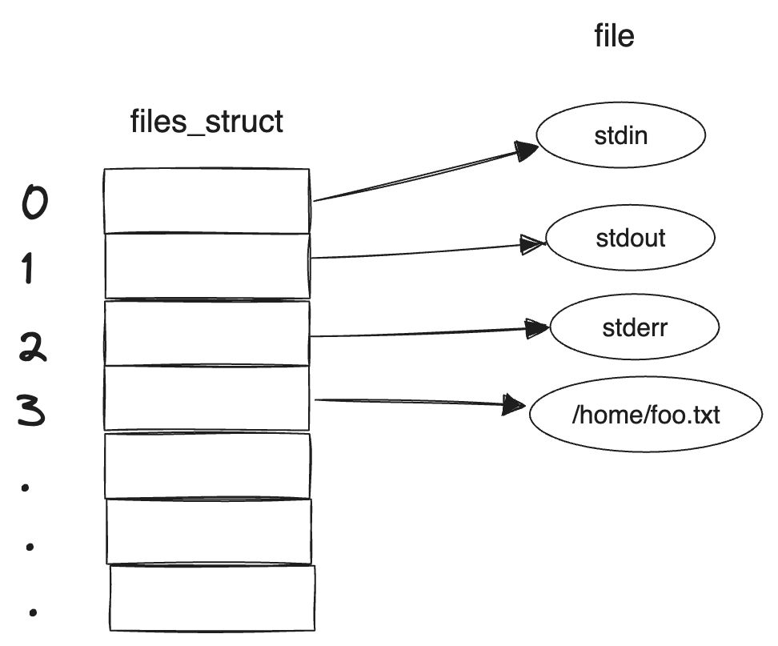

通过图片可以看到，文件描述符表其实就是一个序列表，它也拥有索引。用户程序并不能直接访问内核中的文件描述符表，而只能通过它的索引(即0、1、2、3这些数字)来访问每一个文件，而这些索引就称为**文件描述符(File Descriptor)**，用int类型变量保存。

每个程序启动时会自动打开三个文件：标准输入、标准输出和标准错误输出。在C标准库中分别使用`FILE*`类型的`stdin`、`stdout`、`stderr`表示。这三个文件是最先打开的，所以描述符分别是0、1、2，保存在对应的`FILE`结构体中。头文件`unistd.h`中有如下的宏定义来标识这三个文件描述符:

```c
// unistd.h

#define	 STDIN_FILENO	0	/* standard input file descriptor */
#define	STDOUT_FILENO	1	/* standard output file descriptor */
#define	STDERR_FILENO	2	/* standard error file descriptor */
```

### 4. open/close 系统调用

#### open

> `open`系统调用函数可以打开或创建一个文件。

```c
#include <fcntl.h>

函数声明
int open(const char* pathname, int flags);
int open(const char* pathname, int flags, mode_t mode);
返回值：成功返回新分配的文件描述符，出错返回-1并设置errno
```

在Man Page中open函数有两种形式，一种带两个参数，一种带三个参数，其实在C代码中open函数是这样声明的：

```c
int open(const char* pathname, int flags, ...);
```

最后的可变参数可以是0个或1个，由flags参数中的标志位决定，见下面的详细说明。

- `pathname`: 要打开或创建的文件名，和fopen一样，pathname既可以是相对路径也可以是绝对路径。

- `flags`: 文件打开模式，该参数有一系列常数值可供选择，可以同时选择多个常数使用`|`运算符连接起来，所以这些常数的宏定义都以o_开头，表示or。

  必选项: 以下三个常数中必须指定一个，并且这三个常数仅允许同时存在一个。

  - O_RDONLY: 只读;
  - O_WRONLY: 只写;
  - O_RDWR: 可读可写;

  以下可选项可以同时指定0个或多个，和必选项按位或起来作为flags参数。可选项有很多，这里只介绍一部分，其它选项可参考open(2)的Man Page:

  - O_APPEND: 表示追加写入;
  - O_CREAT: 如果文件不存在，则创建该文件。使用此选项需要提供第三个参数`mode`，表示该文件的访问权限;
  - O_EXCL: 如果同时指定了O_CREAT，并且文件已存在，则出错返回;
  - O_TRUNC: 如果文件已存在，并且以只写或可读可写方式打开，则将其长度截断（Truncate）为0字节;
  - O_NONBLOCK: 对于设备文件，以O_NONBLOCK方式打开可以做非阻塞I/O（Nonblock I/O），非阻塞I/O在下一节详细讲解;

- `mode`: 指定文件权限，可以用八进制数表示，比如0644表示`-rw-r--r--`，也可以用S_IRUSR、S_IWUSR等宏定义按位或起来表示，详见open(2)的Man Page。要注意的是，文件权限由open的mode参数和当前进程的umask掩码共同决定。

  如下补充: 

  Shell进程的umask掩码可以用umask命令查看：

  ```bash
  $ umask
  022
  ```

  使用 touch 命令创建一个文件时，创建权限是0666，而 touch 进程继承了Shell进程的umask掩码，所以最终的文件权限是 0666 &~ 022 = 0644:

  ```bash
  $ touch a.txt
  ❯ ll
  -rw-r--r--    1 zero  staff     0 Jan  2 22:09 a.txt
  ```

  同样的道理，用gcc编译生成可执行文件时，创建权限为0777，而最终的文件权限是 0777 &~ 022 = 0755:

  ```bash
  $ gcc main.c
  $ ll
  -rwxr-xr-x    1 zero  staff  16840 Jan  2 22:11 a.out
  -rw-r--r--    1 zero  staff     25 Jan  2 22:11 main.c
  ```

  我们看到的都是被umask掩码修改之后的权限，那么如何证明touch或gcc创建文件的权限本来应该是0666和0777呢？我们可以把Shell进程的umask改成0，再重复上述实验:

  ```bash
  $ umask 0 
  $ umask
  000
  $ touch a.txt
  $ ll
  -rw-rw-rw-    1 zero  staff      0 Jan  2 22:13 a.txt
  ```

  ```bash
  $ gcc main.c
  $ ll
  -rwxrwxrwx    1 zero  staff  16840 Jan  2 22:14 a.out
  -rw-r--r--    1 zero  staff     25 Jan  2 22:11 main.c
  ```

注意open函数与C标准I/O库的fopen函数有些细微的区别：

- 以可写的方式fopen一个文件时，如果文件不存在会自动创建，而open一个文件时必须明确指定O_CREAT才会创建文件，否则文件不存在就出错返回。
- 以w或w+方式fopen一个文件时，如果文件已存在就截断为0字节，而open一个文件时必须明确指定O_TRUNC才会截断文件，否则直接在原来的数据上改写。


#### close

> `close`系统调用函数用于关闭一个已经打开的文件。

```c
#include <unistd.h>

int close(int fd);
返回值：成功返回0，出错返回-1并设置errno
```

`fd`: 要关闭的文件描述符。

需要说明的是，当一个进程终止时，内核对该进程所有尚未关闭的文件描述符调用close关闭，所以即使用户程序不调用close，在终止时内核也会自动关闭它打开的所有文件。但是对于一个长年累月运行的程序（比如网络服务器），打开的文件描述符一定要记得关闭，否则随着打开的文件越来越多，会占用大量文件描述符和系统资源。

由open返回的文件描述符一定是该进程尚未使用的最小描述符。由于程序启动时自动打开文件描述符0、1、2，因此第一次调用open打开文件通常会返回描述符3，再调用open就会返回4。可以利用这一点在标准输入、标准输出或标准错误输出上打开一个新文件，实现重定向的功能。例如，首先调用close关闭文件描述符1，然后调用open打开一个常规文件，则一定会返回文件描述符1，这时候标准输出就不再是终端，而是一个常规文件了，再调用printf就不会打印到屏幕上，而是写到这个文件中了。后面要讲的dup2函数提供了另外一种办法在指定的文件描述符上打开文件。

```c
int main() {
    printf("");
    // 关闭标准输出，文件描述符表索引为1的位置将会空出来
    close(1);

    // 再创建一个文件，而这个文件的描述符则会使用1来标识
    // 这样就利用这个机制替代了标准输出
    int fd = open("./stdout.log",O_RDWR | O_CREAT,0644);
    if(fd != -1){
        // 向标准输出中输入数据
        // 此时并不会输出到终端，而是输出到 fd 描述符对应的文件中
        fprintf(stdout,"Hello，World! \n");
        // 关闭文件
        close(fd);
    }
    return 0;
}
```

下面通过一些习题进一步熟悉这两个系统调用函数:

1. 打开文件/home/akae.txt用于写操作，以追加方式打开
2. 打开文件/home/akae.txt用于写操作，如果该文件不存在则创建它
3. 打开文件/home/akae.txt用于写操作，如果该文件已存在则截断为0字节，如果该文件不存在则创建它
4. 打开文件/home/akae.txt用于写操作，如果该文件已存在则报错退出，如果该文件不存在则创建它

```c
#define FILE "/home/akae.txt"

int main() {
    // 1. 打开文件/home/akae.txt用于写操作，以追加方式打开
    int fd = open(FILE,O_WRONLY | O_APPEND);
    assert(fd != -1);
    close(fd);

    // 2. 打开文件/home/akae.txt用于写操作，如果该文件不存在则创建它
    int fd = open(FILE,O_WRONLY | O_CREAT,0666);
    assert(fd != -1);
    close(fd);

    // 3.打开文件/home/akae.txt用于写操作，如果该文件已存在则截断为0字节，如果该文件不存在则创建它
    int fd = open(FILE,O_WRONLY | O_CREAT | O_TRUNC);
    assert(fd != -1);
    close(fd);

    // 4. 打开文件/home/akae.txt用于写操作，如果该文件已存在则报错退出，如果该文件不存在则创建它
    int fd = open(FILE, O_WRONLY | O_CREAT | O_EXCL);
    assert(fd != -1);
    close(fd);

    return 0;
}
```

### 5. read/write 系统调用

#### read

> `read`系统调用函数可以从打开的设备或文件中读取数据。

```c
#include <unistd.h>

ssize_t	 read(int fd, void* buf, size_t count);
返回值：成功返回读取的字节数，出错返回-1并设置errno，如果在调read之前已到达文件末尾，则这次read返回0;
```

`fd`: 要读取的文件对应的文件描述符;

`buf`: 用于保存读取到的数据的缓冲区;

`count`: 请求读取的字节数;

参数count是请求读取的字节数，读上来的数据保存在缓冲区buf中，同时文件的当前读写位置向后移。注意: 这个读写位置和C标准IO库的读写位置有可能不同，这个读写位置是记录在内核中的，而C标准IO库的读写位置是用户空间IO缓冲区中的位置。比如用fgetc读一个字节，fgetc有可能从内核中预读1024个字节到I/O缓冲区中，再返回第一个字节，这时该文件在内核中记录的读写位置是1024，而在FILE结构体中记录的读写位置是1。

返回值类型为`ssize_t`，表示有符号的`size_t`，这样既可以返回0(表示读取到达文件末尾)也可以返回-1(表示出错)。正常返回值表明了本次读取的实际字节数，有些情况下实际读取到的字节数会小于`count`，例如:

- 读常规文件时，在读到count个字节之前已到达文件末尾。例如，距文件末尾还有30个字节而请求读100个字节，则read返回30，下次read将返回0。
- 从终端设备读，通常以行为单位，读到换行符就返回了。
- 从网络读，根据不同的传输层协议和内核缓存机制，返回值可能小于请求的字节数，后面socket编程部分会详细讲解。

#### write

> `write`系统调用函数可以向打开的设备或文件中写入数据。

```c
#include <unistd.h>

ssize_t write(int fd, const void* buf, size_t count);
返回值：成功返回写入的字节数，出错返回-1并设置errno
```

`fd`: 要写入的文件对应的文件描述符;

`buf`: 要写入的数据缓冲区;

`count`: 要写入的字节数;

向常规文件中写入时，返回值通常和`count`请求写入的字节数是一致的，但是向终端设备或网络设备写入则不一定,下面会说到原因。

#### 阻塞(Blocking)

对常规文件进行读写是不会产生阻塞的，以读取为例，不管读取多少字节，`read`一定会在有限的时间内返回。而从终端设备或网络设备读取则不一定，如果从终端输入的数据没有换行符，调用`read`读取终端就会一直阻塞，如果网络设备没有接受到数据包，调用`read`读取网络设备也会产生阻塞，至于阻塞多长时间也是不确定的，如果一直没有输入换行符或者接受到数据包就会一直阻塞下去。

现在明确一下**阻塞(Blocking)**这个概念:

当进程调用了一个阻塞的系统函数时，该进程会被置于**睡眠状态(Sleep)**，这时内核会调度其他的进程进行执行，直到该进程等待的事件发生了(比如网络上接到了数据包，或者调用sleep指定的睡眠时间到了)，它才有可能继续运行。

与睡眠状态相对的是**运行状态(Running)**，在Linux内核中，处于运行状态的进程分为两种情况:

- 正在被调度运行: CPU处于该进程的上下文环境中，程序计数器（eip）里保存着该进程的指令地址，通用寄存器里保存着该进程运算过程的中间结果，正在执行该进程的指令，正在读写该进程的地址空间。
- 就绪状态: 该进程不需要等待什么事件发生，随时都可以执行，但CPU暂时还在执行另一个进程，所以该进程在一个就绪队列中等待被内核调度。

系统中可能同时有多个就绪的进程，那么该调度谁执行呢？内核的调度算法是基于优先级和时间片的，而且会根据每个进程的运行情况动态调整它的优先级和时间片，让每个进程都能比较公平地得到机会执行，同时要兼顾用户体验，不能让和用户交互的进程响应太慢。

下面这个小案例实现从终端读取数据，再写回终端:

```c
int main(void) {
    char buf[10]; // 定义缓冲区
    int n;  // 读取到的字节数
    // 读取标准输入
    n = read(STDIN_FILENO,buf, sizeof(buf));
    if(n == -1){
        perror("read stdin failed:");
        exit(1);
    }
    // 将数据写回标准输出
    write(STDOUT_FILENO,buf,n);
    return 0;
}
```

执行结果如下:

```bash
$ ./a.out
hello (回车)
hello

$ ./a.out
hello world(回车)
hello worl$ d
zsh: command not found: d
```

第一次执行a.out的结果很正常，而第二次执行的过程有点特殊，现在分析一下：

1. Shell进程创建a.out进程，a.out进程开始执行，而Shell进程睡眠等待a.out进程退出。
2. a.out调用read时睡眠等待，直到终端设备输入了换行符才从read返回，read只读走10个字符，剩下的字符('d\n')仍然保存在内核的终端设备输入缓冲区中。
3. a.out进程打印结束并且退出，这时Shell进程恢复运行，Shell继续从终端读取用户输入的命令，于是读走了终端设备输入缓冲区中剩下的字符('d\n'),把它当成一条命令解释执行，结果发现执行不了，没有d这个命令。

#### 非阻塞(Non Blocking)

在使用`open`打开一个设备时指定`O_NONBLOCK`标志，`read/write`就不会阻塞。以read为例，如果设备暂时没有数据可读就返回-1，同时置errno为EWOULDBLOCK（或者EAGAIN，这两个宏定义的值相同），表示本来应该阻塞在这里（would block，虚拟语气）。事实上并没有阻塞而是直接返回错误，调用者应该试着再读一次（again）。这种行为方式称为轮询（Poll），调用者只是查询一下，而不是阻塞在这里死等，这样可以同时监视多个设备:

```c
while(1) {
    非阻塞read(设备1);
    if(设备1有数据到达)
   			处理数据;
    
  	非阻塞read(设备2);
    if(设备2有数据到达)
    		处理数据;
    ...
}
```

如果read(设备1)是阻塞的，那么只要设备1没有数据到达就会一直阻塞在设备1的read调用上，即使设备2有数据到达也不能处理，使用非阻塞I/O就可以避免设备2得不到及时处理。

非阻塞I/O有一个缺点，如果所有设备都一直没有数据到达，调用者需要反复查询做无用功，如果阻塞在那里，操作系统可以调度别的进程执行，就不会做无用功了。在使用非阻塞I/O时，通常不会在一个while循环中一直不停地查询（这称为Tight Loop），而是每延迟等待一会儿来查询一下，以免做太多无用功，在延迟等待的时候可以调度其它进程执行。

```c
while(1) {
    非阻塞read(设备1);
    if(设备1有数据到达)
    		处理数据;
    
  	非阻塞read(设备2);
    if(设备2有数据到达)
    		处理数据;
    ...
    sleep(n);
}
```

这样做的问题是，设备1有数据到达时可能不能及时处理，最长需延迟n秒才能处理，而且反复查询还是做了很多无用功。以后要学习的`select(2)`函数可以阻塞地同时监视多个设备，还可以设定阻塞等待的超时时间，从而圆满地解决了这个问题。

以下是一个非阻塞I/O的例子。目前我们学过的可能引起阻塞的设备只有终端，所以我们用终端来做这个实验。

程序开始执行时在0、1、2文件描述符上自动打开的文件就是终端，但是没有O_NONBLOCK标志。读标准输入是阻塞的。我们可以重新打开一遍设备文件/dev/tty（表示当前终端），在打开时指定O_NONBLOCK标志。

```c
#include <stdio.h>
#include <fcntl.h>
#include <unistd.h>
#include <errno.h>
#include <stdlib.h>

// 重试读取提示信息
#define MSG_TRY "try again read\n"

int main(void) {
    char buf[10]; // 定义缓冲区
    int n;        // 读取到的字节数量
    int stdfd;       // 重新打开的终端设备描述符
    // 打开终端设备，以非阻塞模式
    stdfd = open("/dev/tty",O_RDONLY | O_NONBLOCK);
    if(stdfd == -1){
        perror("open terminal failed: ");
        exit(1);
    }
    // 以非阻塞模式循环读取标准输入
    loop_read:
    n = read(stdfd,buf, sizeof(buf));
    if (n == -1){
        if(errno == EAGAIN){// 表示目前没有数据可读
            sleep(1); // 睡眠1秒
            write(STDOUT_FILENO,MSG_TRY, sizeof(MSG_TRY));
            goto loop_read; // 跳转回去继续尝试读取
        }
        perror("read stdin failed:");
        exit(1);
    }
    // 写回到标准输出
    write(STDOUT_FILENO,buf,n);
    close(stdfd);
    return 0;
}
```

执行结果:

```bash
$ ./a.out
try again read
try again read
try again read
try again read
try again read
try again read
try again read
try again read
try again read
...
```

程序并不会阻塞，而是会不断的输出`try again read`，直到往终端中输入数据;

### 6. lseek 系统调用

> `lseek`系统调用函数可以移动文件的读写位置(或者叫偏移量)。

每个打开的文件都记录着当前读写位置，打开文件时读写位置是0，表示文件开头，通常读写多少个字节就会将读写位置往后移多少个字节。但是有一个例外，如果以O_APPEND方式打开，每次写操作都会在文件末尾追加数据，然后将读写位置移到新的文件末尾。lseek和标准I/O库的fseek函数类似，可以移动当前读写位置（或者叫偏移量）。

```c
#include <unistd.h>

off_t lseek(int fd, off_t offset, int whence);
返回值为新的偏移量
```

参数offset和whence的含义和fseek函数完全相同。只不过第一个参数换成了文件描述符。和fseek一样，偏移量允许超过文件末尾，这种情况下对该文件的下一次写操作将延长文件，中间空洞的部分读出来都是0。

若lseek成功执行，则返回新的偏移量，因此可用以下方法确定一个打开文件的当前偏移量：

```c
off_t currpos;
currpos = lseek(fd, 0, SEEK_CUR);
```

这种方法也可用来确定文件或设备是否可以设置偏移量，常规文件都可以设置偏移量，而设备一般是不可以设置偏移量的。如果设备不支持lseek，则lseek返回-1，并将errno设置为ESPIPE。注意fseek和lseek在返回值上有细微的差别，fseek成功时返回0失败时返回-1，要返回当前偏移量需调用ftell，而lseek成功时返回当前偏移量失败时返回-1。

### 7. fcntl 系统调用

在刚才的非阻塞IO案例中，我们为什么不直接对**标准输入(STDIN_FILENO)**做非阻塞`read`操作呢？而是要从新`open`打开`/dev/tty`呢？

因为STDIN_FILENO在程序启动时已经被自动打开了，而我们需要在调用open时指定O_NONBLOCK标志。这里介绍另外一种办法，可以用fcntl函数改变一个已打开的文件的属性，可以重新设置读、写、追加、非阻塞等标志（这些标志称为File StatusFlag），而不必重新open文件。

```c
#include <unistd.h>
#include <fcntl.h>

int fcntl(int fd, int cmd);
int fcntl(int fd, int cmd, long arg);
int fcntl(int fd, int cmd, struct flock* lock);
```

`fd`: 要操作的文件描述符;

`cmd`: 要执行的操作，有如下选项:

- F_DUPFD: 创建一个新的文件描述符，同样指向`fd`所指向的文件;
- F_GETFD: 获取`fd`的文件描述符标记;
- F_SETFD: 对`fd`设置文件描述符标记;
- F_GETFL: 获取`fd`的文件状态标记;
- F_SETFL: 对`fd`设置文件状态;

`arg`: 可选参数，由`cmd`参数所决定;

如下案例： 使用`fcntl`将标准输入更改为非阻塞模式

```c
#include <stdio.h>
#include <fcntl.h>
#include <errno.h>
#include <unistd.h>
#include <stdlib.h>
#define MSG_TRY "try again read\n"

/**
 * 使用fcntl 系统调用，动态将标准输入更改为 非阻塞模式
 */
int main(void) {
    char buf[10]; // 定义缓冲区
    int n;        // 读取到的字节数量

    int flags;
    // 1. 获取标准输入的状态标记
    flags = fcntl(STDIN_FILENO,F_GETFL);
    // 2. 将状态标记 追加上 O_NONBLOCK
    flags |= O_NONBLOCK;
    // 3. 将新的状态值，更新回标准输入
    int res = fcntl(STDIN_FILENO,F_SETFL,flags);
    if(res == -1){
        perror("Modify stdin flags:");
        exit(1);
    }
    loop:
    n = read(STDIN_FILENO,buf, sizeof(buf));
    if (n == -1){
        if (errno == EAGAIN){
            write(STDOUT_FILENO,MSG_TRY, sizeof(MSG_TRY));
            sleep(1);
            goto loop;
        }
        perror("read stdin failed:");
        exit(1);
    }
    return 0;
}
```

### 8. ioctl 系统调用

ioctl用于向设备发控制和配置命令，有些命令也需要读写一些数据，但这些数据是不能用read/write读写的，称为Out-of-band数据。也就是说，read/write读写的数据是in-band数据，是I/O操作的主体，而ioctl命令传送的是控制信息，其中的数据是辅助的数据。例如，在串口线上收发数据通过read/write操作，而串口的波特率、校验位、停止位通过ioctl设置，A/D转换的结果通过read读取，而A/D转换的精度和工作频率通过ioctl设置。

```c
#include <sys/ioctl.h>

int ioctl(int fd, int request, ...);
```

`fd`: 某个设备的文件描述符;

`request`: 对射陪要发送的控制命令;

`...`: 可变参数，通常是一个指向变量或结构体的指针;

若出错则返回-1，若成功则返回其他值，返回值也是取决于request。

以下程序使用TIOCGWINSZ命令获得终端设备的窗口大小:

```c
#include <stdio.h>
#include <stdlib.h>
#include <unistd.h>
#include <sys/ioctl.h>

int main(int argc, char *argv[]) {
    // 终端窗口 大小信息结构体
    struct winsize windowSize;

    // 是否连接到终端
    if (isatty(STDOUT_FILENO) == 0){
        exit(1);
    }

    // 通过ioctl函数 对终端设备发送命令
    // 发送 TIOCGWINSZ 命令，获取终端窗口的大小信息
    if (ioctl(STDOUT_FILENO,TIOCGWINSZ,&windowSize) < 0){
        perror("ioctl TIOCGWINSZ error:");
        exit(1);
    }
    printf("高度: %d, 宽度: %d \n",windowSize.ws_row, windowSize.ws_col);
    return 0;
}

```

在图形界面的终端里多次改变终端窗口的大小并运行该程序，观察结果。

### 9. mmap 系统调用(重要)

> `mmap`全称**memory map(内存映射)**，简而言之就是将**内核空间**的一段内存区域映射到到**用户空间**的一段内存区域。映射成功后这两块内存区域将会产生关联，无论修改哪一块内存，都会反映到对方。对于内核空间与用户空间两者之间需要大量数据传输等操作的话效率是非常高的。当然，也可以将内核空间的一段内存区域同时映射到多个进程，这样还可以实现进程间的共享内存通信。

最常见的内存映射就是文件操作，将文件映射至内存(进程空间)，这样就可以将对文件的操作，转换为对内存的操作，一次避免更多的`lseek`、`read`、`write`调用，这点对于大文件或者频繁访问的文件而言尤其受益。

```c
#include <sys/mman.h>

void* mmap(void* addr, size_t len, int prot, int flag, int filedes, off_t offset);
```

- `addr`:

  如果`addr`参数为`NULL`，内核会自动在进程内存空间选择一块合适的内存建立映射。如果`addr`不为`NULL`，表示给内核一个提示，内核从`addr`地址之上的区域选择一块合适的内存建立映射。通常我们都是传`NULL`，让内核自己选择内存地址;

- `offset`:

  需要映射的内容在内核空间中偏移量，也就是从文件内容的什么位置开始映射。必须是`PAGE_SIZE`(在32位体系统结构上通常是4K)的整数倍;

- `len`:

  需要映射的那一段内容的长度大小。

- `filedes`:

  要映射的文件描述符，由`open`返回的值。

- `prot`:

  该参数用于指定映射区域的保护权限，它是一个掩码，可以通过位运算来设置多个权限，取值有如下几种:

  - PROT_EXEC: 表示这段映射区域可以被执行，例如映射动态库;
  - PROT_READ: 表示这段映射区域可以读取;
  - PROT_WRITE: 表示这段映射区域可以写入;
  - PROT_NONE: 表示这段映射区域不可访问;

- `flag`:

  该参数用于指定一些特性和行为，同样可以通过位运算来设置多个标志，常用的取值有:

  - MAP_SHARED: 多个进程对同一个文件的映射是共享的，一个进程对映射的内存做了修改，另一个进程也会看到这种变化。
  - MAP_PRIVATE: 多个进程对同一个文件的映射不是共享的，一个进程对映射的内存做了修改，另一个进程并不会看到这种变化，也不会真的写到文件中去。
  - MAP_ANONYMOUS: 创建一个匿名映射区域，不与任何文件关联。用于匿名内存的分配。

当映射建立完成后，会将映射的内存起始地址作为返回值返回。 

映射建立后，使用完毕后需要通过`munmap`来关闭内存映射，以此释放内存;

```c
#include <sys/mman.h>

int munmap(void* addr, size_t len);
```

- `addr`: 要关闭的内存映射起始地址，也就是`mmap`的返回值;
- `len`: 要关闭映射的内存长度;

#### mmap文件操作

下面通过一个案例，实现对文件内容的内存映射、读取、写入以及关闭等操作;

创建一个文本`hello.txt`

```tex
Hello,world
```

编写案例程序:

```c
#include <stdio.h>
#include <sys/mman.h>
#include <fcntl.h>
#include <stdlib.h>
#include <string.h>

int main(void) {
    // 打开一个文件
    int file_fd = open("hello.txt",O_RDWR);
    if(file_fd < 0){
        perror("open file");
        exit(1);
    }
    // 要映射的内存长度，只映射5个字节
    int len = 5;
    // 起始偏移量，0表示从文件内容的头部开始
    int offset = 0;

    // 通过mmap 对打开的文件建立内存映射
  	// 以可读可写权限,并且进程共享 建立映射
    char* content = mmap(NULL,len,PROT_READ | PROT_WRITE,MAP_SHARED, file_fd, offset);
    if (content == MAP_FAILED){
        // 内存映射失败
        perror("mmap failed");
        exit(1);
    }
    // 获取到了映射内容的起始内存地址，接下来就可以像操作内存一样来修改内容

    // 1. 读取映射到的内容
    char buf[len + 1];
    strncpy(buf,content,len);
    buf[len] = '\0';
    printf("%s\n",buf); // Hello

    // 2. 修改映射的内容
    strncpy(content,"HELLO",len);

    // 3. 再尝试读取映射内容
    printf("%s\n", strncpy(buf,content,len)); // HELLO

    // 4. 取消映射
    munmap(content,len);
    return 0;
}
```

接下来编译执行:

```bash
$ gcc main.c
$ ./a.out
Hello
HELLO
```


## 进程

### 1. 引言

我们知道，每个进程在内核中都有一个进程控制块（PCB）来维护进程相关的信息，Linux内核的进程控制块是`task_struct`结构体。

现在我们全面了解一下其中都有哪些信息:

- 进程id。系统中每个进程有唯一的id，在C语言中用pid_t类型表示，其实就是一个非负整数。
- 进程的状态，有运行、挂起、停止、僵尸等状态。
- 进程切换时需要保存和恢复的一些CPU寄存器。
- 描述虚拟地址空间的信息。
- 描述控制终端的信息。
- 当前工作目录(Current Working Dirctory)。
- umask掩码。
- 文件描述表，包含很多指向`file`结构体的指针。
- 和信号相关的信息。
- 用户id和用户组id。
- 控制终端、Session和进程组。
- 进程可以使用的资源上限(Resource Limit)。

这些东西稍后会进行详细一一介绍。

`fork`和`exec`是本章要介绍的两个重要的系统调用。`fork`的作用是根据一个现有的进程复制出一个新的进程，原来的进程称之为父进程(Parent Process)，新进程称为子进程(Child Process)。系统中同时运行着很多进程，这些进程都是从最初只有一个进程开始一个一个复制出来的。在Shell下输入命令可以运行一个程序，是因为Shell进程在读取用户输入的命令之后会调用fork复制出一个新的Shell进程，然后新的Shell进程调用exec执行新的程序。


例如: 我们打开一个终端程序`/bin/bash`，然后在终端执行 `ls` 可执行程序:

```bash
$ ls
...
```

这个如此简单的操作，会产生如下流程:

1. 首先`fork`创建一个子进程;
2. 这时的子进程仍然在执行`/bin/bash`程序，然后子进程调用`exec`执行新的程序`/bin/ls`;


在`open/close`中我们做过一个实验：用umask命令设置Shell进程的umask掩码，然后运行程序a.out，结果a.out进程的umask掩码也和Shell进程一样。现在可以解释了，因为a.out进程是Shell进程的子进程，子进程的PCB是根据父进程复制而来的，所以其中的umask掩码也和父进程一样。同样道理，子进程的当前工作目录也和父进程一样，所以我们可以用cd命令改变Shell进程的当前目录，然后用ls命令列出那个目录下的文件，ls进程其实是在列自己的当前目录，而不是Shell进程的当前目录，只不过ls进程的当前目录正好和Shell进程相同。

### 2. 环境变量

**环境变量(environment variables)**是操作系统提供的一种机制，用于在操作系统级别存储配置信息和对程序的影响。这些变量包含了影响程序运行行为的各种设置，比如搜索路径、临时文件位置、默认编辑器、语言设置等等。

进程的**环境变量**是指当前进程在运行时可用的特定环境信息，它的可用范围是针对当前进程的。每个进程都有自己的环境变量，当进程被创建时，它会继承父进程的环境变量信息，后续也可以修改、添加或删除自己的环境变量。例如通过`exec`系统调用执行新程序时会把**命令参数**和**环境变量表**传递给main函数。

在libc中定义的全局变量`environ`指针，指向环境变量表，它没有包含在任何头文件中，所以我们可以直接通过该变量来获取环境变量，例如:

```c
int main(void) {
    // 声明一个字符串指针变量，注意名称必须为`environ`
    // 因为该变量由 libc 库中所定义和提供
    extern char** environ;

    // 变量输出环境变量
    for (int i = 0; environ[i] != NULL; i++) {
        printf("%s\n",environ[i]);
    }
    return 0;
}
```

执行结果:

```bash
$ ./a.out
TERM=xterm-256color
SHELL=/bin/zsh
PAGER=less
...
```

由于父进程在调用fork创建子进程时会把自己的环境变量表也复制给子进程，所以a.out打印的环境变量和Shell进程的环境变量是相同的。

按照惯例，环境变量字符串都是name=value这样的形式，大多数name由大写字母加下划线组成，一般把name的部分叫做环境变量，value的部分则是环境变量的值。环境变量定义了进程的运行环境。

#### 查看环境变量

用environ指针可以查看所有环境变量字符串，但是不够方便，如果给出name要在环境变量表中
查找它对应的value，可以用getenv函数:

```c
#include <stdlib.c>

char* getenv(const chart* name);
```

getenv的返回值是指向value的指针，若未找到则为NULL。

```c
int main(int argc, char *argv[]) {
    const char* javaHome = getenv("HOME");
    printf("%s \n",javaHome); // /Users/zero

    const char* custom = getenv("CUSTOM");
    printf("%s \n",custom); // (null)
    return 0;
}
```

#### 设置环境变量

修改变量可以用如下函数:

```c
#include <stdlib.h>

int setenv(const char *name, const char *value, int rewrite);
int	 putenv(char* name)
```

putenv和setenv函数若成功则返回为0，若出错则返回非0。

setenv函数较为特殊，有如下规则:

- 若rewrite非0，则覆盖原来的定义；
- 若rewrite为0，则不覆盖原来的定义，也不返回错误。

```c
#include <stdio.h>
#include <stdlib.h>
#define KEY "ROOT_NAME"

int main() {
    int no = setenv(KEY,"张三",1);
    if (no != 0){
        perror("set env failed");
        exit(no);
    }
    const char* name = getenv(KEY);
    printf("%s",name); // 张三
    return 0;
}
```

#### 删除环境变量

unsetenv删除name的定义。即使name没有定义也不返回错误。

```c
#include <stdio.h>
#include <stdlib.h>

#define KEY "ROOT_NAME"

int main() {
    // 设置环境变量
    int no = setenv(KEY,"张三",1);
    if (no != 0){
        perror("set env failed");
        exit(no);
    }
    // 获取环境变量
    const char* name = getenv(KEY);
    printf("%s\n",name); // 张三
    // 删除环境变量
    no = unsetenv(KEY);
    if (no != 0){
        perror("remove env failed");
        exit(no);
    }
    printf("%s\n", getenv(KEY)); // (null)
    return 0;
}
```

注意： 这些操作都是针对于当前进程的环境变量，并不会影响父进程的环境变量。

父进程在创建子进程时会复制一份环境变量给子进程，但此后二者的环境变量互不影响。

### 3. 进程的控制

#### fork 系统调用

`fork`系统调用负责根据当前现有的进程，复制出来一个新的子进程。系统中同时运行着很多进程，这些进程都是从进程ID为1的进程，一个又一个复刻出来的子进程。

通过`fork`创建的子进程几乎和原来的进程完全相同，例如状态、寄存器、虚拟内存空间、umask、文件描述符表等等信息完全相同，只有一些细微的差别，例如进程id不一致，子进程会拥有自己的进程id;

```c
#include <sys/types.h>
#include <unistd.h>

pid_t fork(void);
```

使用`pid_t`类型作为进程的id，也就是该函数的返回值，返回值有如下情况:

- 如果返回的是-1，表示创建进程失败，可能是内存不足，也可能是进程数量到达系统上限;
- 如果返回值为0或其他正数，则表示创建进程成功，此时会产生两个视角，分别是父进程和子进程:
  - 返回值为0，表示为当前进程为子进程;
  - 返回值大于0，表示当前进程为父进，该值是子进程的id;

简单使用案例如下：

```c
#include <stdio.h>
#include <unistd.h>
#include <stdlib.h>

int main(void) {
    // 创建子进程
    pid_t cPid = fork();
    // cPid为-1，表示创建进程失败
    if (cPid == -1){
        perror("fork process failed");
        exit(1);
    }
    // 创建进程成功
    if (cPid > 0){
        // 父进程后续操作
        printf("进程创建完成，我是父进程.\n");
    } else if (cPid == 0){
        // 子进程后续操作
        printf("进程创建完成，我是子进程.\n");
    }
    return 0;
}
```

执行结果：

```bash
进程创建完成，我是父进程.
进程创建完成，我是子进程.
```


接下来这个案例使用`fork`来创建子进程，并且不同进程输出不同次数的消息内容:

```c
#include <stdio.h>
#include <unistd.h>
#include <stdlib.h>

int main(void) {
    char* message;
    int n;

    // 创建子进程
    pid_t pid = fork();
    if (pid == -1){
        perror("fork process failed");
        exit(1);
    }
    if (pid == 0){
        // 子进程
        message = "我是子进程~\n";
        n = 6;
    }else{
        // 主进程
        message = "我是主进程~\n";
        n = 3;
    }
    while (n > 0){
        printf("%s",message);
        sleep(1);
        n--;
    }
    return 0;
}

```

执行结果:

```bash
$ ./a.out
我是主进程~
我是子进程~
我是主进程~
我是子进程~
我是主进程~
我是子进程~
我是子进程~
$ 我是子进程~
我是子进程~
```

该案例的执行流程如下:

1. 父进程初始化。
2. 父进程调用fork，这是一个系统调用，因此进入内核。
3. 内核根据父进程复制出一个子进程，父进程和子进程的PCB信息相同，用户态代码和数据也相同。因此，子进程现在的状态看起来和父进程一样，做完了初始化，刚调用了fork进入内核，还没有从内核返回。
4. 现在有两个一模一样的进程看起来都调用了fork进入内核等待从内核返回（实际上fork只调用了一次），此外系统中还有很多别的进程也等待从内核返回。是父进程先返回还是子进程先返回，还是这两个进程都等待，先去调度执行别的进程，这都不一定，取决于内核的调度算法。
5. 如果某个时刻父进程被调度执行了，从内核返回后就从fork函数返回，保存在变量pid中的返回值是子进程的id，是一个大于0的整数，因此执下面的else分支，然后执行for循环，打印"我是主进程~\n"三次之后终止。
6. 如果某个时刻子进程被调度执行了，从内核返回后就从fork函数返回，保存在变量pid中的返回值是0，因此执行下面的if (pid == 0)分支，然后执行for循环，打印"我是子进程~\n"六次之后终止。fork调用把父进程的数据复制一份给子进程，但此后二者互不影响，在这个例子中，fork调用之后父进程和子进程的变量message和n被赋予不同的值，互不影响。
7. 父进程每打印一条消息就睡眠1秒，这时内核调度别的进程执行，在1秒这么长的间隙里（对于计算机来说1秒很长了）子进程很有可能被调度到。同样地，子进程每打印一条消息就睡眠1秒，在这1秒期间父进程也很有可能被调度到。所以程序运行的结果基本上是父子进程交替打印，但这也不是一定的，取决于系统中其它进程的运行情况和内核的调度算法，如果系统中其它进程非常繁忙则有可能观察到不同的结果。另外，读者也可以把sleep(1);去掉看程序的运行结果如何。
8. 这个程序是在Shell下运行的，因此Shell进程是父进程的父进程。父进程运行时Shell进程处于等待状态，当父进程终止时Shell进程认为命令执行结束了，于是打印Shell提示符，而事实上子进程这时还没结束，所以子进程的消息打印到了Shell提示符后面。最后光标停在This is the child的下一行，这时用户仍然可以敲命令，即使命令不是紧跟在提示符后面，Shell也能正确读取。

fork函数的特点概括起来就是“调用一次，返回两次”，在父进程中调用一次，在父进程和子进程中各返回一次。从上图可以看出，一开始是一个控制流程，调用fork之后发生了分叉，变成两个控制流程，这也就是“fork”（分叉）这个名字的由来了。子进程中fork的返回值是0，而父进程中fork的返回值则是子进程的id（从根本上说fork是从内核返回的，内核自有办法让父进程和子进程返回不同的值），这样当fork函数返回后，程序员可以根据返回值的不同让父进程和子进程执行不同的代码。

fork的返回值这样规定是有道理的。fork在子进程中返回0，子进程仍可以调用getpid函数得到自己的进程id，也可以调用getppid函数得到父进程的id。在父进程中用getpid可以得到自己的进程id，然而要想得到子进程的id，只有将fork的返回值记录下来，别无它法。

fork的另一个特性是所有由父进程打开的描述符都被复制到子进程中。父、子进程中相同编号的文件描述符在内核中指向同一个file结构体，也就是说，file结构体的引用计数要增加。

#### 孤儿进程

当一个父进程退出后，由该进程所创建出的所有子进程还在运行时，这些子进程就被称之为**孤儿进程**。孤儿进程将会被**init进程(pid为1的进程)**所管理，并且由init进程对它们完成状态收集工作。简单点说孤儿进程就是没有父进程的进程，然后就会认init进程作为父进程，完成孤儿进程的善后工作。
如下案例所示:

```c
#include <stdio.h>
#include <unistd.h>
#include <stdlib.h>

/**
 * 简单点说孤儿进程就是没有父进程的进程，然后就会认init进程作为父进程，完成孤儿进程的善后工作。
 * 通过如下案例，来验证父进程结束后，孤儿进程的变化.
 */

int main(void) {
    int n;
    pid_t pid;
    if((pid = fork()) == -1){
        perror("fork process failed.");
        exit(1);
    }
    if (pid == 0){
        // 子进程
        n = 6;
        while (n > 0){
            printf("我是子进程，我的id为: %d，我的父进程id为: %d \n", getpid(),getppid());
            sleep(1);
            n--;
        }
    }else{
        // 父进程
        n = 3;
        while (n > 0){
            printf("我是父进程，我的id为: %d，我的父进程id为: %d, 我的子进程id为: %d \n",getpid(),getppid(),pid);
            sleep(1);
            n--;
        }
    }
    return 0;
}
```

执行结果:

```bash
$ ./a.out
我是父进程，我的id为: 29173，我的父进程id为: 28151, 我的子进程id为: 29174 
我是子进程，我的id为: 29174，我的父进程id为: 29173 
我是父进程，我的id为: 29173，我的父进程id为: 28151, 我的子进程id为: 29174 
我是子进程，我的id为: 29174，我的父进程id为: 29173 
我是父进程，我的id为: 29173，我的父进程id为: 28151, 我的子进程id为: 29174 
我是子进程，我的id为: 29174，我的父进程id为: 29173 
我是子进程，我的id为: 29174，我的父进程id为: 29173 
$ 我是子进程，我的id为: 29174，我的父进程id为: 1
我是子进程，我的id为: 29174，我的父进程id为: 1 
```

通过输出我们看到，程序刚运行时:

- 父进程id: 29173
- 子进程id: 29174
- bash进程id: 28151

3秒后，父进程输出完毕，父进程死亡:

- 子进程id: 29174
- 子进程的父进程id: 1

可以很明显的看到，在程序中通过`fork`创建出的子进程，在父进程死亡后，它的父进程id变为了 1，成为了**init进程**的子进程。

#### exec 系统调用

刚刚学到的`fork`用于创建进程，问题是创建好的进程是和父进程相同的程序，但是我们往往要使用子进程来执行其他程序，否则创建多进程的意义就不存在了。这个时候就可以通过`exec`系列函数来执行另一个程序。

当一个进程调用`exec`系列函数时，当前进程的用户空间代码和数据会完全被新程序替换掉，然后从新程序的启动例程开始执行。调用exec并不创建新进程，所以调用exec前后该进程的id并未改变。

`exec`并不是一个确定的系统函数，而是一堆以`exec`开头的函数，所以统称为`exec`函数。共有以下6种相关函数:

```c
#include <unistd.h>

l 系列函数
int execl(const char* path, const char* arg, ...);
int execlp(const char* file, const char* arg, ...);
int execle(const char *path, const char *arg, ..., char *const envp[]);

v 系列函数
int execv(const char *path, char *const argv[]);
int execvp(const char *file, char *const argv[]);
int execve(const char *path, char *const argv[], char *const envp[]);

file | path: 要执行的程序
arg  | argv: 程序所需的命令行参数
envp: 要传递给新程序的环境变量
```

啊...头大有木有? 放眼望去一堆相似的函数，下面我们就针对这些函数的区别与功能进行详解。其实这些函数的功能是一致的，都是让当前进程执行另一个程序，只是由于参数传递方式不同，被拆分成多个函数。只有`execve`函数是真正的系统调用函数，其他函数都是针对于该`execve`的封装。

**这些函数整体分为两个系列:**

- 带有`l`字母系列(表示List):

  该系列函数要求将新程序的每个命令行参数都作为一个个的字符串传给它，命令行参数的个数是可变的，所以该系列函数的`arg`都是`...`，并且要求可变参数的最后一个参数必须为`NULL`,表示参数结束，起到哨兵的作用。如下使用`execl`执行新程序:

  ```c
  # 通过execl 运行 ls 程序(无参数)
  execl("/bin/ls","ls",NULL);
  
  # 通过execl 执行 ps 程序(多参数)
  execl("/bin/ps","ps","-o","pid,ppid",NULL);
  ```

- 带`v`字母系列(表示Vector):

  该系列函数要求将新程序的所有命令行参数构建成一个字符串数组，然后将数组作为参数传递给它，并且数组的最后一个参数必须为`NULL`。就像main函数的argv参数或者环境变量表一样。如下使用`execv`执行新程序:

  ```c
  # 构建 ps 程序所需的命令行参数
  char* const args[] = {"ps","-o","pid,ppid", NULL};
  # 执行 ps 程序
  execv("/bin/ps", args);
  ```

- 不以`p`为后缀的函数

  p表示path，函数不是以p结尾的，第一个参数必须是要执行的程序的**相对路径**或**绝对路径**，例如要执行`ls`程序，那么第一个参数必须为`ls`程序的所在路径，如下:

  ```c
  # 执行 ls 程序
  execl("/bin/ls", "ls", NULL);
  
  # 执行 ls 程序，以数组形式传参
  char* const args[] = {"ls", NULL};
  execv("/bin/ls",args);
  ```

- 以`p`为后缀的函数

  如果参数中包含/，则将其视为路径名，否则视为不带路径的程序名，在PATH环境变量的目录列表中搜索这个程序。

  ```c
  # 执行ls 程序，直接指定程序名称，通过path环境变量查找
  execlp("ls","ls",NULL);
  
  # 执行 ls 程序，以数组形式传参
  char* const args[] = {"ls", NULL};
  execvp("ls", args);
  ```

- 以`e`为后缀的函数

  e表示environment，表示将一份新的环境变量表传递给它，其他exec函数仍使用当前的环境变量表执行新程序。

  ```c
  # 创建一份新的环境变量
  char* const envs[] = {"PATH=/bin:/usr/bin","NAME=zhangsan",NULL};
  # 执行 ls 程序，并且将自定义的环境变量传递给它
  execle("/bin/ls","ls",NULL,envs);
  ```

由于exec函数只有错误返回值，只要返回了一定是出错了，所以不需要判断它的返回值，直接在后面调用perror即可。注意在调用execlp时传了两个"ps"参数，第一个"ps"是程序名，execlp函数要在PATH环境变量中找到这个程序并执行它，而第二个"ps"是第一个命令行参数，execlp函数并不关心它的值，只是简单地把它传给ps程序，ps程序可以通过main函数的argv[0]取到这个参数。

#### wait 进程同步

一个进程在终止时，会关闭进程内的所有的文件描述符，并且释放在用户空间分配的内存，但它的**进程控制块(PCB)**还保留着，内核在PCB中保留了一些信息: 如果该进程是正常终止，则保存着退出状态，如果是异常终止，则保留着导致异常终止的**信号**。已经终止的进程的父进程可以调用`wait`和`waitpid`获取这些保留信息，然后彻底清除掉这个进程。

我们知道在终端Shell中可以通过`$?`特殊变量来查看上个进程的退出状态， 因为Shell是它的父进程。当一个进程终止时，Shell会调用`wait`或`waitpid`得到它的退出状态同时清除掉这个进程。

如果一个进程已经终止，但是它的父进程尚未调用`wait`或`waitpid`对它进行清理时，这时的进程状态被称为**僵尸进程(Zombie)**。任何进程终止后都是僵尸进程。

正常情况下僵尸进程都立刻会被父进程清理掉，为了验证刚刚所说的，我们编写一个非正常程序：父进程fork出子进程，然后让子进程终止，而父进程既不终止，也不调用`wait`清理子进程:

```c
int main(void) {
    pid_t pid = fork();
    if(pid > 0){
       //父进程死循环
        while (1);
    }
  // 子进程直接终止
    return 0;
}
```

编译程序，然后后台运行该程序，通过ps查看进程信息:

```bash
$ ./a.out &
[1] 20894

$ ps u
USER   	PID  	%CPU 	%MEM   VSZ    RSS TT  		STAT 	STARTED TIME COMMAND
...
root     20894 99.0  0.0   4212   352 pts/0    RN   14:27   0:13 ./a.out
root     20895  0.0  0.0      0     0 pts/0    ZN   14:27   0:00 [a.out] <defunct>
```

`&` 表示后台运行该程序，Shell不会阻塞等待这个进程终止，并且后台进程是读不到终端输入的。

通过`ps` 程序可以看到 父进程的id为 20894，状态为`RN`表示为正在运行，而子进程的id为20895，并且状态为`ZN`表示为僵尸状态。

如果一个父进程终止，而它的子进程还存在（这些子进程或者仍在运行，或者已经是僵尸进程了），则这些子进程的父进程改为**init进程**。init是系统中的一个特殊进程，通常程序文件是/sbin/init，进程id是1，在系统启动时负责启动各种系统服务，之后就负责清理子进程，只要有子进程终止，init就会调用wait函数清理它。

> 注意: 僵尸进程是不能用kill命令清除掉的，因为kill命令只是用来终止进程的，而僵尸进程已经终止了。

介绍了这么多，下面正式开始介绍`wait`和`waitpid`函数:

```c
#include <sys/types.h>
#include <sys/wait.h>

pid_t wait(int* status);

pid_t waitpid(pid_t pid, int* status, int options);
# pid 为要等待的子进程ID
# - 如果 pid > 0，则等待具有指定PID的子进程。
# - 如果 pid = -1，则等待任意子进程。相当于wait
# - 如果 pid = 0，则等待与调用 waitpid 的进程属于同一进程组的任意子进程。
# - 则等待同一进程组中的任意子进程，其进程组ID等于 pid 的绝对值。

# options 行为选项
# 0 表示没有任何选项
# WNOHANG：如果没有任何已经结束的子进程则马上返回0, 不予以等待；
# WUNTRACED：如果子进程进入暂停执行情况则马上返回, 但结束状态不予以理会. 子进程的结束状态返回后存于status, 底下有几个宏可判别结束情况；
```

执行成功则返回被清理掉的子进程的id，并且将进程的退出状态设置给`status`参数。如果执行错误则返回-1，并且设置errno;

父进程这两个函数时，可能会产生如下几种情况:

- 如果当前进程没有任何子进程，则立刻返回-1。
- 如果当前进程的所有子进程都还在运行，也就是说没有处于僵尸状态的进程，那么就会产生阻塞，直到有一个子进程终止后，父进程会读取该终止信息，并且返回。

这两个函数的区别:

- `wait`会使父进程进入阻塞状态，直到有任意一个子进程终止后，获取其终止信息然后返回结束;
- `waitpid`可以通过指定的进程id，来决定阻塞等待哪个子进程终止，并且还可以在options参数中指定WNOHANG可以使父进程不阻塞而立即返回0。

可见，调用wait和waitpid不仅可以获得子进程的终止信息，还可以使父进程阻塞等待子进程终止，起到进程间同步的作用。如果参数status不是空指针，则子进程的终止信息通过这个参数传出，如果只是为了同步而不关心子进程的终止信息，可以将status参数指定为NULL。

子进程的终止信息在一个`int status`变量中，其中包含了多个字段，提供了许多宏定义可以取出其中的每个字段:

- `WIFEXITED`: 判断进程是否为正常终止，例如通过`exit`终止，如果是结果则为真;
- `WEXITSTATUS`: 取出status中的终止码，也就是子进程中通过`exit`指定的状态值;
- `WIFSIGNALED`: 判断进程是否是收到信号而异常终止的，如果是取出的结果则为真;
- `WTERMSIG`: 取出终止信号的编号;
- `WIFSTOPPED`: 判断子进程是否处于暂停状态，取出的值为真;
- `WSTOPSIG`: 取出暂停信号的编号;

如下案例:

```c
#include <stdio.h>
#include <unistd.h>
#include <stdlib.h>

int main() {
    // 创建子进程
    pid_t  pid = fork();
    if(pid == 0){
      	// 子进程 正常退出，设置值为3
        exit(3);
    }
    int status;
    // 父进程等待子进程结束
    waitpid(pid,&status,0);
    printf("子进程执行结束.\n");

    if (WIFEXITED(status)){// 判断程序是否正常结束，通过exit终止(无论值是多少)，如果是则返回非0
        // 获取exit的状态值
        int code = WEXITSTATUS(status);
        printf("子进程正常退出，状态码为: %d \n",code);
    }else if(WIFSIGNALED(status)){// 如果子进程是因为信号而结束则此宏值为真
        // 获取终止的信号
        int sig = WTERMSIG(status);
        printf("子进程因信号退出，信号为: %d \n",sig);
    }
    return 0;
}
```

执行结果：

```bash
$ ./a.out
子进程执行结束.
子进程正常退出，状态码为: 3 
```

### 4. 进程间通信

每个进程各自拥有自己的**虚拟地址空间**，而虚拟地址空间会被分为两大部分，分别是**内核空间**和**用户空间**。用户空间是每个进程独立拥有的，只有进程自己可以访问，而内核空间则是所有进程共享的。进程的**数据段**和**代码段**相关部分归属于用户空间，所以一个进程中的数据在另一个进程中是不可见的，如果进程之间如果想实现**数据共享**必须通过内核空间: 

1. 在内核空间开辟一块缓冲区;
2. 进程1将数据从自己的用户空间写入到内核空间;
3. 进程2从内核空间将数据读取到自己的用户空间;

内核提供的这种机制称之为**进程间通信(IPC InterProcess Communication)**。

#### Pipe

**Pipe(管道)**是一种最基本的进程通信机制,其原理为在**内核空间**开辟出一个缓冲区(称为管道)，然后进程之间就可以通过该缓冲区来进行通信。

管道由`pipe`函数创建:

```c
#include <unistd.h>

int pipe(int filedes[2]);
```

`pipe`在内核中开辟完成缓冲区后，会通过`filedes`参数传出两个文件描述符:

- `filedes[0]`表示管道的读端，可以通过`read(filedes[0])`读取管道中的数据;
- `filedes[1]`表示管道的写端，可以通过`write(filedes[1])`向管道中写入数据;

pipe函数调用成功返回0，调用失败返回-1。

使用案例如下，实现父子进程间的通信:

```c
#include <stdlib.h>
#include <stdio.h>
#include <unistd.h>

/**
 * 通过 管道 实现进程之间的通信
 */

#define MAX_LINE 80
#define MSG "hello world\n"

int main() {
    int pid;
    // 管道的读写端
    int chan[2];

    // 1. 创建管道
    if(pipe(chan) == -1){
        perror("create pipe failed:");
        exit(1);
    }
    // 2. 创建子进程
    if ((pid = fork()) < 0){
        perror("fork child process failed:");
        exit(1);
    }
    if (pid == 0){
        // 子进程操作
        // 关闭通道写端
        close(chan[1]);
        // 睡眠3s
        sleep(1);
        // 从通道中读取数据
        char line[MAX_LINE];
        int n = read(chan[0], line, MAX_LINE);
        // 打印到标准输出
        write(STDOUT_FILENO,line,n);
    } else{
        // 父进程操作
        // 关闭通道读端
        close(chan[0]);
        // 向通道内写入数据
        write(chan[1],MSG, sizeof(MSG));
        // 等待子进程终止
        wait(NULL);
    }
    return 0;
}
```

1. 父进程调用`pipe`开辟管道，得到两个文件描述符指向管道的两端。
2. 父进程调用`fork`创建子进程，那么子进程也有两个文件描述符指向同一管道。
3. 父进程关闭管道读端，子进程关闭管道写端。父进程可以往管道里写，子进程可以从管道里读，管道是用环形队列实现的，数据从写端流入从读端流出，这样就实现了进程间通信。

使用管道的一些限制:

- 两个进程通过一个管道只能实现单向通信，比如上面的例子，父进程写子进程读，如果有时候也需要子进程写父进程读，就必须另开一个管道。
- 需要通过`fork`来传递通道的文件描述符，使多个进程都能访问同一个管道，这样它们才能进行通信。

管道的一些特性(阻塞式管道):

- 如果管道的**写端**文件描述符全部都关闭了，而仍然有进程从**读端**读取数据，那么剩余的数据被读取完后再次读取会返回0，就像读到文件末尾一样。
- 如果管道的**读端**全都关闭了，这时有进程通过**写端**写入数据，则会收到`SIGPIPE`信号，从而导致进程异常终止。
- 如果管道的**写端**没有全部关闭时，**读端**读取数据发现没有数据可读时会**阻塞**，直到管道中有数据了再读取并且返回。
- 如果管道的**读端**没有完全关闭时，**写端**将通道写满(64k)时会发生**阻塞**，直到管道中有了空位置再写入数据并且返回。

管道的这四种特性具有普遍意义，在后续的网络编程中 TCP Socket也具有这些特性;

**popen/pclose函数**

我们到目前为止了解到了**进程**和**管道**，并且通过一些案例自己动手使用了一番，但是这样使用会比较繁琐，所以提供了如下一组函数,这一组函数自动将**创建进程**和**通道**结合在一起，使用起来更方便:

```c
#include <stdio.h>

FILE *popen(const char* command, const char* type);
# 成功返回文件指针，出错返回NULL

int pclose(FILE* stream);
# 成功返回 popen创建的进程的终止状态，出错返回-1
```

- `command`参数为要执行的命令;
- `type`则表示返回的文件指针是**标准输出**还是**标准输入**;

`popen`的工作流程:

1. 先通过`fork`创建出一个子进程;
2. 通过`pipe`创建出一个管道;
3. 如果`type`参数为`"r"`，管道的**读端**作为子进程的**标准输出**，并且返回的文件指针`FILE*`指向这个管道的读端;
4. 如果`type`参数为`"w"`，管道的**写端**作为子进程的**标准输入**，并且返回的文件指针`FILE*`指向这个管道的写端;
5. 最后子进程通过`exec`执行`command`命令;

`pclose`用于关闭`popen`打开的进程标准IO流，等待该进程执行结束，并且获取进程的终止状态。

如下案例:

1. 通过`popen`执行 `cat` 终端程序，并且读取其数据内容:

   ```c
   int main() {
       // 通过 popen 函数执行 cat 命令行程序，并且获取标准输出
       FILE* out = popen("cat hello.txt","r");
       if(out == NULL){
           perror("popen failed:");
           exit(1);
       }
   
       // 读取标准输出
       int ch;
       while ((ch = fgetc(out)) != EOF){
           putchar(ch);
       }
   
       // 关闭
       pclose(out);
       return 0;
   }
   
   ```

2. 通过`popen`执行 `cat >` 终端程序，向一个文件内部写入数据:

   ```c
   int main() {
       // 执行 cat  > hello.txt 命令
       FILE* in = popen("cat > hello.txt","w");
       if(in == NULL){
           perror("popen failed:");
           exit(1);
       }
       // 写入数据
       fputc('A',in);
       // 关闭
       pclose(in);
       return 0;
   }
   ```

#### FIFO

**FIFO(命名管道)**是Linux中提供了另一种ICP机制，它与**Pipe(无名管道)**不同，有如下特点:

- FIFO管道以文件形式存在于文件系统中，但是它不会占用物理磁盘空间;
- FIFO不需要通信的进程之间有父子关系，只要能访问FIFO管道的所在路径，就能够进行通信;

##### 1. 创建FIFO管道

在Linux中，FIFO(First In, Frist Out)管道是一种特殊类型的文件，可以通过 `mkfifo` 可执行命令创建出FIFO管道:

```bash
$ mkfifo temp
$ ll
prw-r--r--   1 root  root      0 Jan 18 20:55 temp
```

`prw-r--r--`中的`p`表示文件类型为管道。

FIFO文件在磁盘上没有数据块，仅用来标识内核中的一条通道，各个进程可以打开这个文件进行`read`或`write`，实际上是在读写内核数据;

也可以通过C语言中的函数创建:

```c
#include <sys/stat.h>

int mkfifo(const char* pathname, mode_t mode);
# 成功返回管道的文件描述符，失败返回-1;
```

##### 2. 打开FIFO管道

打开FIFO管道就像通过`open`系统调用打开一个普通文件一般，但是和普通文件有些区别:`open`打开一个普通文件不会产生阻塞，但是如果`open`打开一个FIFO管道文件则可能产生阻塞，取决于是否使用`O_NONBLOCK`标志;

阻塞模式:

- 如果以**只读**模式打开FIFO文件，那么会阻塞住，直到有另一个进程以**只写**模式打开同一个FIFO文件;
- 相反以**只写**模式打开也会阻塞，除非有另一个进程以**只读**模式打开了该文件;

非阻塞模式:

- 以**只读**模式打开，没有写进程也会成功返回，此时FIFO被读打开，而不会返回错误。
- 以**只写**模式打开，立即返回，如果此时没有其他进程以读的方式打开，open会失败打开，此时FIFO没有被打开，返回-1。

```c
#include <stdio.h>
#include <fcntl.h>
#include <stdlib.h>

int main(int argc, char *argv[]) {
  	// 以只读方式打开管道(阻塞)
    int fifo_fd = open("temp",O_RDONLY);
    if(fifo_fd == -1){
        perror("open fifo");
        exit(1);
    }
  
    // 以只读方式打开管道(非阻塞)
    int fifo_fd = open("temp",O_RDONLY | O_NONBLOCK);
    if(fifo_fd == -1){
        perror("open fifo");
        exit(1);
    }
  
    // 以只写方式打开管道(阻塞)
    int fifo_fd = open("temp",O_WRONLY);
    if(fifo_fd == -1){
        perror("open fifo");
        exit(1);
    }
  
    
    // 以只写方式打开管道(非阻塞)
    int fifo_fd = open("temp",O_WRONLY | O_NONBLOCK);
    if(fifo_fd == -1){
        perror("open fifo");
        exit(1);
    }
}
```

##### 3. 读写FIFO管道

读取

```c
#include <stdio.h>
#include <fcntl.h>
#include <stdlib.h>
#include <unistd.h>

int main() {
    // 打开管道
    int fifo_fd = open("temp", O_RDONLY);
    if (fifo_fd == -1){
        perror("open fifo");
        exit(1);
    }
    printf("read open fifo success.\n");
    // 读取数据
    char buf[20];
    size_t n = read(fifo_fd,buf, sizeof(buf));
    printf("read fifo success.\n");

    // 输出数据
    write(STDOUT_FILENO,buf,n-1);

    // 关闭管道
    close(fifo_fd);
    return 0;
}
```

写入

```c
#include <stdio.h>
#include <fcntl.h>
#include <stdlib.h>
#include <unistd.h>

#define msg "Hello World"

int main() {
    // 打开管道
    int fifo_fd = open("temp", O_WRONLY);
    if (fifo_fd == -1){
        perror("write open fifo");
        exit(1);
    }
    printf("write open fifo success.\n");

    // 写入数据
    write(fifo_fd,msg, sizeof(msg));
    printf("write fifo success.\n");

    // 关闭管道
    close(fifo_fd);
    return 0;
}
```

然后编译后同时执行两个程序:

```bash
$ ./write
write open fifo success.
write fifo success.
```

```bash
$ ./read
read open fifo success.
read fifo success.
Hello World
```

`open`函数调用中的参数标志`O_NONBLOCK`会影响FIFO的读写操作：

- 对一个空的**阻塞**的FIFO的read调用将等待，直到有数据可以读的时候才继续执行;
- 对一个空的**非阻塞**的FIFO的read调用立即返回0字节。
- 对一个**阻塞**的并且已经满了的FIFO进行write调用将会阻塞，直到数据可以被写入时才开始执行。
- 对一个**非阻塞**的并且已经满了的FIFO进行write调用，返回0，表示一个字节都没写入;

#### 共享内存

> **共享内存(Shared Memory)**指两个或多个进程共享一给定的存储区，进程可以将该段共享存储区连接到自己的用户空间中，如果某个进程向共享内存写入数据，所做的改动将立即影响到可以访问同一段共享内存的任何其他进程。

**共享内存的原理:**

进程之间也可以通过共享内存进行通信: 在物理内存上开辟一块空间，称为共享内存；不同进程将这块共享内存连接到自己的地址空间；不同进程以各自地址空间的虚拟地址通过页表找到共享内存，通过向共享内存中写数据和读数据实现进程间通信。

通过共享内存进行通信是最快的一种IPC机制，因为本质上共享内存就是多个进程之间共同使用同一块物理内存，也就是说多个进程都是直接对同一块内存进行读写操作，完全不需要经过多次的数据拷贝，所以效率非常高效。需要注意的是，在使用共享内存时，必须采取措施来确保数据的一致性和同步，以防止竞态条件等问题。通常，使用同步机制如信号量、互斥锁等来保护共享内存的访问。

**共享内存的操作步骤**

共享内存虽然非常高效，但是使用起来较为繁琐，大致有如下步骤:

1. 创建共享键值标识;

2. 创建共享内存;

3. 挂载共享内存;
4. 读写共享内存;
5. 卸载共享内存;

下面针对这些步骤进行详解。

##### 1.创建键值标识

```c
#include <sys/shm.h>

key_t ftok(const char* pathname, int proj_id);
```

`ftok`函数用于生成一个用于标识共享内存的唯一键值,当两次调用传入相同的参数时，返回值则相同;

- `pathname`: 一个已存在且拥有访问权限的文件路径(注意，只是利用了该文件的一些信息，例如时间戳、文件大小等等生成一些随机种子，然后和`proj_id`进行一些运算等等，从而生成一个键值);
- `proj_id`: 一个整型的数字标识，必须为非0;

最终返回的`key_t`可以作为创建共享内存时的标识，以及后续访问该共享内存所需要使用的，出错会返回-1，并且设置`errno`;


##### 2.创建/打开共享内存

```c
#include <sys/shm.h>

int shmget(key_t key, size_t size, int shmflg);
```

`shmget`函数用于调度内核创建或打开共享内存段，如果`key`标识的共享内存已存在则打开，返回共享内存的id，不存在则创建然后返回id;

- `key`: 共享内存的标识;
- `size`: 要申请的共享内存的大小，至少是`4k(PAGE_SIZE 一页)`，因为共享内存的分配是以页为单位，假设你申请1个字节，那么就会分配4096字节，如果你申请4097个字节，那么会分配8192字节。一定是`4096`的最小公倍数。如果是创建则必须指定该值，如果是访问那么指定为0即可;
- `shmflg`: 用于标识打开还是创建并打开共享内存，以及创建的共享内存的权限。可用多个选项进行 `|`运算，可选性有如下:
  - IPC_CREAT: 表示根据`key`创建出新的共享内存段，如果`key`标识的共享内存已存在，则不创建;
  - IPC_EXCL: 如果和IPC_CREATE一起使用，已存在的话就会出错;

成功后，将返回有效的共享内存标识符,失败返回-1并且设置`errno`。

创建共享内存案例如下:

```c
int main() {
    // 1.创建标识
    key_t key = ftok("hello.txt",9501);
    printf("create key: %d \n",key);
    // 2.创建共享内存段
  	// IPC_CREAT表示不存在则创建
  	// 0666 表示该共享内存的权限，所有用户可读可写
    int sm_id = shmget(key,20,IPC_CREAT | 0666);
    printf("create shared memory id: %d\n",sm_id);
    return 0;
}
```

执行结果:

```bash
$ ./a.out
create key: 0x1d010654
create shared memory id: 1
```

无论执行多少次，`key`都是一致的不会改变，我们还可以通过`ipcs -m`命令查看系统的共享内存信息:

```bash
$ ipcs -m

------------ Shared Memory Segments --------------
key				shmid      owner  	 perms     		bytes   nattch     status
0x1d010654 	1         root      666          20       0     
```

- `key`:使用`ftok`函数生成的键值;

- `shmid`: 共享内存的id,也就是`shmget`函数的返回值;
- `owner`: 该共享内存的所属者;
- `perms`: 该共享内存的访问权限;
- `bytes`: 该共享内存的大小;
- `nattch`: 该共享内存当前被多少进程共享;
- `status`: 状态;

##### 3.进程连接共享内存

当我们创建或者打开一个共享内存，得到其`shmid`后，就可以把该共享内存空间或进程空间连接到一起，通过`sgmat`函数:

```c
#include <sys/shm.h>

void* shmat(int shmid, const void* addr, int shmflg);
```

- `shmid`: 要挂载的共享内存段的id;
- `addr`: 通常指定为`NULL`，表示由内核自动选择进程中的一块可用的地址空间作为连接地址;
- `shmflg`: 如果`addr`设置为`NULL`，这个直接设置为0即可;

成功后返回进程内的连接起始地址，失败则会返回`(void*) -1`;

```c

int main() {
    // 1.创建标识
    key_t key = ftok("HELP.md",9501);
    printf("create key: 0x%x \n",key);
  
    // 2.创建共享内存段
    int sm_id = shmget(key,20,IPC_CREAT | 0666);
    printf("create shared memory id: %d\n",sm_id);

    // 3. 挂载共享内存
    void* shm_ptr = shmat(sm_id,NULL,0);
    if(shm_ptr == (void*)-1){
        perror("shmat failed");
        exit(1);
    }
    // 写入共享内存
    char msg[] = "Hello world";
    strncpy(shm_ptr,msg, sizeof(msg));
  
    // 读取共享内存
    char line[sizeof(msg)];
    strncpy(line,shm_ptr, sizeof(line));
    printf("shm content: %s \n",line);
    return 0;
}
```

##### 4.进程取消连接共享内存

共享内存使用完毕后，通过`shmde`函数取消连接，类似于`malloc`和`free`的关系。

```c
int shmdt(const void* shmaddr);
# 成功返回0，出错返回-1;
```

取消挂载很简单，只需要传入`shmat`函数的返回值地址即可;

```c
#include <stdio.h>
#include <sys/shm.h>
#include <string.h>
#include <stdlib.h>

/**
 * 通过 shmat 函数连接共享内存段
 */

int main() {
    // 1.创建标识
    key_t key = ftok("HELP.md",9501);
    printf("create key: 0x%x \n",key);
    // 2.创建共享内存段
    int sm_id = shmget(key,20,IPC_CREAT | 0666);
    printf("create shared memory id: %d\n",sm_id);

    // 3. 挂载共享内存
    void* shm_ptr = shmat(sm_id,NULL,0);
    if(shm_ptr == (void*)-1){
        perror("shmat failed");
        exit(1);
    }
    printf("shm address: %p\n",shm_ptr); // shm address: 0x10253c000

    // 写入共享内存
    char msg[] = "Hello world";
    strncpy(shm_ptr,msg, sizeof(msg));

    // 读取共享内存
    char line[sizeof(msg)];
    strncpy(line,shm_ptr, sizeof(line));
    printf("shm content: %s \n",line); // Hello world

    // 4. 取消挂载共享内存
    shmdt(shm_ptr);
    return 0;
}
```

##### 5.删除共享内存

```c
#include <stdio.h>
#include <sys/shm.h>
#include <stdlib.h>

int main() {
    // 1. 获取共享内存的键值
    key_t key = ftok("HELP.md",9501);

    // 2. 获取共享内存的标识符
    int shm_id = shmget(key,20,IPC_CREAT | 0666);

    // 3. 根据共享内存标识符 删除共享内存段
    if(shmctl(shm_id,IPC_RMID,NULL) == -1){
        perror("remove shm failed");
        exit(1);
    }
    return 0;
}
```

或者直接通过终端程序`ipcrm -m [shmid]`来删除共享内存块;

#### 消息队列

## 信号


### 1.引用

> 在Linux中，**信号(Signal)**是一种软中断，用于进程之间传递信息。信号可以被一个进程发送给另一个进程,用于通知目标进程发生了某个事件。

为了理解信号，举一个我们经常使用的案例场景:

1. 执行`./a.out`程序，在Shell下启动一个前台进程;
2. 在进程运行过程中，按下`Ctrl-C`，这时键盘输入产生一个**硬件中断**;
3. 如果CPU正在执行该进程的代码，则该进程的用户空间代码暂停执行，CPU由用户空间切换到内核态处**理硬件中断**;
4. 终端驱动程序将Ctrl-C解释成一个`SIGINT`信号，记在该进程的PCB中(也可以认为是终端进程向该前台进程发送了一个SIGINT信号);
5. 当该进程某个时刻要从内核态切换回用户空间之前，首先会先处理PCB中记录的信号，发现有一个`SIGINT`信号存在，而这个信号的默认处理动作是终止进程，所以会直接结束程序，而不会继续执行用户空间的代码;

注意,`Ctrl-C`产生的`SIGIN`信号只能发给前台进程，如果是`./a.out &`后台进程是接收不到该信号的。

Shell可以同时运行一个前台进程和任意多个后台进程，前台进程在运行过程中随时都有可能收到`SIGIN`信号，所以**信号相对于进程的控制流程来说是异步(Asynchronous)的**。

### 2.信号的种类

Linux系统共定义了64种信号，分为两大类：**可靠信号**与**不可靠信号**，前32种信号为不可靠信号，后32种为可靠信号。

- **不可靠信号**: 也称为非实时信号，不支持排队，信号可能会丢失, 比如发送多次相同的信号, 进程只能收到一次. 信号值取值区间为1~31；

- **可靠信号**: 也称为实时信号，支持排队, 信号不会丢失, 发多少次, 就可以收到多少次. 信号值取值区间为32~64;

在终端可以通过`kill -l`列出所有信号，也可以通过`man 7 signal`查看所有信号的解释。每个信号都有一个编号和一个宏定义名称，这些宏定义可以在`sys/signal.h`头文件中找到

下面针对一些常见的信号进行详解:

| Name      | Value | Default Action | Description                                                  |
| --------- | ----- | -------------- | ------------------------------------------------------------ |
| SIGHUP    | 1     | Term           | 挂起                                                         |
| SIGINT    | 2     | Term           | 结束(中断)进程。前台运行时按下(Ctrl-C)时触发                 |
| SIGQUIT   | 3     | Core           | 结束(终止)进程并且生成核心转储文件。前台运行时按下(Ctrl-\\)时触发 |
| SIGILL    | 4     | Core           | 非法指令                                                     |
| SIGTRAP   | 5     | Core           | 浮点异常                                                     |
| SIGABRT   | 6     | Core           | 由`abort`函数生成的信号，通常用于强制终止程序的执行          |
| SIGBUS    | 7     | Core           | 由于对无效的内存地址进行访问而导致终止进程的信号。           |
| SIGFPE    | 8     | Core           | 由于浮点异常导致终止进程的信号。例如将`0`作为除数则会产生该信号。 |
| SIGKILL   | 9     | Term           | 杀死进程。用于强制杀掉一个进程。                             |
| SIGUSR1   | 10    | Term           | 用户自定义信号1。                                            |
| SIGSEGV   | 11    | Core           | 由于对有效的内存地址进行错误操作而导致终止进程的信号。很常见的错误信号，使用未初始化的指针、数组越界等都会产生该信号。 |
| SIGUSR2   | 12    | Term           | 用户自定义信号2。                                            |
| SIGPIPE   | 13    | Term           | 由于对没有读端的管道写入而终止进程的信号。                   |
| SIGALRM   | 14    | Term           | 由`alarm`函数通知内核发出的信号。                            |
| SIGTERM   | 15    | Term           | 正常终止进程。这是一种相对温和的终止请求，允许程序在退出之前完成必要的清理工作。 |
| SIGSTKFLT | 16    |                | 栈溢出                                                       |
| SIGCHLD   | 17    | Ign            | 子进程退出信号。当子进程结束后，会向父进程发送该信号。       |
| SIGCONT   | 18    | Ign            | 当处于暂停的进程开始继续执行。                               |
| SIGSTOP   | 19    | Stop           | 进程暂停执行。                                               |
| SIGTSTP   | 20    | Stop           | 进程暂停执行。                                               |
| SIGTTIN   | 21    | Stop           | 进程暂停，后台进程从终端读数据时                             |
| SIGTTOU   | 22    | Stop           | 进程暂停，后台进程向终端写数据时                             |
| SIGURG    | 23    | Ign            | I/O有紧急数据到达当前进程                                    |
| SIGXCPU   | 24    | Term           | 进程的CPU时间片到期                                          |
| SIGXFSZ   | 25    | Term           | 文件大小的超出上限                                           |
| SIGVTALRM | 26    | Term           | 虚拟时钟超时                                                 |
| SIGPROF   | 27    | Term           | profile时钟超时                                              |
| SIGWINCH  | 28    | Ign            | 窗口大小改变                                                 |
| SIGIO     | 29    | Ign            | I/O相关                                                      |
| SIGPWR    | 30    |                | 关机                                                         |
| SIGSYS    | 31    | Core           | 系统调用异常                                                 |

每个信号都有一个默认的**处理行为(Action)**，这个行为决定了进程接收到不同的信号后，会做出不同的行为。例如有些信号的行为就非常暴力和激进，一旦触发就会**杀掉进程**，而有些信号就会比较温和，是可以被忽略或者补救。

如下列出信号的默认行为配置:

- **Term**: 表示终止进程。
- **Ign**: 表示忽略该信号。
- **Core**: 表示终止该进程，并且生成Core Dump`文件。
- **Stop**: 表示停止(暂停)该进程。
- **Cont**: 表示继续执行该进程(如果该进程当前处于停止状态(Stop))。


**产生信号的条件主要有:**

- 用户在终端按下某些键时，终端驱动程序会发送信号给前台进程，例如Ctrl-C产生`SIGINT`信号，Ctrl-\产生`SIGQUIT`信号，Ctrl-Z产生`SIGTSTP`信号。
- 硬件异常产生信号，这些条件由硬件检测到并通知内核，然后内核向当前进程发送适当的信号,如下举例:
  - 例如当前进程执行了除以0的指令，CPU的运算单元会产生异常，内核将这个异常解释为`SIGFPE`信号发送给进程;
  - 比如当前进程访问了非法内存地址，，MMU会产生异常，内核将这个异常解释为`SIGSEGV`信号发送给进程;
- 一个进程调用kill(2)函数可以发送信号给另一个进程。
- 可以用kill(1)命令发送信号给某个进程，kill(1)命令也是调用kill(2)函数实现的，如果不明确指定信号则发送`SIGTERM`信号，该信号的默认处理动作是终止进程。
- 当内核检测到某种软件条件发生时也可以通过信号通知进程，例如闹钟超时产生`SIGALRM`信号，向读端已关闭的管道写数据时产生`SIGPIPE`信号。

如果不想按默认动作处理信号，用户程序可以调用sigaction(2)函数告诉内核如何处理某种信号（sigaction函数稍后详细介绍），可选的处理动作有以下三种：

1. 忽略此信号;

2. 执行该信号的默认处理动作;

3. 提供一个信号处理函数，要求内核在处理该信号时切换到用户态执行这个处理函数，这种方式称为捕捉（Catch）一个信号。

### 3.信号的产生

#### 3.1 终端输入信号

上一节讲过，`SIGINT`信号是终止进程，`SIGQUIT`是终止进程并且进程**Core Dump**，接下来我们来验证一下。

首先解释什么是Core Dump。当一个进程要异常终止时，可以选择把进程的用户空间内存数据全部保存到磁盘上，文件名通常是core，这叫做Core Dump。进程异常终止通常是因为
有Bug，比如非法内存访问导致段错误，事后可以用调试器检查core文件以查清错误原因，这叫做Post-mortem Debug。

一个进程允许产生多大的core文件取决于进程的Resource Limit(这个信息保存在PCB中)，我们可以通过`ulimit -a`来查看Shell进程的资源使用限制信息:

```bash
$ ulimit -a
-t: cpu time (seconds)              unlimited		# CPU时间片限制
-f: file size (blocks)              unlimited		# 可创建的文件大小限制
-d: data seg size (kbytes)          unlimited		# 数据段大小限制
-s: stack size (kbytes)             8192				# 进程的栈大小限制
-c: core file size (blocks)         0						# 可以生成的Core Dump文件大小限制
-m: resident set size (kbytes)      unlimited
-u: processes                       6942				# 最大用户进程数量限制
-n: file descriptors                65535				# 最多可以打开多少文件描述符
-l: locked-in-memory size (kbytes)  64
-v: address space (kbytes)          unlimited		# 虚拟内存大小限制
-x: file locks                      unlimited		# 文件锁
-i: pending signals                 6942				
-q: bytes in POSIX msg queues       819200
-e: max nice                        0
-r: max rt priority                 0
-N 15:                              unlimited
```

默认是不允许产生core文件的，因为core文件中可能包含用户密码等敏感信息，不安全。在开发调试阶段可以用ulimit命令改变这个限制，允许产生core文件。首先用ulimit命令改变Shell进程的Resource Limit，允许core文件最大为1024K:

```bash
$ ulimit -c 1024
```

然后写一个死循环程序：

```c
int main(){
  while(1);
  return 0;
}
```

然后以前台进程方式运行这个程序，然后在终端输入`Ctrl-C`或`Ctrl-\`:

```bash
$ gcc main.c

$ ./a.out # 按下Ctrl-C
^C

$ ./a.out # 按下Ctrl-\
^\[1]    16715 quit (core dumped)  ./a.out

$ ls
a.out  core.16715  main.c
```

按下`Ctrl-\`触发`SIGQUIT`信号，终止进程后产生了`core.16715`文件。ulimit命令改变了Shell进程的Resource Limit，a.out进程的PCB由Shell进程复制而来，所以也
具有和Shell进程相同的Resource Limit值，这样就可以产生Core Dump了。

#### 3.2 通过系统调用发送信号

以上一节的死循环程序为例，以后台进程方式运行该程序:

```bash
# 后台运行
$ ./a.out &
[1] 20292

# 通过kill 向20292进程发送 SIGSEGV信号
$ kill -SIGSEGV 20292
[1]  + 20292 segmentation fault (core dumped)  ./a.out

# 产生了core dump
$ ls
a.out  core.20292  main.c
```

通过`kill`发送信号的写法有多种，以该案例发送的信号为例，分别可以写为如下几种:

```bash
$ kill -SIGSEGV [pid]
$ kill -SEGV [pid]
$ kill -11 [pid]
```

`11`是`SIGSEGV`信号的编号取值，而`SEGV`则是它的简写，这三种方式完全等价;

**kill和raise函数**

`kill`命令是通过调用`kill`函数实现的，`kill`函数可以向一个指定的进程发送指定的信号。

`raise`函数可以给当前进程发送指定的信号，也就是当前进程给自己发送信号。

```c
#include <signal.h>

int kill(pid_t pid, int signo);
int raise(int signo);
```

这两个函数都是成功时返回0，错误返回-1;

`abort`函数使当前进程接收到SIGABRT信号而异常终止。

```c
#include <stdlib.h>
void abort(void);
```

就像`exit`函数一样，`abort`函数总是会成功的，所以没有返回值。

#### 3.3 由软件条件产生信号

本节主要介绍`alarm`函数和`SIGALRM`信号。

```c
#include <unistd.h>

unsigned int alarm(unsigned int seconds);
```

调用`alarm`函数需要传入一个无符号整型`seconds`参数，告诉内核在`seconds`秒后给当前进程发生一个`SIGALRM`信号，该信号的处理动作是**终止当前进程**。

返回值是`0`则表示成功，若返回值是其他数值，则表示是之前调用过该函数，所距离发送信号的剩余秒数。

如果`seconds`设置为0，表示取消之前的调用，返回值是剩余时间。

如下案例: 

该程序的作用为10秒内不停的数数，10秒后被`SIGALRM`信号终止:

```c
#include <unistd.h>
#include <stdio.h>

int main(){
  
  int counter = 0;
  
  // 10秒后给进程发送 SIGALRM信号
  alarm(10);
  
  // 循环计数输出
  while(1){
    printf("counter: %d \n",counter);
    counter++;
    sleep(1);
  }
  return 0;
}
```

```bash
$ ./a.out
counter: 0 
counter: 1 
counter: 2 
counter: 3 
counter: 4 
counter: 5 
counter: 6 
counter: 7 
counter: 8 
counter: 9 
[1]    8286 alarm      ./a.out
```

### 4.阻塞信号

进程接收到信号并且执行信号的处理动作这个过程被称之为信号**递达(Delivery)**，而信号在**递达**之前，称之为信号**未决(Pending)**。

进程可以选择**阻塞(屏蔽)**某些信号，被**阻塞**的信号产生后将会保持在**未决状态**，不会被进程处理，直到该进程解除了对这些信号的阻塞后，才会执行递达动作。

注意，**阻塞信号**和**忽略信号**是不同的，忽略信号是信号递达之后的一种可选的处理动作，而阻塞信号相当于暂时搁置信号的处理，待到解除阻塞后，才可以递达。

如下示意图:

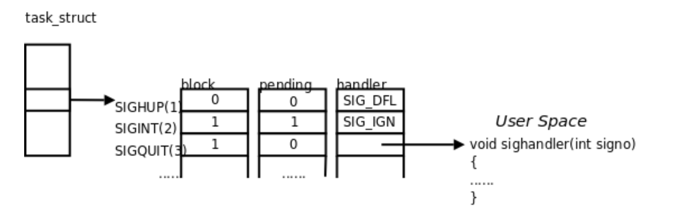

每个信号都有两个标志位分别表示阻塞和未决，还有一个函数指针表示处理动作。信号产生时，内核在进程控制块中设置该信号的未决标志，直到信号递达才清除该标志。在上图的例子中:

1. SIGHUP信号未阻塞也未产生过，当它递达时执行默认处理动作。
2. SIGINT信号产生过，但正在被阻塞，所以暂时不能递达。虽然它的处理动作是忽略，但在没有解除阻塞之前不能忽略这个信号，因为进程仍有机会改变处理动作之后再解除阻塞。
3. SIGQUIT信号未产生过，一旦产生SIGQUIT信号将被阻塞，它的处理动作是用户自定义函数sighandler。

未决和阻塞标志可以用相同的数据类型sigset_t来存储，sigset_t称为信号集，这个类型可以表示每个信号的“有效”或“无效”状态，在阻塞信号集中“有效”和“无效”的含义是该信号是否被阻塞，而在未决信号集中“有效”和“无效”的含义是该信号是否处于未决状态。下一节将详细介绍信号集的各种操作。阻塞信号集也叫做当前进程的信号屏蔽字（Signal Mask），这里的“屏蔽”应该理解为阻塞而不是忽略。 

### 5.捕捉信号

如果信号的处理动作是用户自定义函数，在信号递达时就调用这个函数，这称为捕捉信号。由于信号处理函数的代码是在用户空间的，处理过程比较复杂，举例如下：

1. 用户程序为`SIGQUIT`信号注册自定义处理函数`sighanler`；
2. 当前正在执行`main`函数，这时发生中断或异常切换到内核态。
3. 在中断处理完毕后要返回用户态的`main`函数之前检查到有信号`IGQUIT`递达。
4. 内核决定返回用户态后不是恢复`main`函数的上下文继续执行，而是执行`sighandler`函数，`sighandler`和`main`函数使用不同的堆栈空间，它们之间不存在调用和被调用的关系，是两个独立的控制流程。
5. `sighandler`函数返回后自动执行特殊的系统调用sigreturn再次进入内核态。
6. 如果没有新的信号要递达，这次再返回用户态就是恢复`main`函数的上下文继续执行了。

注意，当某个信号的处理函数被调用执行时，内核会自动将该信号加入进程的**信号屏蔽字**，当处理函数执行完后再恢复原来的信号屏蔽字，这样就能保证了在处理一个信号时，相同的信号再次产生，那么它会被阻塞到当前信号处理完毕结束为止。如果希望除了当前信号被自动屏蔽外，还希望屏蔽一些其他信号，则可以使用`sa_mask`字段来完成。

#### 5.1 sigaction

下面我们来介绍一个结构体: `sigaction`，该结构体就是信号的自定义描述，结构如下:

```c
#include <signal.h>

struct sigaction{
  void (*sa_hanlder) (int);
  sigset_t sa_mask;
  
  int sa_flags;
  void (*sa_sigaction) (int, siginfo_t *, void *);
}
```

`sa_handler`: 自定义处理函数的函数指针，传入`SIG_IGN`表示忽略信号，`SIG_DFL`表示执行默认处理行为;

`sa_mask`: 执行处理函数时要屏蔽的信号集合;

`sa_flags`: 设置为0即可;

有了信号自定义处理描述，接下来介绍如何将`sigaction`结构体和指定的信号绑定，通过`sigaction`函数进行绑定:

```c
#include <signal.h>

int sigaction(int signo, const struct sigaction* act, struct sigaction* oact);
```

`sigaction`函数可以读取和修改与指定信号相关联的处理动作。调用成功返回0，出错返回-1；

`signo`: 要绑定的信号编号;

`act`: 要绑定的信号处理行为;

`oact`: 用于传出该信号原来的处理行为;

编写一个简单的测试案例:

```c
#include <stdio.h>
#include <stdlib.h>
#include <signal.h>

/**
 * 自定义 SIGINT 信号处理函数
 * @param sig_no 触发的信号值
 */
void handler(int sig_no){
    printf("触发了 %d 信号，不会终止进程哦~\n",sig_no);
}

int main() {
    // 自定义信号处理行为
    struct sigaction custom_action;
    custom_action.sa_handler = handler; // 执行处理函数地址
    custom_action.sa_flags = 0;

    // 用于保存信号原来的处理行为信息
    struct sigaction old_action;

    // 绑定 SIGINT 信号的处理行为
    if (sigaction(SIGINT, &custom_action, &old_action) == -1){
        perror("bind SIGINT");
        exit(1);
    }
    // 阻塞程序，测试使用 Ctrl-C 是否可以终止进程.
    while (1);
}
```

运行后使用`Ctrl-C`来终止它试试:

```bash
$ ./a.out
^C触发了 2 信号，不会终止进程哦~
^C触发了 2 信号，不会终止进程哦~
^C触发了 2 信号，不会终止进程哦~
```

#### 5.2 pause

```c
#include <unistd.h>

int pause(void);
```

`pause`函数将当前进程**阻塞挂起**，直到有信号递达:

- 如果递达的信号处理动作是**终止进程**，则会结束进程，并且`pause`函数没有机会返回，就像执行`exit`函数一样;
- 如果递达的信号处理动作是**忽略**，进程则继续处于阻塞，`pause`函数不返回;
- 如果递达的信号处理动作是**被捕捉**后的自定义处理行为函数，则调用对应的处理函数之后返回-1，errno设置为`EINTR`，错误码EINTR表示“被信号中断”，所以pause只有出错的返回值;

#### 5.3 自定义sleep函数

通过`alarm`函数和`pause`函数自定义实现一个`sleep`函数:

```c
#include <stdio.h>
#include <unistd.h>
#include <signal.h>
#include <stdlib.h>

/**
 * 自定义 sleep 函数
 */

/**
 * 自定义 SIGALRM 信号处理函数
 * 该函数什么都不做，只用来将进程从内核态切换回用户态
 */
void wake_handler(int sig_no){
    return;
}

/**
 * 使当前进程阻塞挂起 second 秒
 * @param second 要阻塞的时长
 */
unsigned int my_sleep(unsigned int second){
    // 1. 对 SIGALRM 信号进行捕捉处理
    struct sigaction new_act, old_act;
    new_act.sa_handler = wake_handler;
    new_act.sa_flags = 0;
    sigemptyset(&new_act.sa_mask);
    if (sigaction(SIGALRM,&new_act,&old_act) == -1){
        perror("bind SIGALRM");
        exit(1);
    }

    // 2. 通知内核，在 second 秒后向该进程发送 SIGALRM 信号
    alarm(second);

    // 3. 调用 pause 函数阻塞进程，等待信号
    pause();

    // 4. 判断进程阻塞时长是否达到了 second 秒，
    // 如果没有则返回剩余的时长
    // alarm(0) 表示取消之前的定时时长，返回剩余的时间.
    unsigned int remain = alarm(0);

    // 5. 将SIGALRM 信号的处理还原
    sigaction(SIGALRM,&old_act,NULL);
    return remain;
}

int main(){
  my_sleep(3);
}
```

执行流程:

1. 通过`alarm`函数通知内核在`second`秒后向当前进程发送`SIGALRM`信号。
2. 调用`pause`等待，内核切换到别的进程运行。
3. `second`秒后，内核发`SIGALRM`给这个进程。
4. 从内核态返回这个进程的用户态之前处理未决信号，发现有`SIGALRM`信号，其处理函数是`wake_handler`。
5. 切换到用户态执行`wake_handler`函数，进入`wake_handler`函数时`SIGALRM`信号被自动屏蔽，从`wake_handler`函数返回时`SIGALRM`信号自动解除屏蔽。然后自动执行系统调用`sigreturn`再次进入内核，再返回用户态继续执行进程的主控制流程（main函数调用的`my_sleep`函数）。
6. `pause`函数返回-1，然后调用`alarm(0)`取消闹钟，调用`sigaction`恢复`SIGALRM`信号以前的处理动作。

**优化改进**

该函数目前存在一些问题: 系统运行的时序（Timing）并不像我们写程序时所设想的那样。虽然alarm(nsecs)紧接着的下一行就是pause()，但是无法保证pause()一定会在调用alarm(nsecs)之后的nsecs秒之内被调用。由于异步事件在任何时候都有可能发生（这里的异步事件指出现更高优先级的进程），如果我们写程序时考虑不周密，就可能由于时序问题而导致错误，这叫做竞态条件（Race Condition）。

解决方法就是将**解除信号屏蔽**和**挂起进程阻塞**合并成一个原子操作，可以通过`sigsuspend`函数来实现:

```c
#include <signal.h>

int sigsuspend(const sigset_t *sigmask);
```

和pause一样，sigsuspend没有成功返回值，只有执行了一个信号处理函数之后sigsuspend才返回，返回值为-1，errno设置为EINTR。

调用sigsuspend时，进程的信号屏蔽字由sigmask参数指定，可以通过指定sigmask来临时解除对某个信号的屏蔽，然后挂起等待，当sigsuspend返回时，进程的信号屏蔽字恢复为原来的值，如果原来对该信号是屏蔽的，从sigsuspend返回后仍然是屏蔽的。

改进版本:

```c
#include <stdio.h>
#include <unistd.h>
#include <signal.h>
#include <stdlib.h>

/**
 * 自定义 sleep 函数(优化版)
 *  函数执行流程:
 *   1. 设置 SIGALRM 信号的处理函数;
 *   2. 让当前进程屏蔽 SIGALRM 信号;
 *   3. 通知内核在n秒后向当前进程发送 SIGALRM 信号;
 *   4. 使用原子操作，同时执行下面两条操作
 *     4.1 让当前进程解除 SIGALRM 信号的屏蔽;
 *     4.2 阻塞挂起当前进程，等待信号的递达;
 *   5. 接收到 SIGALRM 信号，进程被唤醒, 查看有没有剩余的可阻塞时长
 *   6. 设置 SIGALRM 信号的处理函数置为默认处理函数;
 *   7. 恢复进程的信号屏蔽字信息;
 */


// 自定义 SIGALRM 信号处理函数
// 该函数什么都不做，只用来将进程从内核态切换回用户态
void wake_handler(int sig_no){
}

// 使当前进程阻塞挂起 second 秒
// @param second 要阻塞的时长
unsigned int my_sleep(unsigned int second){
    // 1. 对 SIGALRM 信号绑定处理函数
    struct sigaction new_act, old_act;
    new_act.sa_handler = wake_handler;
    new_act.sa_flags = 0;
    sigemptyset(&new_act.sa_mask);
    if (sigaction(SIGALRM,&new_act,&old_act) == -1){
        perror("bind SIGALRM");
        exit(1);
    }

    // 2. 屏蔽 SIGALRM 信号
    sigset_t mask, mask_back, sus_make;
    sigemptyset(&mask);
    sigaddset(&mask,SIGALRM);
    sigprocmask(SIG_BLOCK, &mask, &mask_back);

    // 3. 通知内核，在 second 秒后向该进程发送 SIGALRM 信号
    alarm(second);

    // 4. 解除 SIGALRM 信号的屏蔽 && 阻塞进程等待有信号递达(注意这是一个原子操作)
    sus_make = mask_back;
    sigdelset(&sus_make, SIGALRM);
    sigsuspend(&sus_make);

    // 5. 判断进程阻塞时长是否达到了 second 秒，
    // 如果没有则返回剩余的时长
    // alarm(0) 表示取消之前的定时时长，返回剩余的时间.
    unsigned int remain = alarm(0);

    // 6. 将SIGALRM 信号的处理行为还原为默认的
    sigaction(SIGALRM,&old_act,NULL);

    // 7. 恢复进程屏蔽字
    sigprocmask(SIG_SETMASK, &mask_back, NULL);
    return remain;
}

int main(void) {
    int n = 10;
    while (n){
        printf("%d\n",n);
        n--;
        my_sleep(1);
    }
    return 0;
}
```


#### 5.4 关于SIGCHLD信号

进程一章讲过用`wait`和`waitpid`函数清理僵尸进程，父进程可以阻塞等待子进程结束，也可以非阻塞地查询是否有子进程结束等待清理（也就是轮询的方式）。采用第一种方式，父进程阻塞了就不能处理自己的工作了；采用第二种方式，父进程在处理自己的工作的同时还要记得时不时地轮询一下，程序实现复杂。

其实，每一个子进程终止时都会给父进程发送一个`SIGCHLD`信号，该信号的默认处理动作是**忽略**，父进程可以自定义SIGCHLD信号的处理函数，这样父进程只需专心处理自己的工作，不必关心子进程了，子进程终止时会通知父进程，父进程在信号处理函数中调用wait清理子进程即可。

如下案例:

```c
#include <stdio.h>
#include <stdlib.h>
#include <signal.h>
#include <unistd.h>

/**
 * 请编写一个程序完成以下功能：父进程fork出子进程，子进程调用exit(2)终止，父进程自定
    义SIGCHLD信号的处理函数，在其中调用wait获得子进程的退出状态并打印。
 */


// 自定义子进程终止信号的 处理函数
void child_handler(int sig_no){
    int child_status;
    int child_pid = wait(&child_status);
    printf("子进程 %d 终止了，终止状态为: %d \n",child_pid, WEXITSTATUS(child_status));
}

int main() {
    // 设置 SIGCHLD 信号处理函数
    struct sigaction act;
    act.sa_flags = 0;
    sigemptyset(&act.sa_mask);
    act.sa_handler = child_handler;
    sigaction(SIGCHLD, &act, NULL);

    // 创建子进程
    pid_t pid = fork();
    switch (pid) {
        case -1:
            perror("fork process");
            return 1;
        case 0:
            // child process
            // 直接终止子进程，以 SIGINT 信号方式终止
            exit(2);
        default:
            // parent process
            // 3秒后结束程序.
            sleep(3);
            break;
    }
    return 0;
}

```


## 线程

### 线程的概念

**线程(Thread)**是操作系统能够进行**调度运行**的最小单元。它被包含在**进程**之中，是进程中的实际运行单元。一条线程指的是进程中的一个独立的控制流，一个进程中可以同时存在多个线程，但至少会存在一个**主线程**。每条线程**并行执行**不同的任务。就像操作系统可以同时运行多个进程一样，每个进程中又可以同时运行多个线程。

进程在各自独立的地址空间中运行，而进程中的线程则共享这整片地址空间，因此进程的**数据段(Data Segment)**和**代码段(Text Segment)**都是共享的，如函数、全局变量等等在各线程中都是可以访问调用的，除此之外还**共享**以下进程资源:

- 文件描述符表
- 每种信号的处理方式(自定义的信号处理函数)
- 当前工作目录
- 用户id和组id

但也有一些资源时每个**线程私有的**:

- 线程id
- 线程上下文信息，记录各种寄存器的值、程序计数器和栈指针,保存在一个`context`结构体中
- 栈空间
- errno 变量
- 信号屏蔽字
- 调度优先级

线程库的函数是由POSIX标准定义的，所以头文件称之为`pthread.h`，在Linux上该函数库位于`libpthread`共享库中，因此在编译时要加上`-lpthread`参数;

### 线程的创建

```c
#include <pthread.h>

int pthread_create(pthread_t *thread, 
                   const pthread_attr_t *attr,
                   void *(*start_routine) (void *), 
                   void *arg);
```

- `thread`: 通过该参数传出线程的id;
- `attr`: 线程的属性，通常设置为`NULL`;
- `start_routine`: 这是一个函数指针，也就是创建的线程要执行的任务函数;
- `arg`: 任务函数的参数;

在一个线程中调用`pthread_create`函数创建**新的线程**后，**当前线程**得到该函数返回值后继续往下执行，而新线程将执行`start_routine`函数，并且将`arg`作为唯一的参数传递给`start_routine`函数。并且将新线程的id写入到`thread`参数所指向的内存单元中。

新线程执行完`start_routine`函数，这个线程就退出了，父线程可以调用`pthread_join`函数来得到`start_routine`函数的返回值，类似于父进程中调用`wait`得到子进程的终止状态。

我们知道进程id的类型是`pid_t`，每个进程的id在整个系统中是唯一的，调用`getpid(2)`可以获得当前进程的id，是一个正整数值。

线程id的类型是`thread_t`，它只在当前进程中保证是唯一的，在不同的系统中`thread_t`这个类型有不同的实现，它可能是一个整数值，也可能是一个结构体，也可能是一个地址，所以不能简单地当成整数用printf打印，调用`pthread_self(3)`可以获得当前线程的id。

创建线程案例:

```c
#include <stdio.h>
#include <stdlib.h>
#include <pthread.h>
#include <unistd.h>

/**
 * 线程要执行的任务函数
 * @param msg
 */
void* task(void* arg){
    printf("%s \n", arg);
    return NULL;
}

int main() {
    pthread_t tid; // 用于保存线程的id

    // 创建线程
    int res_no = pthread_create(&tid, NULL, task, "Hello thread.");;
    if(res_no){
        // 错误处理
      	fprintf(stderr, "thread create: %s \n", strerror(res_no));
        exit(1);
    }
    sleep(1);
    printf("创建的子线程ID: %d\n", tid);
    return 0;
}
```

然后编译: 

```bash
$ gcc main.c -lpthread
$ ./a.out
```

切记，别忘了加上`-lpthread`选项，否则链接器将会找不到`pthread_create`函数.

在Linux上，`thread_t`类型是一个地址值，属于同一进程的多个线程调用getpid(2)可以得到相同的进程号，而调用`pthread_self(3)`得到的线程号各不相同。

由于`pthread_create`的错误码不保存在`errno`中，因此不能直接用`perror(3)`打印错误信息，可以先用`strerror(3)`把错误码转换成错误信息再打印。

如果进程中的任意一个线程调用了`exit`函数，则整个进程直接终止，由于从main函数return也相当于调用`exit`，为了防止新创建的线程还没有得到执行就终止，我们在main函数return之前延时1秒，这只是一种权宜之计。

### 线程的控制

#### 线程终止

线程的终止方式有如下几种:

- 通过调用`pthread_exit`函数来终止当前线程(主动);
- 从线程**任务函数**中`return`，或者正常执行结束(主动);
- 被其他线程通过`pthread_cancel`函数终止(被动);
- 进程中的任意线程调用`exit`函数，则所有线程终止(主动 Or 被动);

```c
#include <pthread.h>

void pthread_exit(void* value_ptr);
```

`pthread_exit`函数用于终止当前线程，`value_ptr`作为线程的返回值存储单元，其他线程可以通过`pthread_join`来获得这个指针;

> **注意:** `pthread_exit`或者return返回的指针所指向的内存单元必须是全局区或者堆区的内存地址，不可以是线程函数栈中的内存。

#### 线程同步

线程之间是并行关系，它们的执行顺序是无法确定的，但是在某些场景下我们需要让它们按照顺序执行，这时候就需要同步机制。

```c
#include <pthread.h>

int pthread_join(pthread_t thread, void** value_ptr);
```

- `thread`: 要等待结束的线程的id;
- `value_ptr`: 结束线程的返回值的指针;

调用`pthread_join`函数会将**当前线程阻塞挂起**，直到id为`thread`的线程终止之后才会继续执行。

线程被终止的方式不同，终止状态也会存在差异，规则如下:

1. 如果线程通过`return`关键字终止，`value_ptr`则指向线程的**任务函数**的返回值指针;
2. 如果线程被别的线程通过`pthread_cancel`异常终止，`value_ptr`则指向常量`PTHREAD_CANCELED`;
3. 如果线程通过主动调用`pthread_exit`终止，`value_ptr`则指向`pthread_exit`函数中的`value_ptr`参数地址;

如果对线程的终止状态不感兴趣，可以将`NULL`作为`value_ptr`参数传入;

成功返回0，错误则返回错误码;

**案例一:**

```c
#include <stdio.h>
#include <pthread.h>
#include <string.h>
#include <stdlib.h>

/**
 * 方式一: 线程通过 return终止方式;
 */

// 线程函数
void* task(void* arg){
    printf("new thread running task \n");
    printf("task arg: %d \n",arg);
    return (void*)200;
}

int main() {
    // 线程id
    pthread_t threadId;
    // 创建线程
    int errno = pthread_create(&threadId, NULL, task, (void*)100);
    if(errno){
        fprintf(stderr,"create thread failed: %s \n", strerror(errno));
        exit(errno);
    }

    // 等待线程结束，并且获取线程执行的函数返回值
    void* res;
    errno = pthread_join(threadId, &res);
    if(errno){
        fprintf(stderr,"join thread failed: %s \n", strerror(errno));
        exit(errno);
    }
    printf("new thread stop res: %d \n", (int)res);
    return 0;
}
```

执行结果:

```bash
new thread running task
task arg: 100
new thread stop res: 200
```

**案例二:**

```c
#include <stdio.h>
#include <pthread.h>
#include <string.h>
#include <stdlib.h>
/**
 * 方式二: 线程通过 pthread_exit方式终止;
 */

// 线程函数
void* task(void* arg){
    printf("new thread running task \n");
    printf("task arg: %d \n",arg);

    // TODO 通过 pthread_exit 终止线程，并且传出返回值指针
    pthread_exit((void*) 200);
}

int main() {
    // 线程id
    pthread_t threadId;
    // 创建线程
    int errno = pthread_create(&threadId, NULL, task, (void*)100);
    if(errno){
        fprintf(stderr,"create thread failed: %s \n", strerror(errno));
        exit(errno);
    }

    // 等待线程结束，并且获取线程执行的函数返回值
    void* res;
    errno = pthread_join(threadId, &res);
    if(errno){
        fprintf(stderr,"join thread failed: %s \n", strerror(errno));
        exit(errno);
    }
    printf("new thread stop res: %d \n", (int)res);
    return 0;
}
```

执行结果:

```bash
new thread running task
task arg: 100
new thread stop res: 200
```

**案例三:**

```c
#include <stdio.h>
#include <pthread.h>
#include <string.h>
#include <stdlib.h>
#include <unistd.h>

/**
 * 方式三: 被其他线程通过 pthread_cancel 函数终止;
 */

// 线程函数
void* task(void* arg){
    printf("new thread running task \n");
    // 手动进入死循环
    int sec = 0;
    while (1){
        printf("new thread sleep %d sec. \n", ++sec);
        sleep(1);
    }
}

int main() {
    // 线程id
    pthread_t threadId;
    // 创建线程
    int errno;
    if((errno = pthread_create(&threadId, NULL, task, NULL))){
        fprintf(stderr,"create thread failed: %s \n", strerror(errno));
        exit(errno);
    }

    sleep(3);
    // TODO 中断线程
    // 三秒后，主线程通过 pthread_cancel 主动打断新线程的运行
    if ((errno = pthread_cancel(threadId))){
        fprintf(stderr,"cancel thread failed: %s \n", strerror(errno));
        exit(errno);
    };

    // TODO  等待线程结束，并且获取线程执行的函数返回值
    void* res;
    if((errno = pthread_join(threadId, &res))){
        fprintf(stderr,"join thread failed: %s \n", strerror(errno));
        exit(errno);
    }
    if (res == PTHREAD_CANCELED){
        // 线程是被其他线程取消的
        printf("new thread is cancel res: %d \n",(int)res);
    }
    return 0;
}
```

执行结果:

```bash
new thread running task
new thread sleep 1 sec.
new thread sleep 2 sec.
new thread sleep 3 sec.
new thread sleep 4 sec.
new thread is cancel res: 1
```

在Linux的`pthread`库中常数`PTHREAD_CANCELED`的值为`-1`:

```c
#define PTHREAD_CANCELED 		((void *) -1)
```

而在MacOS中值为`1`:

```c
#define PTHREAD_CANCELED	  ((void *) 1)
```

一般情况下，线程终止后，其终止状态一直保留到其它线程调用`pthread_join`获取它的状态为止。但是线程也可以被置为**detach状态**,这样的线程一旦终止就立刻回收它占用的所有资源，而不保留终止状态。所以不能对一个已经处于**detach状态**的线程调用`pthread_join`这样的调用将返回`EINVAL`。

对一个尚未**detach**的线程调用`pthread_join`或`pthread_detach`都可以把该线程置为**detach状态**,也就是说，不能对同一线程调用两次`pthread_join`，或者如果已经对一个线程
调用了`pthread_detach`就不能再调用`pthread_join`了。

```c
#include <pthread.h>

int pthread_detach(pthread_t tid);
```

成功返回0，失败返回错误码;

#### Mutex

多个线程同时对**共享数据**进行修改时可能会产生冲突，从而导致数据的不稳定性，这跟前面讲到的信号的可重入性是同样的问题。

如下案例:

```c
#include <pthread.h>
#include <stdio.h>

int counter = 0;

// 对 counter 自增,循环5000次
void* add(void *arg) {
  for (int i = 0; i < 5000; i++) {
    counter++;
  }
  return NULL;
}

int main() {
    // 启用两个线程，分别执行 add 函数
    pthread_t t1, t2;
    pthread_create(&t1, NULL, add, NULL);
    pthread_create(&t2, NULL, add, NULL);
    // 等待两个线程结束
    pthread_join(t1,NULL);
    pthread_join(t2,NULL);
    // 输出结果值
    printf("counter: %d \n", counter);
    return 0;
}

```

编译后运行，多运行几次，你会发现`counter`的值是不稳定的:

```bash
$ gcc main.c -lpthread
$ ./a.out
counter: 10000
$ ./a.out
counter: 10000
$ ./a.out
counter: 5349
$ ./a.out
counter: 9833
```

原因也很简单: `a++`这行代码最终会被拆解成三条指令，并不是一个**原子操作**。

那么如何解决？最普遍的方式就是引入**互斥锁(Mutex Lock)**，简单来说就是把可能存在发生冲突的**共享资源**和一把锁关联起来，只有拿到这把锁才能访问该资源，但是由于这把锁只存在一把，所以最多只能有一个人同时访问该资源，其他人只能选择排队。

Mutex使用`pthread_mutex_t`类型表示，表示为一把互斥锁;

##### 初始化Mutex

```c
#include <pthread.h>

int pthread_mutex_init(pthread_mutex_t* mutex, const pthread_mutexattr_t* attr);
# 返回值：成功返回0，失败返回错误号。
```

`pthread_mutex_init`函数用于对`pthread_mutex_t`进行初始化。`attr`参数是设定Mutex的属性，一般设置为`NULL`即可;

如果Mutex是**全局变量**或者**静态变量**，也可以直接使用宏定义`PTHREAD_MUTEX_INITIALIZER`来初始化，如下两种初始化方式:

```c
#include <pthread.h>

// 全局互斥锁
pthread_mutex_t lock1 = PTHREAD_MUTEX_INITIALIZER;

int main(){
  // 局部互斥锁
  pthread_mutex_t lock2;
  pthread_mutex_init(&lock2, NULL);
}
```

##### 销毁Mutex

Mutex也可以销毁，通过`pthread_mutex_destroy`函数销毁:

```c
#include <pthread.h>

int pthread_mutex_destroy(pthread_mutex_t *mutex);
# 
```

##### 加锁

```c
#include <pthread.h>

int pthread_mutex_lock(pthread_mutex_t *mutex);
int pthread_mutex_trylock(pthread_mutex_t *mutex);
# 返回值：成功返回0，失败返回错误号
```

`pthread_mutex_lock`会一直阻塞着，直到获取到锁;

`pthread_mutex_trylock`会尝试获取锁，不管能不能拿到锁都会立即返回;

##### 解锁

```c
#include <pthread.h>

int pthread_mutex_unlock(pthread_mutex_t *mutex);
# 返回值：成功返回0，失败返回错误号
```

接下来使用Mutex来解决上一个问题:

```c
#include <stdio.h>
#include <pthread.h>
#include <string.h>

/**
 * 使用 Mutex 实现 多线程的同步
 */

// 共享资源
int counter = 0;
/// 定义并且初始化互斥锁
pthread_mutex_t counter_lock = PTHREAD_MUTEX_INITIALIZER;

// 对 counter 自增,循环5000次
void* add(void *arg) {
    pthread_mutex_init(&counter_lock, NULL);
    for (int i = 0; i < 5000; i++) {
        /// 加锁
        int errno = pthread_mutex_lock(&counter_lock);
        if(errno != 0){
            // 加锁失败
            fprintf(stderr,"lock failed: %s \n",strerror(errno));
        }

        /// 操作共享数据
        counter++;

        /// 解锁
        errno = pthread_mutex_unlock(&counter_lock);
        if(errno != 0){
            // 解锁失败
            fprintf(stderr,"unlock failed: %s \n",strerror(errno));
        }
    }
    return NULL;
}

int main() {
    // 启用 10 个线程测试
    pthread_t tids[10];
    for (int i = 0; i < 10; i++) {
        pthread_create(&tids[i], NULL, add, NULL);
    }
    pthread_mutex_init();

    // 等待10个线程全部结束
    for (int i = 0; i < 10; i++) {
        pthread_join(tids[i], NULL);
    }

    // 销毁互斥锁
    pthread_mutex_destroy(&counter_lock);

    // 输出总结果
    printf("counter: %d \n", counter);
    return 0;
}
```

如果程序正确，那么结果应该总是 50000~

##### 补充

Mutex的两个基本操作lock和unlock是如何实现的呢？

假设Mutex变量的值为`0`表示互斥锁空闲，这时某个进程调用lock可以获得锁，而Mutex的值为0表示互斥锁已经被某个线程获得，其它线程再调用lock只能挂起等待。那么lock和unlock的伪代码如下：

```c
// 加锁
lock: 
	if(mutex == 0){
    mutex = 1;
  }else{
    // 阻塞等待，直到被其他线程唤醒;
		goto lock;
  }

// 解锁
unlock:
	mutex = 0;
	... // 唤醒其他阻塞等待的线程
```

unlock操作中唤醒等待线程的步骤可以有不同的实现，可以只唤醒一个等待线程，也可以唤醒所有等待该Mutex的线程，然后让被唤醒的这些线程去竞争获得这个Mutex，竞争失败的线程继续挂起等待。

细心的读者应该已经看出问题了：对Mutex变量的读取、判断和修改不是原子操作。如果两个线程同时调用lock，这时Mutex是0，两个线程都判断mutex==0成立，然后其中一个线程置mutex=1，而另一个线程并不知道这一情况，也置mutex=1，于是两个线程都以为自己获得了锁。

为了实现互斥锁操作，大多数体系结构都提供了`swap`或`exchange`指令，该指令的作用是把寄存器和内存单元的数据相交换，由于只有一条指令，保证了原子性，即使是多处理器平台，访问内存的总线周期也有先后，一个处理器上的交换指令执行时另一个处理器的交换指令只能等待总线周期。

“挂起等待”和“唤醒等待线程”的操作如何实现？每个Mutex有一个等待队列，一个线程要在Mutex上挂起等待，首先在把自己加入等待队列中，然后置线程状态为睡眠，然后调用调度器函数切换到别的线程。一个线程要唤醒等待队列中的其它线程，只需从等待队列中取出一项，把它的状态从睡眠改为就绪，加入就绪队列，那么下次调度器函数执行时就有可能切换到被唤醒的线程。

**死锁**

一般情况下，如果同一个线程先后两次调用lock，在第二次调用时，由于锁已经被占用，该线程会挂起等待别的线程释放锁，然而锁正是被自己占用着的，该线程又被挂起而没有机会释放锁，因此就永远处于挂起等待状态了，这叫做死锁（Deadlock）。另一种典型的死锁情形是这样：线程A获得了锁1，线程B获得了锁2，这时线程A调用lock试图获得锁2，结果是需要挂起等待线程B释放锁2，而这时线程B也调用lock试图获得锁1，结果是需要挂起等待线程A释放锁1，于是线程A和B都永远处于挂起状态了。

#### Condition

如果我们需要多个线程之间交替执行，根据某个条件是否成立协调各个线程的执行，就需要通过**条件变量(Condition Variable)**来实现，简单点说就是，**Condition**可以让**Mutex**的同步粒度更细一些，做到一些更精准的操作。最典型的就是**生产者与消费者模型**。

**Condition**使用`pthread_cond_t`类型来表示，可通过以下两个方法来进行初始化和销毁:

```c
#include <pthread.h>

int pthread_cond_init(pthread_cond_t* cond, const pthread_condattr_t* attr);
int pthread_cond_destroy(pthread_cond_t *cond);
# 成功返回0，失败返回错误号。
```

如果Condition是静态分配的，也可以使用宏定义来初始化:

```c
pthread_cond_t cond = PTHREAD_COND_INITIALIZER;
```

Condition Variable的操作函数有如下:

```c
#include <pthread.h>

int pthread_cond_wait(pthread_cond_t* cond, pthread_mutex_t* mutex);
int pthread_cond_timedwait(pthread_cond_t* cond, pthread_mutex_t* mutex, const struct timespec* abstime);
# 成功返回0，失败返回错误号。
```

`pthread_cond_wait`: 释放Mutex，并且挂起阻塞当前线程，等待唤醒;

`pthread_cond_timedwait`: 同上，但是可以指定超时时间，一旦超过这个时间没有被唤醒，则返回`ETIMEDOUT`;

```c
#include <pthread.h>

int pthread_cond_broadcast(pthread_cond_t *cond);
int pthread_cond_signal(pthread_cond_t *cond);
# 成功返回0，失败返回错误号。
```

`pthread_cond_signal`: 唤醒阻塞在`cond`上的某一个等待线程;

`pthread_cond_broadcast`: 唤醒阻塞在`cond`上的所有等待线程;

生产者消费者案例:

```c
#include <stdio.h>
#include <pthread.h>
#include <unistd.h>

/**
 * 通过 Mutex 和 Condition 实现一个生产者消费者模型
 */


// ============== 共享资源 ================
int cakeCount = 0;    // 当前蛋糕数量
int maxCakeCount = 10;// 最大蛋糕数量
int producerSum = 0; // 共生产的蛋糕数量
int consumerSum = 0; // 共消费的蛋糕数量
// ======================================

// ============= 同步工具 =================
// 互斥锁
pthread_mutex_t lock = PTHREAD_MUTEX_INITIALIZER;
// 条件变量
pthread_cond_t cond = PTHREAD_COND_INITIALIZER;
// =======================================

/**
 * 生产者线程函数
 */
void* producerTask(void* arg){
    // 加锁
    pthread_mutex_lock(&lock);
    // 生产蛋糕
    while (1){
        if(cakeCount >= maxCakeCount){
            // 已到达最大数量，无法继续生产
            // 唤醒消费者
            pthread_cond_signal(&cond);
            if(producerSum == 20){
                // 停止生产者
                printf("生产者生成完成20个蛋糕，结束!\n");
                break;
            }
            printf("蛋糕已满，不能继续生产，唤醒消费者! \n");
            // 阻塞生产者
            pthread_cond_wait(&cond, &lock);
        }
        cakeCount++;
        producerSum++;
        printf("生产者生成了1个蛋糕，当前蛋糕数量: %d，共生产蛋糕数量: %d \n",cakeCount,producerSum);
        sleep(1);
    }
    // 解锁
    pthread_mutex_unlock(&lock);
}

/**
 * 消费者线程函数
 */
void* consumerTask(void* arg){
    // 加锁
    pthread_mutex_lock(&lock);
    // 消费蛋糕
    while (1){
        if(cakeCount <= 0){
            // 没有蛋糕了，无法继续消费
            // 唤醒生产者
            pthread_cond_signal(&cond);
            if(consumerSum == 20){
                printf("消费者共消费蛋糕数量: %d，结束!\n",consumerSum);
                break;
            }
            printf("没有蛋糕了，唤醒生产者!\n");
            // 阻塞消费者
            pthread_cond_wait(&cond,&lock);
        }
        cakeCount--;
        consumerSum++;
        printf("消费者消费了1个蛋糕，当前蛋糕数量: %d，共消费蛋糕数量: %d\n",cakeCount,consumerSum);
        sleep(1);
    }
    // 解锁
    pthread_mutex_unlock(&lock);
}

int main() {
    pthread_t producer, consumer;
    // 开启生产者
    pthread_create(&producer, NULL, producerTask, NULL);
    // 开启消费者
    pthread_create(&consumer, NULL, consumerTask, NULL);

    pthread_join(producer,NULL);
    pthread_join(consumer,NULL);
    return 0;
}
```

#### Semaphore

刚刚学完的**Mutex(互斥)**机制可以保证同一时间**仅有一个**线程能访问指定的**共享资源**，而**Semaphore(信号量)**机制可以保证同一时间有**限定数量**的线程访问共享资源。

简单点说就是**Mutex**变量是非0即1的，默认为1，表示有一个可用资源，加锁后则变为0，表示没有资源可用。而**Semaphore**的可用资源数量可以大于1.

而且，**Semaphore**不仅可以用于线程间的同步，还可以实现进程间的通信。

**Semaphore**变量的类型为`sem_t`。

##### 初始化和销毁

初始化函数:

```c
#include <semaphore.h>

int sem_init(sem_t *sem, int pshared, unsigned int value);
```

- `sem`： 要初始化的信号量变量;
- `value`: 表示该信号量可用的资源数量;
- `pshared`: 设置为0表示线程同步，1表示为进程同步;

销毁函数:

```c
#include <semaphore.h>

int sem_destroy(sem_t * sem);
```

在用完semaphore变量之后应该调用sem_destroy()释放与semaphore相关的资源。

##### 阻塞与唤醒

```c
#include <semaphore.h>

int sem_wait(sem_t *sem);
int sem_trywait(sem_t *sem);
int sem_post(sem_t * sem);
```

`sem_wait`: 获取信号量资源，使`semaphore`的值减1，如果当前已经没有可用资源，则挂起等待。

`sem_wait`: 尝试获取信号量资源，没有可用资源则直接返回。

`sem_post`: 释放信号量资源，使`semaphore`的值加1，同时唤醒其他等待的线程;


## Shell编程

### 1.Shell的历史

Shell的作用就是**解释并且执行用户的指令**，用户输入一条命令，Shell就解释执行一条命令，这种方式称为**交互式(Interactive)**。

Shell还有另一种执行命令的方式: 将多条命令写成一个脚本(Script)，里面包含了要执行的多条命令，让Shell一次性把这些命令执行完，而不是一条一条的输入执行，这种方式称为**批处理(Batcg)**。Shell脚本和编程语言很相似，也有变量和流程控制语句，但Shell脚本是解释执行的，不需要编译，Shell程序从脚本中一行一行读取并执行这些命令，相当于一个用户把脚本中的命令一行一行敲到Shell提示符下执行。

由于历史原因，UNIX系统上有多种Shell:

- **sh (Bourne Shell)**: 由Steve Bourne开发，各种UNIX系统都配有sh。
- **csh (C Shell)**: 由Bill Joy开发，随BSD UNIX发布，它的流程控制语句很像C语言，支持很多Bourne Shell所不支持的功能：作业控制，命令历史，命令行编辑。
- **ksh (Korn Shell)**: 由David Korn开发，向后兼容sh的功能，并且添加了csh引入的新功能，是目前很多UNIX系统标准配置的Shell，在这些系统上/bin/sh往往是指向/bin/ksh的符号链接。
- **tcsh (TENEX C Shell)**: 是csh的增强版本，引入了命令补全等功能，在FreeBSD、Mac OS X等系统上替代了csh。
- **bash (Bourne Again Shell)**: 由GNU开发的Shell，主要目标是与POSIX标准保持一致，同时兼顾对sh的兼容，bash从csh和ksh借鉴了很多功能，是各种Linux发行版标准配置的Shell，在Linux系统上/bin/sh往往是指向/bin/bash的符号链接[36]。虽然如此，bash和sh还是有很多不同的，一方面，bash扩展了一些命令和参数，另一方面，bash并不完全和sh兼容，有些行为并不一致，所以bash需要模拟sh的行为：当我们通过sh这个程序名启动bash时，bash可以假装自己是sh，不认扩展的命令，并且行为与sh保持一致。

文件/etc/shells给出了系统中所有已知（不一定已安装）的Shell，除了上面提到的Shell之外还有很多变种:

```bash
$ cat /etc/shells
# List of acceptable shells for chpass(1).
# Ftpd will not allow users to connect who are not using
# one of these shells.

/bin/bash
/bin/csh
/bin/dash
/bin/ksh
/bin/sh
/bin/tcsh
/bin/zsh
```

用户的默认Shell设置在/etc/passwd文件中，例如下面配置设置:

```bash
$ cat /etc/passwd
...
root:x:0:0:root:/root:/usr/local/bin/zsh
...
zero:x:1000:1000::/home/zero:/bin/bash
```

当`root`用户打开终端窗口时，就会自动执行`/usr/local/bin/zsh`Shell。

而`zero`用户打开终端窗口时，就会自动执行`/bin/bash`Shell。

### 2.Shell执行命令

#### 2.1 执行交互式命令

用户在命令行输入命令后，一般情况下Shell会fork并exec该命令，但是Shell的内建命令例外，执行内建命令相当于调用Shell进程中的一个函数，并不创建新的进程。以前学过的`cd`、`alias`、`umask`、`exit`等命令即是内建命令，凡是用`which`命令查不到程序文件所在位置的命令都是内建命令。

本节会介绍很多内建命令，如`export`、`shift`、`if`、`eval`、`[`、`for`、`while`等等。内建命令虽然不创建新的进程，但也会有Exit Status，通常也用0表示成功非零表示失败，虽然内建命令不创建新的进程，但执行结束后也会有一个状态码，也可以用特殊变量$?读出。

#### 2.2 执行Shell脚本

首先编写一个简单的脚本，保存为script.sh:

```sh
#! /bin/sh

cd ..
ls
```

Shell脚本中用#表示注释，相当于C语言的//注释。

但如果#位于第一行开头，并且是`#!`（称为Shebang）则例外，它表示该脚本使用后面指定的解释器`/bin/sh`解释执行。

接下来为该脚本赋予执行权限，并且执行该脚本:

```bash
$ chmod +x script.sh
$ ./script.sh
```

Shell会`fork`一个子进程并调用`exec`执行`./script.sh`这个程序，
exec系统调用应该把子进程的代码段替换成./script.sh程序的代码段，并从它_start开始执行。然而script.sh是个文本文件，根本没有代码段和_start函数，怎么办呢？其实exec还有另外一种机制，如果要执行的是一个文本文件，并且第一行用Shebang指定了解释器，则用解释器程序的代码段替换当前进程，并且从解释器的_start开始执行，而这个文本文件被当作命令行参数传给解释器。因此，执行上述脚本相当于如下操作:

```bash
$ /bin/sh ./script.sh
```

以这种方式执行不需要script.sh文件具有可执行权限。

两种执行Shell脚本的方法:

```bash
$ ./script.sh

$ sh ./script.sh
```

这两种方法本质上是一样的,另外还有一种方式:

```bash
$ source ./script.sh

或者

$ . ./script.sh
```

source或者.命令是Shell的内建命令，这种方式也不会创建子Shell，而是直接在交互式Shell下逐行执行脚本中的命令。也就是说脚本中所执行的命令会影响到Shell本身，例如在脚本中通过`cd`内建命令进入了其他工作目录，结束后Shell也会处于这个工作目录。

### 3.Shell基本语法

##### 变量

按照惯例，Shell变量由全大写字母加下划线组成，有两种类型的Shell变量:

- **本地变量**: 只存在于当前Shell进程，用set命令可以显示当前Shell进程中定义的所有变量（包括本地变量和环境变量）和函数。
- **环境变量**: 环境变量可以从父进程传给子进程，因此Shell进程的环境变量可以从当前Shell进程传给fork出来的子进程。用printenv命令可以显示当前Shell进程的环境变量。

环境变量是任何进程都有的概念，而本地变量是Shell特有的概念。在Shell中，环境变量和本地变量的定义和用法相似。

在Shell中定义或赋值一个变量：

```sh
$ UNAME=zhangsan
```

注意`=`两边不能有空格，否则会被Shell解释成命令和命令行参数。

本地变量定义后仅存在于当前Shell进程，使用`export`命令可以将本地变量导出为环境变量:

```sh
$ UNAME=zhangsan
$ export UNAME
```

也可以一步完成:

```sh
$ export UNAME=zhangsan
```

使用`unset`命令可以删除已定义的本地变量或环境变量:

```sh
$ unset UNAME
```

可以通过`$`或者`${}`来获取已存在的变量的值，如下所示:

```sh
$ echo $UNAME
zhangsan
$ echo ${UNAME}
zhangsan
```

Shell中的变量不需要明确指定类型，事实上Shell变量的值都是字符串，比如我们定义VAR=45，其实VAR的值是字符串45而非整数。Shell变量不需要先定义后使用，如果对一个没有定义的变量取值，则值为空字符串。

##### 文件名代换

这些用于匹配的字符称为通配符（Wildcard），具体如下:

| 通配符     | 说明                               |
| ---------- | ---------------------------------- |
| *          | 匹配0个或多个任意字符              |
| ?          | 匹配一个任意字符                   |
| [若干字符] | 匹配方括号中任意一个字符的一次出现 |

```sh
$ ls /dev/ttyS*
$ ls ch0?.doc
$ ls ch0[0-2].doc
$ ls ch[012][0-9].doc
```

注意，Globbing所匹配的文件名是由Shell展开的，也就是说在参数还没传给程序之前已经展开了，比如上述ls ch0[012].doc命令，如果当前目录下有ch00.doc和ch02.doc，则传给ls命令的参数实际上是这两个文件名，而不是一个匹配字符串。

##### 命令代换

用反引号或者`$()`括起来的内容也可以是一条命令，Shell会优先执行该命令，然后将命令的输出结果作为值替换到命令行中，如下:

```sh
$ DATE=`date`
$ echo $DATE
2024年 01月 28日 星期日 18:50:50 CST
```

也可以使用`$()`来代换:

```sh
$ DATE=$(date)
$ echo ${DATE}
2024年 01月 28日 星期日 18:50:50 CST
```

##### 算术代换

之前说到了，Shell中的变量都是字符串类型，那么如果想进行数字运算呢？这个时候就需要使用`$(())`来进行运算，`$(())`中的Shell变量取值将转换为整数，如下:

```sh
$ AGE=18
$ NEW_AGE=$(($AGE + 3))
$ echo $NEW_AGE
21
```

`$(())`中只能用 + - * / 和()运算符，并且只能做整数运算。

##### 单引号

Shell脚本中的单引号和双引号一样都是字符串的界定符。单引号保证引号内所有的字符的字面值，不存在特殊含义，所以不会进行解析,如下:

```sh
$ echo '$SHELL'
$SHELL
```

##### 双引号

双引号同样也是字符串边界符，但是会对特殊字符进行解析，如下:

```sh
$ echo "$SHELL"
/usr/local/bin/zsh

$ echo "`date`"
2024年 01月 28日 星期日 19:04:27 CST
```

### 4.Bash启动脚本

启动脚本是**bash**程序启动时自动执行的脚本。用户可以把一些环境变量的设置和alias、umask设置放在启动脚本中，这样每次启动Shell时这些设置都自动生效。

启动bash的方法不同，执行启动脚本的步骤也不相同，具体可分为以下几种情况:

#### - 登录交互式启动

交互Shell是指用户在提示符下输命令的Shell而非执行脚本的Shell，登录Shell就是在输入用户名和密码登录后得到的Shell，比如从字符终端登录或者用telnet/ssh从远程登录。

这样启动bash会自动执行以下脚本:

1. 首先执行`/etc/profile`脚本文件，系统中每个用户登录时都要执行这个脚本，如果系统管理员希望某个设置对所有用户都生效，可以写在这个脚本里。

2. 然后在当前用户主目录下依次寻找`~/.bash_profile`、`~/.bash_login`和`~/.profile`三个脚本文件，按照这个顺序找到第一个存在并且可读的脚步文件来执行。如果希望某些配置只对当前用户生效，那么可以配置在这里。并且由于该脚本是在`/etc/profile`之后执行，所以该脚本的优先级更高，重复的配置会覆盖掉`/etc/profile`文件中的配置。

   `~/.profile`这个启动脚本是sh规定的，bash规定首先查找以`~/.bash_`开头的启动脚本，如果没有则执行`~/.profile`，是为了和sh保持一致。

3. 顺便一提，在退出登录时会执行~/.bash_logout脚本（如果它存在的话）。

#### - 非登录交互式启动

比如在图形界面下打开一个终端窗口，或者在Shell中输入bash命令，就得到一个非登录式Shell。

这种Shell在启动时自动执行`~/.bashrc`脚本。

为了使登录式Shell也能执行`~/.bashrc`脚本，通常会在`~/.bash_profile`中调用执行`~/.bashrc`文件，在`~/.bash_profile`中追加以下内容:

```shell
if [ -f ~/.bashrc]; then
	. ~/.bashrc
fi
```

这段代码的意思是: 如果`~/.bashrc`文件存在，则以`source`方式执行它。

多数Linux发行版在创建帐户时会自动创建`~/.bash_profile`和`~/.bashrc`脚本，`~/.bash_profile`中通常都有上面这几行。所以，如果要在启动脚本中做某些设置，使它在图形终端窗口和字符终端的Shell中都起作用，最好就是在`~/.bashrc`中设置。

#### - 非交互式启动

为执行脚本而fork出来的子Shell是非交互Shell，启动时执行的脚本文件由环境变量BASH_ENV定义，相当于自动执行以下命令：

```shell
if [ -n "$BASH_ENV" ]; then
		. "$BASH_ENV";
fi
```

如果环境变量BASH_ENV的值不是空字符串，则把它的值当作启动脚本的文件名，source执行这个脚本。

#### - 以sh命令启动

如果以sh命令启动bash，bash将模拟sh的行为，以~/.bash_开头的那些启动脚本就不认了。所以，如果作为交互登录Shell启动，或者使用--login参数启动，则依次执行以下脚本：

1. `/etc/profile`
2. `~/.profile`

如果作为交互Shell启动，相当于自动执行以下命令：

```shell
if [ -n "$ENV" ]; then . "$ENV"; fi
```

如果作为非交互Shell启动，则不执行任何启动脚本。通常我们写的Shell脚本都以`#! /bin/sh`开头，都属于这种方式。

### 5.Shell脚本语法

#### 5.1 条件断言

通过`test`命令或者`[]`可以断言一个条件是否成立，如果断言结果为真则命令的Exit Status为0，反之为1(与C语言的逻辑表示整好相反)。

如下例子，断言两个数字的大小:

```bash
# 定义两个数字变量
❯ NUM1=18
❯ NUM2=20

# NUM1 小于 NUM2
$ test $NUM1 -lt $NUM2 
$ echo $? 
0 # 输出0，表示为真

# NUM1 大于 NUM2
$ test $NUM1 -gt $NUM2
$ echo $? 
1 # 输出1，表示为假

# NUM1 等于 NUM2
$ test $NUM1 -eq $NUM2
$ echo $?
1
```

`test`也可以替换为如下写法:

```bash
$ [ $NUM1 -eq 18 ]
$ echo $?
0
```

常见的断言命令参数有如下:

| 命令                   | 说明                                                         |
| ---------------------- | ------------------------------------------------------------ |
| [ -d `DIR` ]           | 如果`DIR`存在并且是一个目录则为真，反之为假;                 |
| [ -f `FILE` ]          | 如果`FILE`存在且是一个普通文件则为真                         |
| [ -z `STRING`]         | 如果`STRING`的长度为零则为真(用于判断是否为空字符串，或者变量是否未声明) |
| [ -n `STRING`]         | 如果`STRING`的长度非零则为真                                 |
| [ STRING1 = STRING2 ]  | 如果两个字符串相同则为真                                     |
| [ STRING1 != STRING2 ] | 如果字符串不相同则为真                                       |
| [ ARG1 OP ARG2 ]       | ARG1和ARG2应该是整数或者取值为整数的变量，OP的可选项有:<br>-eq(==)<br>-ne(!=)<br>-lt(<)<br>-le(<=)<br>-gt(>)<br>-ge(>=) |

使用案例如下：

```bash
$ ls
coder  hello.s  tools

# 判断 coder目录是否存在
$ test -d coder
$ echo $?
0

# 判断 hello.s文件是否存在
$ test -f hello.s
$ echo $?
0

# 断言字符长度是否为0
$ test -z ""
$ echo $?
0
# 断言一个变量是否未定义
$ test -z $CUSTOM
$ echo $?
0

# 断字符串长度为非0
$ test -n 'zhangsan'
$ echo $?
0
# 断言一个变量是否已存在
$ test -n $NUM1
$ echo $?
0

```

多个条件断言之间可以做与、或、非逻辑运算:

| 表达式             | 说明                                              |
| ------------------ | ------------------------------------------------- |
| [ ! EXPR ]         | EXPR可以是上表中的任意一种测试条件，!表示逻辑反。 |
| [ EXPR1 -a EXPR2 ] | -a 表示逻辑与(and)，两个表达式都为真时才为真。    |
| [ EXPR -o EXPR2 ]  | -o 表示逻辑或(or)，有一个表达式为真则为真。       |

案例如下:

```bash
$ [ $NUM1 -eq 18 -a $NUM2 -eq 20 ]
$ echo $?
0

$ test $NUM1 -eq 18 -o $NUM2 -eq 22
$ echo $?
0
```

#### 5.2 条件分支语句

和C语言类似，在Shell中用if、then、elif、else、fi这几条命令实现分支控制。这种流程控
制语句本质上也是由若干条Shell命令组成的，例如先前讲过的:

```shell
if [ -f ~/.bashrc ]; then
. ~/.bashrc
fi
```

其实是三条命令，if [ -f ~/.bashrc ]是第一条，then . ~/.bashrc是第二条，fi是第三条。如果两条命令写在同一行则需要用;号隔开，一行只写一条命令就不需要写;号了，另外，then后面有换行，但这条命令没写完，Shell会自动续行，把下一行接在then后面当作一条命令处理。和[命令一样，要注意命令和各参数之间必须用空格隔开。if命令的参数组成一条子命令，如果该子命令的Exit Status为0（表示真），则执行then后面的子命令，如果Exit Status非0（表示假），则执行elif、else或者fi后面的子命令。if后面的子命令通常是测试命令，但也可以是其它命令。Shell脚本没有{}括号，所以用fi表示if语句块的结束。见下例:

```shell
#! /bin/sh

if [ -f /bin/bash ]
        then echo "/bin/bash is a file"
        else echo "/bin/bash is not a file"
fi

if :;
        then echo "always true"; fi

```

`:`是一个特殊的命令，称为空命令，该命令不做任何事，但Exit Status总是真。此外，也可以执
行`/bin/true`或`/bin/false`得到真或假的Exit Status。再看一个例子：

```shell
#! /bin/sh

echo "Is it morning? Please answer yes or no."

# 等待用户输入一行字符串
read YES_OR_NO

# 根据输入的不同，输出不同的信息
if [ "$YES_OR_NO" = "yes" ]; then
        echo "Good morining"
elif [ "$YES_OR_NO" = "no" ]; then
        echo "Good afternoon!"
else
        echo "Sorry, $YES_OR_NO not recognized.  Enter yes or no."
        exit 1
fi
exit 0
```

`read`命令的作用是等待获取一行标准输入字符串，将该字符串内容保存在一个`YES_OR_NO`变量中。


执行结果:

```bash
$ ./script.sh
Is it morning? Please answer yes or no.
yes
Good morining


$ ./script.sh
Is it morning? Please answer yes or no.
no
Good afternoon!


$ ./script.sh
Is it morning? Please answer yes or no.
hhh
Sorry, hhh not recognized.  Enter yes or no.
```

此外，Shell还提供了&&和||语法，和C语言类似，具有Short-circuit特性，很多Shell脚本喜欢写
成这样：

```bash
$ test "$(whoami)" != 'root' && (echo you are using a non-privileged account; exit 1)
```

&&相当于“if...then...”，而||相当于“if not...then...”。&&和||用于连接两个命令，而上面讲的-a和-o仅用于在测试表达式中连接两个测试条件，要注意它们的区别，例如:

```bash
$ test "$VAR" -ge 1 -a "$VAR" -lt 3
```

和以下写法完全等价:

```bash
$ test "$VAR" -gt 1 && test "$VAR" -lt 3
```

#### 5.3 多条件分支语句

case命令可类比C语言的switch/case语句，esac表示case语句块的结束。C语言的case只能匹配整型或字符型常量表达式，而Shell脚本的case可以匹配字符串和Wildcard，每个匹配分支可以有若干条命令，末尾必须以;;结束，执行时找到第一个匹配的分支并执行相应的命令，然后直接跳到esac之后，不需要像C语言一样用break跳出。

```shell
#!/bin/zsh

echo "Is it morning? Please answer yes or no."

# 获取输入
read LINE

case "$LINE" in

# 第一条分支匹配
yes | y | Yes | YES )
  echo "Good Morning!" ;;

# 第二条分支匹配
[nN]*)
  echo "Good Afternoon!" ;;

# 其他分支处理
*)
  echo "Sorry, $YES_OR_NO not recognized. Enter yes or no."
  exit 1
  ;;
esac
exit 0
```

#### 5.4 循环语句

##### for

Shell脚本的for循环结构和C语言很不一样，它类似于某些编程语言的foreach循环。例如:

```shell
#! /bin/sh

for ITEM in apple banana pear; do
	echo "I like $ITEM"
done
```

`ITEM`是循环迭代的临时变量，第一次循环取值为`apple`，第二次取值是`banana`，第三次取值是`pear`。

举例有需求: 将当前目录下的chap0、chap1、chap2等文件名改为chap0~、chap1~、chap2~等（按惯例，末尾有~字符的文件名表示临时文件），该程序可以这样写:

```shell
#! /bin/sh

for FILE_NAME in chap?; do
	mv $FILENAME $FILE_NAME~
done
```

##### while

while的用法和C语言类似。

```shell
#! /bin/zsh
COUNT=3

while [ ! $COUNT -eq 0 ]; do
	echo "Hello World $COUNT"
  COUNT=$((COUNT-1))
done
```

练习需求：输入一个密码，如果超过5次不正确，则结束程序.

```shell
#! /bin/sh

echo "Enter password:"
read PASSWD

TRY_COUNT=1

while [ "$PASSWD" != "root" ]; do
  if [ "$TRY_COUNT" = 5 ]; then
    echo "Sorry, no retries available"
    exit 1
  fi
	echo "Sorry, try again"
	TRY_COUNT=$((TRY_COUNT+1))
	read PASSWD
done
```

### 6.特殊变量

在Shell中有许多变量都是被自动赋值的，如下几种:

| 特殊变量        | 代表含义                                                     |
| --------------- | ------------------------------------------------------------ |
| `$0、$1、$2...` | 启动进程的命令行参数，相当于C语言main函数的`argv[0]、argv[1]、argv[2]...` |
| `$#`            | 命令行参数的数量(不包括第一个参数)，相当于C语言main函数的argc - 1 |
| `$@`            | 命令行参数列表(不包含第一个参数)                             |
| `$?`            | 上一条命令的Exit Status                                      |
| `$$`            | 当前Shell的进程号                                            |

```shell
#!/bin/zsh

echo "共 $# 个命令行参数"

# 根据索引访问命令行参数
echo "第一个参数: $0"
echo "第一个参数: $1"
echo "第一个参数: $2"
```

遍历参数列表

```shell
# 遍历命令行参数 第一种方式
INDEX=1
while [ "$#" -gt 0 ]; do
    echo "第 $INDEX 个参数: $1"
    shift
done
```

```shell
# 遍历命令行参数 第二种方式
for ITEM in "$@" ; do
    echo "$ITEM"
done
```

### 7.可执行命令

针对一些非常常用的终端程序进行逐一详解和学习.

#### echo

`echo`译为回音，该程序接收多个参数，然后在**标准输出**中以一个字符串形式输出。

基础用法如下:

```bash
$ echo hello world
hello world
```

`echo`程序也可以结合`$`符来使用，`$`用来获取变量的值:

```bash
$ nickname=张三
$ echo hello world $nickname
hello world 张三

$ echo $?
0
```

`$?`表示获取Shell的上一个程序的终止状态，0表示正常终止，非0表示异常终止.

参数使用`''`括起来表示为纯文本，`$`符将不会进行语义解析:

```bash
$ echo '$nickname 你好 哈哈哈'
$nickname 你好 哈哈哈
```

参数使用`""`括起来表示为一个整体字符串，这样就可以识别`\`反斜杠转义字符和空格等特殊字符:

```bash
$ echo "hello\nworld"
hello
world

$ echo "hello             world"
hello             world
```

如果不使用`“”`，那么结果会有何不同呢?

可选参数有如下:

| 参数 | 作用                         |
| ---- | ---------------------------- |
| -n   | 输出内容不追加`\n`换行符     |
| -e   | 启用`\`反斜杠的转义解释      |
| -E   | 关闭\`反斜杠的转义解释(默认) |

 

## 网络通信

### 1.协议的概念

> 协议是双方共同制定的一组规则，双方都按照这组规则来对数据进行编码和解码，在网络通信中，协议是一个非常重要的概念。

### 2.OSI七层模型

**OSI(Open System Interconnection)**意为开放式系统互联，是计算机网络体系结构的标准化框架。该模型分为七层，用于描述和理解计算机网络中不同层次之间的通信，它由国际标准化组织(ISO)在20世纪80年代制定，旨在帮助不同厂商的计算机系统能够相互通信和协作。

这个模型将网络通信划分为七个不同的层次，每个层次负责不同的功能和任务:

- **物理层**

  物理传输媒介，负责传输原始比特流，进行数模转换与模数转换。如**电缆、双绞线和光纤**等都属于物理层。

- **数据链路层**

  负责数据传校验，将要传输的数据打包成网络传输的基本单位-**以太网帧**，以便物理媒介上传输，也就是**以太网协议**。

- **网络层**

  负责路由找到目标网络，实现不同网络之间建立**点对点**的传输，并且完成数据的传输和转发，也就是**IP协议**。

- **传输层**

  负责两台计算机之间的**端对端**的传输，提供数据传输的流量控制，如**TCP、UDP协议**。

- **会话层**

  负责建立、管理和终止会话连接，提供数据交换的会话控制。

- **表示层**

  负责数据格式的转换、加密和压缩，提供数据的解码和编码，如JPEG、ASCII等。

- **应用层**

  负责为用户提供网络服务和应用程序的接口，实现特定的网络应用功能，如**HTTP**、**FTP**、**SMTP、QUIC**等协议。

### 3.TCP/IP四层模型

**OSI**是一种理论下的模型，而**TCP/IP**已被广泛使用，成为网络互联事实上的标准。**TCP/IP**简化为了四层模型:

- **网络接口层**: 对应OSI中的**物理层**和**数据链路层**。
- **网络层**
- **传输层**
- **应用层**: 对应OSI中的**会话层**、**表示层**和**应用层**。

与OSI的对应关系如下:

| OSI七层网络模型       | TCP/IP四层概念模型 | 对应网络协议                   |
| :-------------------- | :----------------- | :----------------------------- |
| 应用层(Application)   | 应用层             | HTTP、TFTP、FTP、NFS、SMTP     |
| 表示层(Presentation)  |                    | Telnet、Rlogin、SNMP、Gopher   |
| 会话层(Session)       |                    | SMTP、DNS                      |
| 传输层(Transport)     | 传输层             | TCP、UDP                       |
| 网络层(Network)       | 网络层             | IP、ICMP、ARP、RARP、AKP、UUCP |
| 数据链路层(Data Link) | 网络接口层         | FDDI、Ethernet、Arpanet、PDN   |
| 物理层(Physical)      |                    |                                |


### 4.网络传输流程

下面通过一张图来简述，网络通信的整体流程:

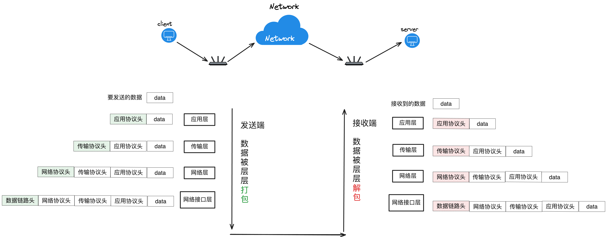

**发送端**

一个数据载体(Payload)由上至下，经过各层的添砖加瓦，将各自使用的**协议(Protocol)**头部添加到数据头，最终被打包成了**以太网帧**，由物理层传输出去。

**接收端**

将接受到的**以太网帧**由下之上，被各层进行层层解包(移除掉自己的协议头部信息)，最终被还原成了**数据载体**。

### 5.应用程序架构

**C/S模式**

传统的网络应用程序设计架构，也就是Client(客户端)/Serve(服务器)架构。为用户提供部署客户端来和服务端来进行通信。

**B/S模型**

Browser(浏览器)/Server(服务端)架构。不需要专门开发客户端程序来和服务端进行通信，而是使用浏览器充当客户端，来和服务端进行通信，一般采用HTTP/HTTPS协议。

**优缺点:**

- B/S: 轻松实现跨平台，维护成本低，但是需要考虑兼容性问题。
- C/S: 开发成本较高，需要单独维护客户端程序的开发，但是扩展性强，性能可以根据需要优化。

### 6.协议格式详解

#### 1.以太网帧

**以太网帧**就是数据被各层加工后形成的一种能够在网络中传输的数据包，在**网络接口层(数据链路层)**形成，它的格式如下:

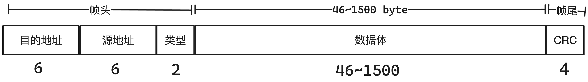

具体分为三大部分:

- **帧头部**

  - **目的地址**: 目标计算机的MAC地址，占6个字节。
  - **源地址**: 当前计算机的MAC地址，占6个字节。
  - **类型**: 指定网络层使用的协议类型，以及数据体的长度。通常是`0x0800`，表示IP协议。
    - `0x0800`: 表示IP协议，数据体的长度范围为 46~1500。
    - `0x0806`: 表示ARP协议，数据体的长度为46。
    - `0x8035`: 表示RARP协议，数据体的长度为46。

- **数据体**

  包含了更上层协议的数据信息，如IP协议的信息。

- **帧尾**

  帧尾是以太网帧的最后部分，用于标识帧的结束。它包含了一个帧校验序列（FCS），通常使用循环冗余检查（CRC）算法计算得出。帧校验序列用于检测在传输过程中是否发生了数据损坏。帧尾的长度为4个字节。

一个**以太网帧**的体积范围为**(64~1518)**个字节，帧头部固定为**14**个字节，帧尾固定为**4**个字节，数据体大小范围为**(46~1500)**，取决于网络层的协议类型。

当**帧头部**的**类型**不同时，那么数据体的内容和长度也会有所不同，如**类型**为`0x0800`时，则采用的是**IP协议**，数据体的体量较为大一些。


类型为`0x0806`时，采用ARP协议，数据体的体积会相对于较小:


类型为`0x8035`时，表示采用RARP协议:


**PAD**是因为数据体长度不够**46**，所以进行填充补位。

#### 2.ARP协议

**ARP(Address Resolution Protocol，地址解析协议)**是一种网络层的协议，用于将IP地址映射到MAC地址。在计算机网络中，当一台设备需要与另一台设备通信时，它需要知道目标设备的MAC地址才能将数据帧发送到正确的位置。ARP协议就是解决这个问题的。

具体来说，当一台设备知道目标设备的IP地址但不知道其MAC地址时，它会发送一个ARP请求广播消息到网络上，询问该IP地址对应的MAC地址。目标设备收到这个ARP请求后，会发送一个ARP响应消息，包含自己的MAC地址。发送ARP请求和响应的过程中使用的是广播，因此所有连接到同一网络的设备都会收到这些消息。一旦发送设备收到了目标设备的MAC地址，它就可以将数据帧发送到目标设备了。

当发送方不知道目标设备的MAC地址时，它会将目标设备的IP地址作为目标MAC地址设置为广播地址（全为1的MAC地址，通常表示为FF:FF:FF:FF:FF:FF）。这样做的目的是将数据帧发送到网络上的所有设备，以便目标设备能够接收到该数据帧。当网络上的设备收到这个数据帧时，它们会检查数据帧中的目标MAC地址是否与自己的MAC地址匹配。如果匹配则进行ARP响应，如果不匹配，则会丢弃该数据帧。

简单来说就是: 根据ARP协议可以根据一个计算机的IP地址，获取到它的MAC地址。

下面是一个采用ARP协议的以太网帧的结构图:

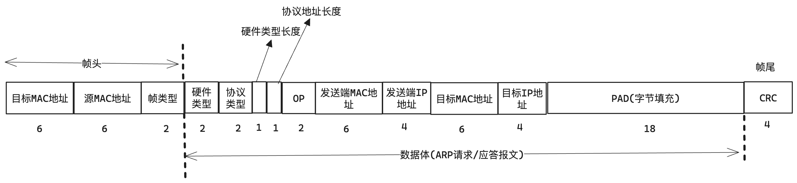

ARP报文包含如下几部分:

1. **硬件类型**

2. **协议类型**

3. **硬件类型长度**

4. **协议地址长度**

5. **OP** - 表示是请求还是应答，1表示请求，2表示应答。
6. **发送端MAC地址**
7. **发送端IP地址**
8. **目标MAC地址**
9. **目标IP地址**

ARP请求和应答报文具体格式如下:

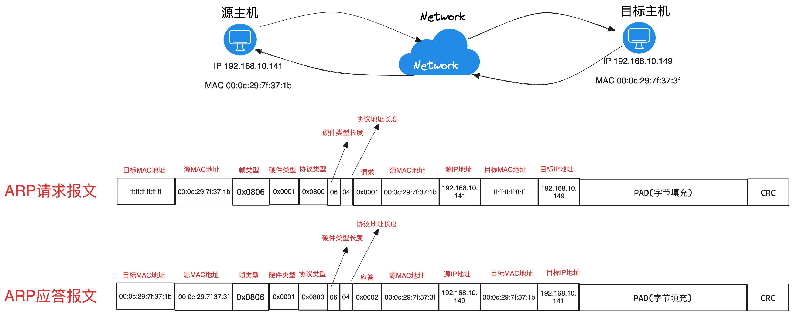

1. 源主机通过目标主机的IP地址，对网络发起ARP广播请求，由于不知道目标MAC地址，所以设置为`ff:ff:ff:ff:ff:ff`。
2. 当网络中的目标主机收到这个帧后，检查帧中的目标IP地址是否与自己的IP地址匹配，如果匹配则对该源主机发起ARP应答。
3. 源主机收到目标主机的ARP应答报文，从中获取到源MAC地址。

#### 3.IP协议

**IP协议**也是位于网络层的通信协议，通常传输具体的数据就是采用IP协议，格式结构图如下:

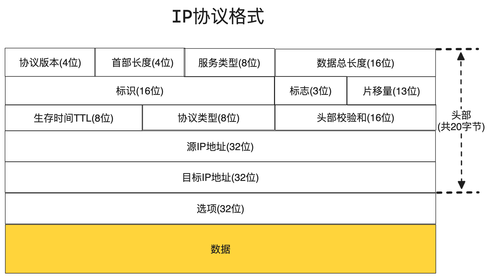

结构分为三大部分:

- **头部(20字节)**

  - **协议版本**

    描述当前IP协议版本。占4位。

    - `0x0100`: 表示IPv4版本;
    - `0x0110`: 表示IPv6版本;

  - **首部长度**

    描述IP报文头部的长度，占4位。因为在IP包头中有变长的可选部分因此其取值范围是0到15，但是通常最小设置为`0x0101`(5)。

    所以头部最大长度为60字节(15 * 4)，最小为20字节(5 * 4)。

  - **服务类型**: 指定IP数据报的处理优先级和服务质量，占8位(1个字节)。

  - **数据总长度**: 指IP报文的总长度(包含头部长度)，具体的**数据长度** = **数据总长度** - **头部长度**。占16位(2个字节)，最大值为65535。

  - **标识**

    一个IP报文的唯一标识，通常每发一份报文，它的值会加1。占16位(2个字节)。当一个数据包较大时，可以被分割成多个较小的数据包，然后逐个发送，每个数据包都持有相同的报文标识。注意，是分割数据包，并不是指发送多份报文的意思!

  - **标志**

    用于控制帧的分片行为，该值占3位，每位分别表示如下含义:

    - 第一位: 保留位，默认都是0。
    - 第二位: 是否允许分片，设置为1表示不允许分片。如`010`表示为不允许分片。
    - 第三位: 当帧被分片处理后，设置为1表示是分片数据，设置为0表示这是报文的最后一个分片。如`100`表示还有未接收的分片数据，而`000`则表示为最后一片分片数据。

  - **片移量**:  记录当前分片在原始报文中的偏移量，占13位。因此最大的偏移量为2^13 - 1，即8191个8字节的单位，也就是65,528字节。

  - **TTL**: IP报文最大存活时间，当源主机产生一个IP报文后，该字段会填写一个初始值，随后该报文每经过一个路由器该值则减1，当值变为0后，则丢弃该报文，防止引起网络阻塞。

  - **协议类型**: 用于指定传输层使用的协议类型，占8位(1个字节):

    - `0x01`: ICMP

    - `0x0`: IGMP
    - `0x06`: TCP
    - `0x11`: UDP

  - **首部校验和**: 用来做IP头部的正确性检测，但不包含数据部分,占16位(2个字节)。 因为每个路由器要改变TTL的值,所以路由器会为每个通过的数据包重新计算这个值。

  - **源IP地址**: 报文的发送端IP地址(4字节);

  - **目标IP地址**: 报文的接收端IP地址(4字节);

- **选项填充(8字节)**

  可变长且最大不超过40字节;

- **数据**: 

  更上层的协议数据，如TCP、UDP等协议信息;

> **补充**: 很多服务都有固定的端口号，然后客户端程序并不需要指定端口号，而是每次运行时由操作系统自动分配一个空闲的端口号，用完就释放掉，称之为ephemeral的端口号。

#### 4.UDP协议

UDP协议是位于传输层的传输协议，它是**非面向连接**的、**不可靠**的，基于**数据报**的传输层协议。

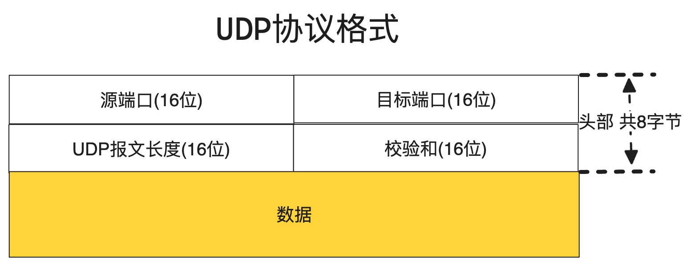

- **头部(8字节)**
  - **源端口**: 发送端的进程端口号(2字节)，范围是0 - 2^16 - 1，其中1 ~ 1023端口被很多软件固定占用。
  - **目标端口**: 接收端的进程端口号(2字节)。
  - **UDP报文长度**: UDP报文的总长度(头部长度 + 数据长度)(2字节)。
  - **校验和**: 此字段用来校验数据是否出错。(2字节)。
- **数据**

**UDP协议的特点:**

1. 不需要建立连接，无状态连接;

2. 传输效率快;

3. 无法保证传输的可靠性和顺序性;

发送端的UDP协议层只负责把应用层传来的数据封装成段交给网络层就算完成任务，如果因为网络层故障导致该段无法发送出去，UDP也不会给应用层任何反馈。接受端的UDP协议层只负责把收到的数据包解析后根据端口号交给对应的应用程序就算完成任务。

如果发送端发来多个数据包并且在网络上经过不同的路由，到达接收端时顺序已经错乱了，那么UDP也不保证按照发送出的顺序交给应用，遵循先来后到的原则。

产生数据丢失的情况:

通常接收端的UDP协议会将受到的数据放在一个固定大小的缓冲区，然后等待应用程序来提取和处理，如果应用程序提取和处理的速度很慢，而发送端的发送速度太快，导致缓冲区已满，那么新的数据包就一会直接丢掉，从而产生丢失数据包。

如果接收端的缓冲区太小，但无法容纳整个数据包，那么缓冲区就会截断数据包，只留下刚好与缓冲区齐平那部分，超出的部分将会丢掉，从而产生丢失数据包。

> 总的来说，UDP协议不提供**流量控制**或**拥塞控制**机制，因此在UDP通信中，应用程序需要自行处理数据包的丢失或截断情况。

### 7.TCP协议

由于TCP协议非常重要，并且内容还特别多，所以专门抽取一节来讲述。

TCP是**面向连接**的、**可靠的**，基于**字节流**的传输协议，它是互联网中应用最广泛的协议，一切皆TCP！

下面是它的协议格式:

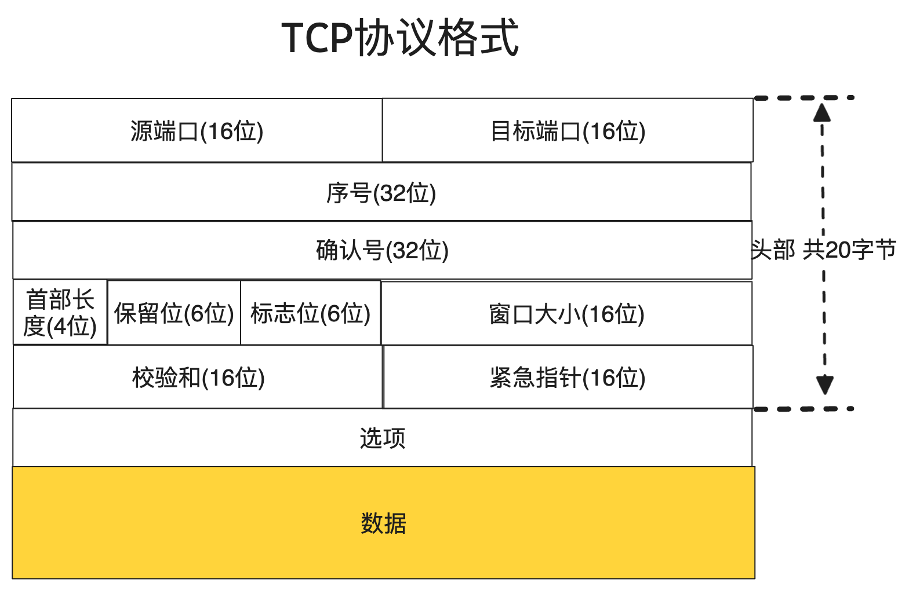

TCP报文整体分为两大部分，细分可分为三大部分: 协议头部、选项(可有可无)、数据载荷。

- **头部(20字节)**

  TCP头部占20个固定字节，分为如下部分:

  - **源端口**: 发送端的进程端口号(2字节);

  - **目标端口**: 接收端的进程端口号(2字节);

  - **序号**

    当前报文的唯一序号(4字节)，初始值为一个随机数。序号的增长规则: `当前报文的序号 = 发送的上一条报文序号 + 发送上一条报文数据长度`;

  - **确认号**

    用于回应发送端的确认号(4字节)。通常和发送端上一条报文的**序号**和**数据长度**有着密切的关系: `报文的确认号 = 接收的上一条报文的序号 + 接收的上一条报文的数据长度 + 1`，刚好对应对端要发送的下一条报文的序号。

    **序号**和**确认号**在TCP中扮演者非常重要的角色: 它们的作用有如下:

    1. 确认号指示了接收端期望接收的下一个字节的序号。通过确认号，接收端告知发送端，它已经成功接收并正确处理了确认号之前的所有数据。
    2. 确认号还用于流量控制。接收端可以通过确认号告知发送端它的可用接收缓冲区大小，从而控制发送端的发送速率，防止发送端发送过多数据导致接收端缓冲区溢出。
    3. 确认号也在拥塞控制中扮演重要角色。发送端根据确认号来检测数据包的丢失，触发拥塞控制算法以调整发送速率以及网络资源的使用。
    5. 如果发送端未收到接收端对特定数据的确认，它将会重传具有相同序号的数据。接收端可以利用确认号来识别并消除重复的数据。

  - **首部长度**

    头部区域的长度(包含**选项区域**)，占4位，一个位表示4个字节。默认为5，也就是不包含选项区域的话，头部固定大小为20个字节(5 * 4)。但是选项部分是可变长的，加上选项部分最大为15，也就是60个字节(15 * 4)，前20个字节为头部长度，后40字节为选项长度。

  - **保留位**: 未使用的位，保留未来使用(占6位); (首部长度 + 保留位 + 标志位) 共占2个字节;

  - **标志位**

    表示TCP的状态标志位的控制信息，简单来说就是该报文的具体作用。共占6个位`000000`，每个位持有不同的作用:

    - `000001`: 第一位，表示`FIN`结束，表示申请关闭连接。

    - `000010`: 第二位，表示`SYN`同步，表示申请建立连接，并且同步双方的序号。
    - `000100`： 第三位，表示`RST`，用于中断或拒绝一个非法的报文段，当收到具有RST标志的TCP段时，接收端会立即中断当前连接，并且不会回复任何响应。
    - `001000`： 第四位，表示`PSH`推送，用于发送数据并且告知让接收端立即将该报文和缓冲区内的数据提交给应用程序(`read函数立即返回`)，而不是等缓冲区满了再处理。
    - `010000`: 第五位，表示`ACK`确认，确认收到数据。
    - `100000`: 第六位`URG`标志,表示报文段中存在紧急数据，让接收端优先处理紧急数据，提交给应用程序，TCP头部包含了一个**紧急指针**，指定了紧急数据的位置。

  - **窗口大小**

    窗口大小又称为滑动窗口大小，是TCP协议实现**流量控制**和**网络拥塞**的核心参数。该值明确了当前接收方可以接收的数据量，用于控制发送方的发送速率，作用有如下几点:

    1. 接收方通过发送TCP段中的窗口大小信息，告知发送方自己当前可接收的数据量。发送方根据接收方的窗口大小来控制发送的数据量，避免发送过多的数据导致接收方的缓冲区溢出。
    2. 如果发送方收到接收方窗口大小较小的通知，它将减少发送数据的速率，以避免网络拥塞和丢包。

  - **校验和**: 校验和(2字节)。

  - **紧急指针**: 指定了紧急数据在数据流中的位置，如果TCP标志为`URG`则会根据该位置找到紧急数据(2字节)。

- **选项(0 ~ 40字节)**

  用于交换双端的一些控制信息，常见的选项有如下:

  - Maximum Segment Size（MSS）: 指定TCP连接中每个报文的数据段最大容量。用于告诉发送端能够发送的最大数据量(不包含头部长度)，通常情况下，MSS 的值由 TCP 协议栈根据网络的 MTU（Maximum Transmission Unit，最大传输单元）来确定，以确保 TCP 数据段能够在网络中正常传输而不会被分片。
  - Timestamp Option(时间戳): 用于在TCP连接中传输时间戳信息，帮助发送端和接收端计算往返时延（RTT），以及预测网络延迟和拥塞情况。

- **数据**

  包含了应用层的协议数据信息。

<hr>

**TCP协议的特点:**


1. 需要建立连接，经过三次握手和四次挥手。

2. 通过序号和确认号，保证了数据的可靠性和顺序性。

3. 能够进行流量控制，避免网络拥塞。

4. 传输效率稍低。

TCP的每个数据包都带有序号，接收端根据序号来处理，就能保证数据的有序性。

TCP的报文发送出去后，可以通过立即响应的`ACK`报文中得到一个确认号，如果确认号是发送出去的报文的序号 + 1，那么就表示对方真的接收到了，如果不是则需要进行重发。

TCP实现了流量的控制，通过流量窗口大小来告诉发送端，自己能承受的数据大小，别发送太快撑死我，也别发送太慢饿死我。

TCP是面向连接的协议，双方都会一系列的状态，通过通信报文中的标志位如`SYN`、`ACK`、`FIN`等标志来进行状态的变更。

##### 协议状态

在TCP连接中，每一端都会在通信过程中处于不同的状态，通常由状态机来管理，状态有如下几种:

- **CLOSED(关闭)**: 初始状态，表示TCP连接未建立或已经关闭。
- **LISTEN（监听）**: 服务器端处于等待连接的状态，准备接受客户端的连接请求(当服务端主动监听某个端口时就会进入该状态)。
- **SYN_SENT（同步已发送）**: 客户端发送连接请求（SYN）后进入的状态，等待服务器端的确认。
- **SYN_RECEIVED（同步已接收）**: 服务器端接收到客户端的连接请求后进入的状态，发送确认（ACK）并等待客户端的确认。
- **ESTABLISHED（已建立）**: 表示连接已经建立，双方可以进行数据传输。
- **FIN_WAIT_1（等待对方的结束请求）**: 表示一端已经发送了结束请求（FIN），正在等待另一端的确认。
- **FIN_WAIT_2（等待对方的结束请求确认）**: 表示一端已经收到了结束请求（FIN），并发送了确认，但仍在等待对方的确认。
- **CLOSE_WAIT（等待关闭）**: 表示一端已经收到了对方的结束请求（FIN），并发送了确认，等待自己的应用程序关闭连接。
- **CLOSING（关闭中）**: 表示双方同时发送了结束请求（FIN），但是两端的结束请求交叉，即出现了一种异常情况。
- **TIME_WAIT（时间等待）**：表示连接已经关闭，但是仍在等待可能出现的延迟数据段，以确保在网络中的所有数据段都已被正确处理。
- **CLOSED（关闭）**：最终状态，表示连接已经完全关闭。

这些状态描述了TCP连接在不同阶段的状态变化，每个状态之间的转换是由TCP连接的双方在通信过程中发送的报文来触发的。

##### 三次握手

三次握手是TCP协议建立连接的过程，这个过程除了建立连接还有很重要的一个作用，那就是同步双方的**序号**，具体流程如下:

1. **第一次握手**: 客户端 -> 服务端

   客户端生成一个随机数，作为自己的起始序号，然后对服务端发起`SYN`报文并且将起始序号作为报文的序号，表示申请建立连接并且将自己的起始序号同步给服务端;

   客户端状态由`CLOSE`转为`SYN_SEND`。

2. **第二次握手**: 服务端 -> 客户端

   服务端接到客户端的`SYN`报文，服务端也生成一个随机数，作为服务端的起始序号，然后对客户端发起一个`ACK + SYN`报文，将客户端的起始序号加1，作为报文的确认号，并且将自己的起始序号作为报文序号，同步给客户端;

   服务端状态由`LISTEN`转为`SYN_RECEIVED`。

3. **第三次握手**: 客户端 -> 服务端

   接收到服务端的`ACK + SYN`报文，检查报文的确认号，确认无误之后，向服务端发起一个`ACK`报文，并且将接收到的报文序号加1，作为响应报文的确认序号;

   客户端状态由`SYN_SEND`转为`ESTABLISHED`，并且服务端接到该报文后，状态同样转为`ESTABLISHED`;

   至此连接建立完成。

> 为什么一定要三次握手？ 因为三次握手是以最少的通信次数就能让双方都能确认对方已经准备好建立连接的次数，如果要经过更多次的握手反而会浪费很多成本!

流程图:

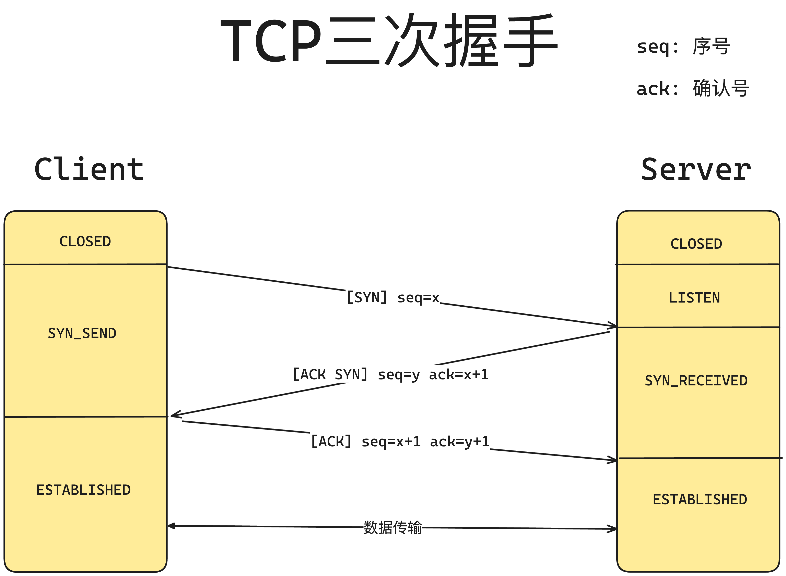


<hr>

##### 四次挥手

四次挥手是TCP断开连接的过程，双端都有申请断开连接的权利，我们以客户端申请关闭为例，关于序号和确认号的变化这里就不多赘述:

1. **第一次挥手**: 客户端 -> 服务端

   客户端向服务端发送`FIN + ACK`报文，表示申请断开连接;

   客户端状态由`ESTABLISHED`转为`FIN_WAIT_1`。

2. **第二次挥手**: 服务端 -> 客户端

   - 服务端接收到客户端的断开连接请求，响应一个`ACK`报文，表示收到了断开请求，然后服务端状态由``ESTABLISHED`转为`CLOSED_WAIT`状态;

   - 客户端接收到服务端的`ACK`报文。状态由`FIN_WAIT_1`转为`FIN_WAIT_2`，然后等待服务端主动发送`FIN + ACK`报文申请关闭连接;

     **注意:** 如果此时服务器宕机了或者处于一些其他原因，导致客户端再也没有接收到服务端的`FIN`报文，那么客户端则永远停留在这个状态，TCP协议里并没有对这个状态做处理，不过在Linux系统中有，可以调整`tcp_fin_time`参数设置超时时间，一旦以`FIN_WAIT_2`状态超过了这个时长，则直接销毁。

3. **第三次挥手:** 服务端 -> 客户端

   服务端主动向客户端发送`FIN + ACK`报文，表示申请断开连接，然后状态由`CLOSED_WAIT`转为`LAST_ACK`，然后等待客户端的`ACK`确认。

4. **第四次挥手**: 客户端 -> 服务端

   客户端接收到服务端的端开连接请求，响应给服务端一个`ACK`报文，然后状态由`FIN_WAIT_2`转为`TIME_WAIT`。

   服务端接收到客户端的最后一个`ACK`报文,状态由`LAST_ACK`转为`CLOSED`，服务端连接关闭完成!

   如果服务端超过一定的时间还没有得到最后一个`ACK`报文，那么则继续发送`FIN + ACK`报文，申请关闭连接，也就是重复执行**第三步挥手**;客户端处于`TIME_WAIT`状态后，会空闲等待2个`MSL(IP报文最长的生存时间，协议规定位2分钟，实际常用的是30秒或60秒)`，因为如果这次挥手响应的`ACK`报文如果丢失后，服务端会继续重复**第三次挥手**，所以为了保证可靠性，客户端需要等待一定的时长来关爱一下服务端，超过这个时长后，状态转为`CLOSED`。

   在 TIME_WAIT 状态下，TCP 连接已经关闭，但是仍然可能会接收到一些延迟的报文段。如果在 TIME_WAIT 状态结束之前收到了对方可能是上一次连接的旧报文段，那么会发送一个重复的确认，以确保对方收到了这些报文段并不会再重发它们。一旦 TIME_WAIT状态持续的时间到期，TCP 连接就会自动转换为 CLOSED 状态，连接就完全关闭了

> 为什么需要四次挥手？为什么双方都需要发送`FIN`报文？
>
> 因为TCP是全双工的通信协议，双方都可以发送和接收数据。当一端希望关闭连接时，它会发送一个 FIN 报文给对方，表示自己已经完成了数据发送，并且不再发送数据了。另一方收到 FIN 报文后，会发送一个 ACK（确认）报文作为确认，表示收到了对方的结束请求。这时，另一方进入了半关闭状态，即可以继续发送数据但不再接收数据。接着，另一方也可能会发送一个 FIN 报文给第一方，表示自己也已经完成了数据发送，这样就完成了 TCP 连接的关闭。
>
> 双方都发送 FIN 报文的目的是确保双方都有机会告知对方自己已经完成了数据的发送，并且不再发送数据。如果只有一方发送 FIN 报文而另一方不发送，则可能会导致连接处于半关闭状态，其中一方可能仍然在发送数据，而另一方已经关闭了连接，从而可能导致数据丢失或不一致。
>
> 因此，为了确保连接的正常关闭，TCP 协议规定了双方都需要发送 FIN 报文，以便双方都知道对方已经完成了数据发送，从而安全地关闭连接。

流程图:

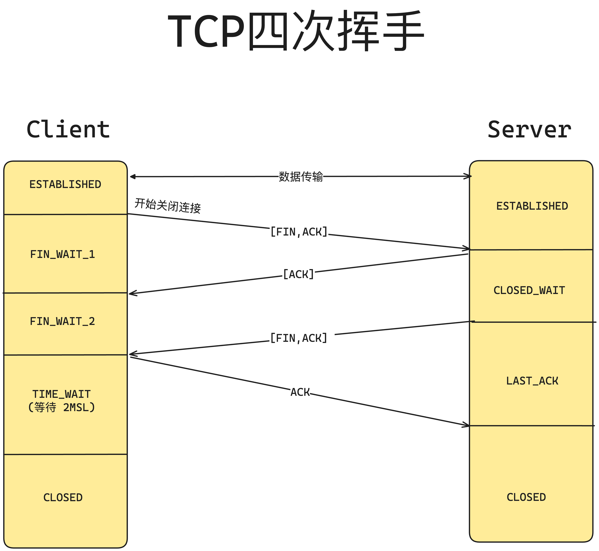

<hr>

##### 滑动窗口

滑动窗口是一个抽象的概念，一种形象的比喻，是TCP协议实现流量控制的机制。其实在上面介绍报文格式的时候就描述的差不多了，这里简单记录一下:

滑动窗口就是通过报文中的**窗口大小**字段，告诉对方自己的**数据缓冲区**目前还可以容纳多少数据，适当的控制发送的速率和容量。

<hr>

##### MTU和MSS

**MTU(Maximum Transmission Unit)**最大传输单元，是指IP协议在网络通信中整个报文(包括IP头部)允许的最大长度，以字节为单位。当数据包超过了网络的MTU时，它就会被分片（分成更小的片段）以适应网络的MTU，然后再传输。

**MSS(Maximum Segment Size)**最大分段大小，是指TCP协议中，数据部分区域允许的最大长度(不包含TCP头部和IP头部)，以字节为单位。TCP在建立连接时会通过握手过程中的报文中的**选项**字段来协商MSS的大小，以确保双方都能够支持的最大数据包大小。

<hr>
#### 6.HTTP协议


### 8.Socket编程

传统的进程间通信借助于内核提供的IPC机制，但是只限于本机之间通信，如果想要跨机通信，就必须要通过网络通信，而网络通信本质上也是借助于内核，通过内核提供的**Socket**机制来实现网络通信。**Socket** 是一种在计算机网络中进行通信的抽象概念，它允许不同的程序在网络上进行数据交换，就像电话插座允许电话之间进行通信一样。

#### 前置知识补充

##### 网络字节序

大端和小端的概念: 也就是多个字节，在内存中排列的顺序。

我们都知道数值分为高位和低位，比如`0x123456`,其中`12`为高位，而`56`为低位。

而内存地址也分为高位和低位，比如`0xc1a203` ~ `0xc1a206`这片内存，刚好3个字节，如果将`0x123456`放在这里，那么该如何存放？

- 小端: 低位数据放在低位地址，高位数据放在高位地址;
- 大端: 低位数据放在高位地址，高位数据放在低位地址;

根据TCP/IP协议规定，网络数据都应该采用大端字节序，也被称为网络字节序。

可以通过如下程序来查看本机的字节序方式:

```c
/**
 * 判断处理器是否为大端模式 方式一
 * @return 1: 是大端模式, 0: 小端模式
 */
char is_big_endian(){
    int i = 1;
    if(*((char*) &i) == 1){
        return 0;
    }
    return 1;
}
```

为了使网络程序具有可移植性，使同样的C语言代码在大端和小端平台上编译后都能正常运行，可以通过以下提供的函数实现网络字节序和本机字节序的转换:

```c
#include <arpa/inet.h>

uint32_t htonl(uint32_t hostlong);
uint16_t htons(uint16_t hostshort);
uint32_t ntohl(uint32_t netlong);
uint16_t ntohs(uint16_t netshort);
```

这些函数名很好记，`h`表示host，`n`表示network，`l`表示32位长整数，`s`表示16位短整数。

##### 各种地址类型

socket API是一层抽象的网络编程接口，适用于各种底层网络协议，如IPv4、IPv6，以及后面要讲的UNIX Domain Socket。

然而，各种网络协议的地址格式并不相同: IPv4和IPv6的地址格式定义在`netinet/in.h`中: 

- IPv4地址用`sockaddr_in`结构体表示,包括16位端口号和32位IP地址。

- IPv6地址用`sockaddr_in6`结构体表示,包括16位端口号、128位IP地址和一些控制字段。
- UNIX Domain Socket的地址格式定义在`sys/un.h`中，用sockaddr_un结构体表示。

各种socket地址结构体的开头都是相同的，前16位表示整个结构体的长度(并不是所有UNIX的实现都有长度字段，如Linux就没有),后16位表示地址类型。

IPv4、IPv6和UnixDomain Socket的地址类型分别定义为常数`AF_INET`、`AF_INET6`、`AF_UNIX`。

这样，只要取得某种sockaddr结构体的首地址，不需要知道具体是哪种类型的sockaddr结构体，就可以根据地址类型字段确定结构体中的内容。

因此，socket API可以接受各种类型的`sockaddr`结构体指针做参数，例如`bind`、`accept`、`connect`等函数都用`struct sockaddr*` 类型表示，在传递参数之前要强制类型转换一下，例如：

```c
struct sockaddr_in servaddr;
/* initialize servaddr */
bind(listen_fd, (struct sockaddr *)&servaddr, sizeof(servaddr));
```

##### Socket Pair

Socket pair其实就是通过`socket`函数分配的一个**伪文件描述符**。该文件描述符可以操作**两个内核缓冲区**，一个为**读**缓冲区，另一个为**写**缓冲区。显然读缓冲区适用于读取对端发送来过来的数据，而写缓冲区用于向对端发送数据。

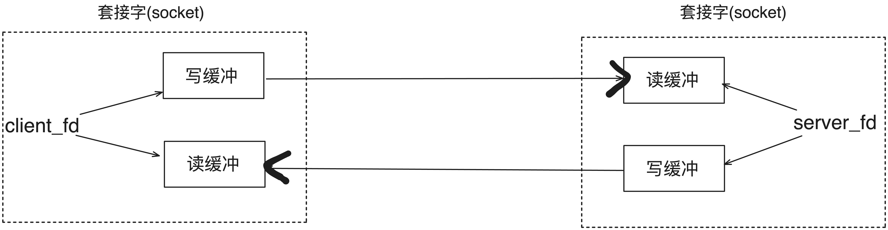

#### Socket API

##### socket

```c
#include <sys/socket.h>

int socket(int domain, int type, int protocol);
```

创建socket套接字，也就是上面提到的**socket pair**。

参数说明:

- `domain`: 协议版本，可选项如下:
  - AF_INET: 表示IPv4;
  - AF_INET6: 表示IPv6;
  - AF_UNIX: 表示本地套接字通信;
- `type`: 协议类型，可选项如下:
  - SOCK_STREAM: 流式，默认使用TCP协议;
  - SOCK_DGRAM: 报式，默认使用UDP协议;
- `protocol`: 一般设置为0，表示使用对应类型的默认协议。

成功返回一个大于0的文件描述符，失败返回-1，并且设置errno。

当调用该函数后，返回一个 socket 文件描述符，内核会提供与描述符对应的读和写缓冲区。

##### bind

```c
#include <sys/socket.h>

int bind(int socket, const struct sockaddr* address, socklen_t address_len);
```

将 socket 文件描述符和一个主机端口进行绑定。

参数说明:

- `socket`: 要绑定的socket描述符;

- `address`: 要绑定的主机+端口信息;

  ```c
  // 定义个TCP协议地址
  struct sockaddr_in server;
  server.sin_family = AF_INET;
  server.sin_port = htons(8081); // 转换端口字节序
  inet_pton(AF_INET, "127.0.0.1",&server.sin_addr.s_addr); // 转换IP字节序
  ```

- `address_len`: `address`的字节数;

成功返回0。失败返回-1，并且设置errno。

##### listen

```c
#include <sys/socket.h>

int listen(int sockfd, int backlog);
```

将传入的`sockfd`套接字描述符由主动态标记为被动态，使其称为一个**监听描述符**通常是服务器套接字，以便开始接收连接请求。

参数说明:

- `sockfd`: 要标记的套接字描述符;
- `backlog`: 允许同时请求连接的最大数量(也就是请求连接队列的长度);

成功返回0。失败返回-1，并且设置errno。

将socket 描述符标记为被动态后，还会为它创建**请求连接队列**和**已连接队列**，分别来存放**正在等待处理**的连接和**已连接完成**的连接。

##### accept

```c
#include <sys/socket.h>

int accept(int sockfd, struct sockaddr* addr, socklen_t addrlen);
```

从`sockfd`描述符中的**已连接队列**中获取连接(也就意味着在调用该函数之前，连接就可能已经建立完成)，若当前没有连接则**会阻塞等待**。

参数说明:

- `sockfd`: 已经被标记为被动态的监听描述符;
- `addr`: 传出参数，保存连接的客户端地址信息;
- `addrlen`: 这是一个传入并且传出参数，传入`addr`类型的内存长度，然后传出`addr`类型保存客户端连接信息后的占用的内存长度;

成功返回客户端连接的 socket 文件描述符，通过该描述符和客户端进行通信。失败返回-1，并设置errno。

accept是一个阻塞函数，若没有新的连接请求，则一直阻塞。从已连接队列中获取一个新的连接，并且获取一个新的文件描述符作为返回值(内核会负责将请求队列中的连接转移到已连接队列中)。

##### connect

```c
#include <sys/socket.h>

int connect(int sockfd, const struct sockaddr* addr, socklen_t addrlen);
```

连接服务端。

函数参数:

- `sockfd`: 要与服务端建立连接的客户端套接字描述符;
- `addr`: 服务端的地址信息;
- `addrlen`: `addr`的类型长度;

成功返回0。失败返回-1，并且设置errno;

##### setsockopt
```c
#include <sys/socket.h>

int setsockopt(int sockfd, int level, int optname, const void* optval, socklen_t optvallen);
```
该函数用于为套接字描述符设置选项，也就是IP和TCP协议报文中的**选项**。

函数参数: 
- `sockfd`:  要设置选项的套接字描述符;
- `level`:  要设置选项的协议级别，可选项如下:
	- **SOL_SOCKET**: 表示通用套接字选项;
	- **IPPROTO_TCP**: 表示设置TCP协议选项，常见选项如下:
	- **IPPROTO_IP**: 表示设置IPv4协议选项,常见选项如下:
	- **IPPROTO_IPV6**: 表示设置IPv6版本协议选项;
- `optname`: 要设置的选项名称，常见选项如下:
  - **SOL_SOCKET** 的选项:
    - SO_BROADCAST: 允许套接口传送广播信息。
    - SO_DEBUG: 允许调试;
    - SO_REUSERADDR: 允许重复使用本地地址和端口;
    - SO_KEEPALIVE: 开启心跳检测，持续发送心跳包;
    - SO_SNDBUF: 设置发送缓冲区的大小;
    - SO_RCVBUF: 设置接收缓冲区的大小;
    - SO_RCVTIMEO: 设置接收数据的超时时间;
    - SO_SNDTIMEO: 设置发送数据的超时时间;

  - **IPPROTO_IP** 的选项:
    - IP_TTL: IP报文生存时间。
    - IP_OPTIONS: IP报文头部选项。

  - **IPPRO_TCP** 的选项:
    - TCP_NODELAY: 表示禁用 Nagle 算法，即启用无延迟特性。
    - TCP_MAXSEG: 设置最大数据段大小。

- `optval`: 要设置的选项的取值;
- `optvallen`: 取值的长度;

#### Socket流程描述

要想客户端和服务器能在网络中通信，那必须得使用 Socket 编程，它是进程间通信里比较特别的方式，特别之处在于它是可以跨主机间通信。

Socket 的中文名叫作插口，咋一看还挺迷惑的。事实上，双方要进行网络通信前，各自得创建一个 Socket，这相当于客户端和服务器都开了一个“口子”，双方读取和发送数据的时候，都通过这个“口子”。这样一看，是不是觉得很像弄了一根网线，一头插在客户端，一头插在服务端，然后进行通信。

创建 Socket 的时候，可以指定网络层使用的是 IPv4 还是 IPv6，传输层使用的是 TCP 还是 UDP。

服务器的程序要先跑起来，然后等待客户端的连接和数据，我们先来看看服务端的 Socket 编程过程是怎样的:

1. 服务端首先调用 `socket()` 函数，创建网络协议为 IPv4，以及传输协议为 TCP 的 Socket
2. 接着调用 `bind()` 函数，给这个 Socket 绑定一个 **IP**和**Port**，绑定这两个的目的是什么？
   - 绑定端口的目的：当内核收到 TCP 报文，通过 TCP 头里面的端口号，来找到我们的应用程序，然后把数据传递给我们。
   - 绑定 IP 地址的目的：一台机器是可以有多个网卡的，每个网卡都有对应的 IP 地址，当绑定一个网卡时，内核在收到该网卡上的包，才会发给我们；
3. 绑定完 IP 地址和端口后，就可以调用 `listen()` 函数进行监听，此时对应 TCP 状态图中的 `listen`，如果我们要判定服务器中一个网络程序有没有启动，可以通过 `netstat` 命令查看对应的端口号是否有被监听。
4. 服务端进入了监听状态后，通过调用 `accept()` 函数，来从内核获取客户端的连接，如果没有客户端连接，则会阻塞等待客户端连接的到来。
5. 那客户端是怎么发起连接的呢？客户端在创建好 Socket 后，调用 `connect()` 函数发起连接，该函数的参数要指明服务端的 IP 地址和端口号，然后万众期待的 TCP 三次握手就开始了。

在 TCP 连接的过程中，服务器的内核实际上为每个 Socket 维护了两个队列：

- 一个是「还没完全建立」连接的队列，称为 **TCP 半连接队列**，这个队列都是没有完成三次握手的连接，此时服务端处于 `syn_rcvd` 的状态；
- 一个是「已经建立」连接的队列，称为 **TCP 全连接队列**，这个队列都是完成了三次握手的连接，此时服务端处于 `established` 状态；

当 TCP 全连接队列不为空后，服务端的 `accept()` 函数，就会从内核中的 TCP 全连接队列里拿出一个已经完成连接的 Socket 返回应用程序，后续数据传输都用这个 Socket。

注意，监听的 Socket 和真正用来传数据的 Socket 是两个：

- 一个叫作**监听 Socket**；
- 一个叫作**已连接 Socket**；

连接建立后，客户端和服务端就开始相互传输数据了，双方都可以通过 `read()` 和 `write()` 函数来读写数据。

至此， TCP 协议的 Socket 程序的调用过程就结束了。

#### TCP 编程

###### 第一个TCP服务

使用C语言实现一个最简单的TCP服务端与客户端，实现Echo能力: 客户端连接服务端，并且发送字符串，服务端接收到数据后转换为大写响应回客户端。

**服务端**

```c
#include <stdio.h>
#include <sys/socket.h>
#include <arpa/inet.h>
#include <stdlib.h>
#include <unistd.h>
#include <ctype.h>

/**
 * 实现一个简单的TCP服务端 Echo
 */


// 宏定义，用于统一错误处理
#define Err_Handler(res_no,message){ \
    if(res_no == -1){                \
        perror(message);             \
        exit(1);                     \
   }                                 \
}

int main() {
    // 1. 创建Tcp服务端的监听socket
    int listen_fd = socket(AF_INET, SOCK_STREAM, 0);
    Err_Handler(listen_fd,"create socket fail")
    // 2. 要占用的主机地址信息
    struct sockaddr_in server_addr;
    server_addr.sin_family = AF_INET; // 指定协议版本
    server_addr.sin_port = htons(8921);  // 指定端口号(转为大端字节序)
    server_addr.sin_addr.s_addr = htonl(INADDR_ANY); // 指定IP  INADDR_ANY 表示为0，也就是0.0.0.0
    // 3. 将 socket 与一个地址进行绑定，表示要占用的主机端口
    int res_no = bind(listen_fd, (struct sockaddr*)&server_addr, sizeof(server_addr));
    Err_Handler(res_no,"socket bind fail");
    // 4. 将 socket 标记为服务监听，作为服务端
    Err_Handler(listen(listen_fd, 3),"listen fail");
    printf("Accepting connections... \n");
    // 用于记录连接的客户端信息
    int client_fd;  // 客户端连接文件描述符
    struct sockaddr_in client_addr; // 客户端地址
    socklen_t client_addr_len = sizeof(client_addr);
    char buf[80]; // 读取缓冲区
    ssize_t read_bytes; // 读取的数据量
    while (1){
        // 5. 阻塞等待获取连接
        client_fd = accept(listen_fd, (struct sockaddr *)&client_addr, &client_addr_len);
        // 获取连接的IP地址
        char client_ip[INET_ADDRSTRLEN];
        inet_ntop(AF_INET, &client_addr.sin_addr, client_ip, sizeof(client_ip));
        // 获取连接的端口号
        int client_port = ntohs(client_addr.sin_port);
        printf("客户端连接，IP: %s, Port: %d \n",client_ip, client_port);
        while (1){
            // 6. 读取数据
            read_bytes = read(client_fd, buf, sizeof(buf));
            if (read_bytes == 0){
                printf("客户端已经关闭连接... \n");
                break;
            }
            printf("读取到的数据: %s \n", buf);
            // 将数据全部转为大写
            for(int i = 0; i < read_bytes; i++)
                buf[i] = toupper(buf[i]);
            // 7. 将数据写回客户端
            write(client_fd, buf, read_bytes);
        }
        // 关闭客户端
        close(client_fd);
    }
}
```

**客户端**

```c
#include <stdio.h>
#include <sys/socket.h>
#include <arpa/inet.h>
#include <stdlib.h>
#include <unistd.h>
#include <string.h>


/**
 * 实现一个简单的TCP客户端 Echo
 */

// 宏定义，用于统一错误处理
#define Err_Handler(res_no,message){ \
    if(res_no == -1){                \
        perror(message);             \
        exit(1);                     \
   }                                 \
}

int main() {
    //1. 创建 客户端 socket
    int socket_fd = socket(AF_INET, SOCK_STREAM, 0);
    Err_Handler(socket_fd,"create socket fail");
    //2. TCP服务端的地址信息
    struct sockaddr_in server_addr;
    server_addr.sin_family = AF_INET; // 指定协议版本
    server_addr.sin_port = htons(8921);  // 指定端口号(转为大端字节序)
    inet_pton(AF_INET, "127.0.0.1", &server_addr.sin_addr.s_addr); // 指定IP
    //3. 连接服务端
    int res_no = connect(socket_fd,(struct sockaddr*)&server_addr, sizeof(server_addr));
    Err_Handler(res_no, "connect server fail")
    // 连接成功
    printf("Connect server success~ \n");
    char line[1024];
    ssize_t n;
    while (1){
        // 读取标准输入
        n = read(0, line, sizeof(line));
        if (n == EOF || strncmp(line, "quit", 4) == 0){
            printf("Client exit. \n");
            break;
        }
        //4. 将数据发送给服务端
        write(socket_fd, line, n);
        //5. 读取服务端响应
        n = read(socket_fd, line, sizeof(line));
        // 输出到标准输出
        write(1, line, n);
    }
    // 6. 关闭服务端连接
    close(socket_fd);
    return 0;
}

```

###### 多进程并发TCP服务

在第一个TCP服务中，简单实现了TCP服务端和客户端，但是问题很显然，这个服务端同时只能处理一个客户端的请求，这显然不满足一个最基本的服务端条件。

通常我们都是要求服务端高并发、高性能，能够同时为多个客户端进行服务。方案有很多，接下来我们使用多进程的方式来实现: 

使用多进程，让父进程负责接收新的连接，连接完成后开启一个子进程来专门处理这个连接。这种方式有一点需要注意: 当子进程退出时会产生**僵尸进程**，父进程需要注意`SIGCHILD`信号并且调用`wait`为子进程善后。

**服务端**

```c
#include <stdio.h>
#include <sys/socket.h>
#include <arpa/inet.h>
#include <stdlib.h>
#include <unistd.h>
#include <ctype.h>
#include <string.h>
#include <signal.h>
#include <errno.h>

/**
 * 引入多进程，实现并发TCP服务器
 */

// 宏定义，用于统一错误处理
#define Err_Handler(res_no,message){ \
    if(res_no == -1){                \
        perror(message);             \
        exit(1);                     \
   }                                 \
}

// 子进程终止信号处理
void child_handler(int sig_no){
    int child_pid = wait(NULL);
    printf("子进程 %d 终止了\n",child_pid);
}

int main() {
    // 创建TCP服务监听socket
    int listen_fd = socket(AF_INET, SOCK_STREAM, 0);
    Err_Handler(listen_fd,"create socket fail")
    struct sockaddr_in server_addr;
    server_addr.sin_family = AF_INET;
    server_addr.sin_port = htons(8921);
    server_addr.sin_addr.s_addr = htonl(INADDR_ANY);

    // 绑定端口
    int res_no = bind(listen_fd, (struct sockaddr*)&server_addr, sizeof(server_addr));
    Err_Handler(res_no,"socket bind fail");

    // 开启监听
    Err_Handler(listen(listen_fd, 1),"listen fail");
    printf("Accepting connections... \n");


    // 为父进程设置 SIGCHILD 信号处理
    struct sigaction act;
    act.sa_flags = 0;
    sigemptyset(&act.sa_mask);
    act.sa_handler = child_handler;
    sigaction(SIGCHLD, &act, NULL);

    int client_fd;
    struct sockaddr_in client_addr;
    socklen_t client_addr_len = sizeof(client_addr);
    char buf[80];
    ssize_t read_bytes;
    while (1){
        // 阻塞等待客户端连接
        client_fd = accept(listen_fd, (struct sockaddr *)&client_addr, &client_addr_len);
        if (client_fd == -1 && errno == EINTR){
            // 被信号打断，继续服务即可
            continue;
        }
        Err_Handler(client_fd, "accept fail");

        // 获取连接的IP地址
        char client_ip[INET_ADDRSTRLEN];
        inet_ntop(AF_INET, &client_addr.sin_addr, client_ip, sizeof(client_ip));
        // 获取连接的端口号
        int client_port = ntohs(client_addr.sin_port);


        /// 创建子进程，与客户端通信
        pid_t child_pid = fork();
        if (child_pid == -1){
            perror("fork child fail");
            exit(1);
        }
        if (child_pid > 0){
            // 父进程
            printf("客户端连接 [%s :%d]，服务进程: %d \n",client_ip, client_port,child_pid);
            close(client_fd); // 父进程不需要和客户端通信，直接关闭即可
            continue;
        } else{
            // 子进程
            close(listen_fd); // 子进程不需要监听套接字，直接关闭即可
            while (1){
                // 读取数据
                read_bytes = read(client_fd, buf, sizeof(buf));
                if (read_bytes == 0){
                    printf("客户端关闭连接 [%s: %d] \n",client_ip,client_port);
                    close(client_fd);
                    exit(1);
                }
                printf("[%s:%d]: %s \n",client_ip, client_port,buf);

                // 将数据全部转为大写
                for(int i = 0; i < read_bytes; i++)
                    buf[i] = toupper(buf[i]);

                // 将数据写回客户端
                write(client_fd, buf, read_bytes);
            }
        }
    }
}

```

客户端不需要任何修改。

编译运行后，可以同时运行多个客户端进行处理，就已经完成了服务端的并发性，但是问题也很显然，每加一个客户端就要开辟一个新的进程来处理，这样系统的开销成本太大，所以下面我们将使用多线程来实现服务端的并发性，这样要轻量级很多。

###### 多线程并发TCP服务

```c
#include <stdio.h>
#include <sys/socket.h>
#include <arpa/inet.h>
#include <stdlib.h>
#include <unistd.h>
#include <ctype.h>
#include <string.h>
#include <pthread.h>
#include <errno.h>

/**
 * 使用多线程，实现并发TCP服务器
 */

// 宏定义，用于统一错误处理
#define Err_Handler(res_no,message){ \
    if(res_no == -1){                \
        perror(message);             \
        exit(1);                     \
   }                                 \
}

// 连接的客户端信息
typedef struct {
    int fd; // 连接的文件描述符
    int port; // 端口
    const char* ip; // IP
    pthread_t tid; // 服务的线程id
} client_info;

// 处理客户端连接，线程函数
void* client_handler(void* arg){
    // 将参数转换为客户端信息结构
    client_info* client = arg;
    char buf[80]; // 读取缓冲区
    ssize_t read_bytes;

    while (1){
        // 读取数据
        read_bytes = read(client->fd, buf, sizeof(buf));
        if (read_bytes == 0){
            printf("客户端关闭连接 [%s: %d]，服务线程: %lu \n",client->ip,client->port, (unsigned long int)client->tid);
            close(client->fd);
            free(client); // 回收内存
            pthread_exit(NULL); // 结束线程，注意不要使用 exit,该函数会导致整个进程结束;
        }
        printf("[%s:%d]: %s \n",client->ip, client->port,buf);

        // 将数据全部转为大写
        for(int i = 0; i < read_bytes; i++)
            buf[i] = toupper(buf[i]);
        // 将数据写回客户端
        write(client->fd, buf, read_bytes);
    }
}

int main() {
    // 创建TCP服务监听socket
    int listen_fd = socket(AF_INET, SOCK_STREAM, 0);
    Err_Handler(listen_fd,"create socket fail")
    struct sockaddr_in server_addr;
    server_addr.sin_family = AF_INET;
    server_addr.sin_port = htons(8921);
    server_addr.sin_addr.s_addr = htonl(INADDR_ANY);

    // 绑定端口
    int res_no = bind(listen_fd, (struct sockaddr*)&server_addr, sizeof(server_addr));
    Err_Handler(res_no,"socket bind fail");

    // 开启监听
    Err_Handler(listen(listen_fd, 1),"listen fail");
    printf("Accepting connections... \n");

    int client_fd;
    struct sockaddr_in client_addr;
    socklen_t client_addr_len = sizeof(client_addr);

    while (1){
        // 阻塞等待客户端连接
        client_fd = accept(listen_fd, (struct sockaddr *)&client_addr, &client_addr_len);
        if (client_fd == -1 && errno == EINTR){
            // 被信号打断，继续服务即可
            continue;
        }
        Err_Handler(client_fd, "accept fail");

        // 获取连接的IP地址
        char client_ip[INET_ADDRSTRLEN];
        inet_ntop(AF_INET, &client_addr.sin_addr, client_ip, sizeof(client_ip));
        // 获取连接的端口号
        int client_port = ntohs(client_addr.sin_port);
        // 客户端信息
        client_info* info = malloc(sizeof(client_info));
        info->fd = client_fd;
        info->port = client_port;
        info->ip = client_ip;

        // 创建新线程，处理连接，与客户端通信
        pthread_t thread_id;
        pthread_create(&thread_id, NULL, client_handler,info);
        info->tid = thread_id;
        printf("客户端连接 [%s :%d]，服务线程: %lu \n",client_ip, client_port,(unsigned long int)thread_id);

        // 将新线程标记为 detach 状态，一旦线程终止，则自动释放资源.
        pthread_detach(thread_id);
    }
    close(listen_fd);
}
```

#### IO多路复用

上面我们分别通过多进程和多线程的方式实现了并发式的TCP服务端，虽然线程比进程要轻量级许多，但是一个线程负责一个客户端连接还是比较昂贵的成本，假如有一个客户端一直没有任何数据发出，那么是不是该线程就会一直处于阻塞状态？为了避免这种情况我们是不是可以用一个线程来处理多个连接，让线程的执行率最大化，从而产生了**IO多路复用**。

##### 何为多路复用？

首先对多路复用一词进行拆解:

- 多路: 指存在多个待服务或处理的对象;
- 复用: 由一个**执行单元** 提供服务或处理;

综上所述，**多路复用**就是由一个执行单元(比如线程)，同时为多个对象提供服务或处理，形成`1:N`的服务关系。

回到计算机领域，在Linux操作系统中，对IO多路复用的概念有着更加明确的定义:  

> 使用一个线程同时为多个可能会触发`io event`的`fd`提供处理;

在Linux中，提供了三种进行IO多路复用的系统调用函数，分别是: **select**、**poll**和**epoll**，下面进行详细介绍。

##### select

首先认识一个新的类型: `fd_set`，表示为一组文件描述符的集合，可通过如下宏来对该类型操作:

```c
void FD_ZERO(fd_set* set); // 清空该集合
void FD_SET(int fd, fd_set* set); // 将描述符添加到该集合
void FD_CLR(int fd, fd_set* set); // 将描述符从该集合删除
void FD_ISSET(int fd, fd_set* set); // 判断该描述符是否存在于该集合
```

`select`函数可以将一组`fd`提交给内核进行监听，然后阻塞挂起当前线程，当有`fd`触发了`io event`时内核会唤醒线程，并且告知其数量;

```c
#include <sys/select.h>

int select(int nfds, fd_set* readfds, fd_set* writefds, fd_set* exceptfds, struct timeval* timeout);
```

参数说明: 

- `nfds`: 要监听的文件描述符中取值最大的，也就是要监控的文件描述符的范围。
- `readfds`: 输入并且输出参数，入参表示为要以可读事件监听哪些文件描述符，出参表示为触发了可读事件的`fd`集合。
- `writefds`: 输入并且输出参数，和`readfds`类似，只是事件为可写。
- `exceptfds`: 输入并且输出参数，同上，只是事件为异常事件。
- `timeout`: 阻塞挂起的时长，可选项如下:
  - `NULL`: 一直阻塞，直到被监听的`fd`有事件发生;
  - `0`: 表示非阻塞，不管有没有事件触发，都会立即返回;
  - 如果指定了阻塞时长，超过该时间后就算没有事件触发，也会接触阻塞并且返回;

成功返回后，返回值为触发了事件的`fd`的数量，返回-1表示错误;

下面通过select来实现一个基于单线程的IO多路复用TCP服务:

```c
#include <stdio.h>
#include <sys/select.h>
#include <sys/socket.h>
#include <arpa/inet.h>
#include <stdlib.h>
#include <unistd.h>
#include <errno.h>
#include <string.h>
#include <ctype.h>

#define Err_Handler(res_no,message){ \
    if(res_no == -1){                \
        perror(message);             \
        exit(1);                     \
   }                                 \
}

/**
 * 基于IO多路复用的高并发TCP服务端，使用select实现
 */

int main() {
    // 创建监听socket IPv4, TCP
    int listen_fd = socket(AF_INET, SOCK_STREAM, 0);
    Err_Handler(listen_fd, "create listen socket fail");

    // 设置端口复用
    int opt = 1;
    int err = setsockopt(listen_fd, SOL_SOCKET, SO_REUSEADDR, &opt, sizeof(int));
    Err_Handler(err, "set port reuse fail")

    // 准备IP和Port
    struct sockaddr_in listen_addr;
    listen_addr.sin_family = AF_INET;
    listen_addr.sin_port = htons(8921);
    listen_addr.sin_addr.s_addr = htonl(INADDR_ANY);

    // 将 listen 与IP和Port绑定
    err = bind(listen_fd,(struct sockaddr*)&listen_addr, sizeof(listen_addr));
    Err_Handler(err, "bind fail")

    // 开始监听
    listen(listen_fd, 128);

    /// 定义读取事件类型的文件描述符集合(这里不需要处理其他事件类型)
    /// 建立连接事件也属于可读事件
    fd_set in_fds, out_fds;
    FD_ZERO(&in_fds);
    FD_ZERO(&out_fds);

    /// 将监听描述符设置进集合
    FD_SET(listen_fd,&in_fds);

    /// 监听的描述符中最大的
    int cur_max_fd = listen_fd;
    /// 每次唤醒后，就绪的fd的数量
    int ready_n;


    /// =============== 临时处理的客户端连接信息 ========
    int client_fd; // 客户端连接描述符
    struct sockaddr_in client_addr; // 连接地址信息
    socklen_t client_addr_len;
    char client_ip[INET_ADDRSTRLEN]; // 客户端IP
    int client_port; // 客户端Port
    /// =============================================

    printf("Server running success...\n");

    /// 循环处理
    while (1){
        out_fds = in_fds;
        // 阻塞监听描述符，等待事件就绪
        ready_n = select(cur_max_fd + 1,&out_fds, NULL, NULL, NULL);

        // ...事件就绪了，被唤醒
        if (ready_n == -1){
            if (errno == EINTR)continue; // 被信号打断，忽略即可
            break;
        }

        /// TODO 开始处理事件就绪的fd...

        /// TODO 连接事件
        if (FD_ISSET(listen_fd, &out_fds)){
            /// 监听描述符触发连接事件，接收新的客户端连接
            client_fd = accept(listen_fd, (struct sockaddr*)&client_addr, &client_addr_len);
            Err_Handler(client_fd, "accept fail");
            inet_ntop(AF_INET,&client_addr.sin_addr, client_ip, INET_ADDRSTRLEN);
            printf("[%s:%d] Connection~ \n", client_ip, ntohs(client_addr.sin_port));

            // 将新的连接描述符，加入集合中，在下一轮循环中开启监听
            FD_SET(client_fd, &in_fds);
            if (client_fd > cur_max_fd){
                // 更新select监听的描述符范围
                cur_max_fd = client_fd;
            }
            ready_n--;
        }

        /// TODO 数据可读事件
        char buf[1024];
        int n;
        // 从监听描述符开始向后遍历，依次判断每个描述符是否在就绪集合中，直到监听范围的最后一个描述符
        for (int i = listen_fd + 1; ready_n > 0 && i <= cur_max_fd; i++) {
            if (FD_ISSET(i, &out_fds)){
                // 可读
                client_fd = i;
                // 获取该描述符对应的客户端地址信息
                getpeername(client_fd, (struct sockaddr*)&client_addr, &client_addr_len);
                // 将IP转换成字符串
                inet_ntop(AF_INET, &client_addr.sin_addr, client_ip, INET_ADDRSTRLEN);
                // 获取端口
                client_port = ntohs(client_addr.sin_port);
                bzero(buf, sizeof(buf));
                ready_n--;

                // 读取数据
                if (( n = read(client_fd, buf, sizeof(buf))) == 0){
                    // 连接关闭
                    close(client_fd);
                    // 移除该描述符，不再需要监听
                    FD_CLR(client_fd, &in_fds);
                    printf("[%s : %d] Closed.\n", client_ip, client_port);
                    continue;
                }

                // 输出数据内容
                printf("[%s : %d]: %s",client_ip, client_port, buf);

                // 转换为大写后，写回客户端
                for(int j = 0; j < n; j++)
                    buf[j] = toupper(buf[j]);
                write(client_fd, buf, n);
            }
        }
    }
    close(listen_fd);
    return 0;
}
```


**select的实现原理:**

`select` 实现多路复用的方式是，将已连接的 Socket 都放到一个**文件描述符集合**，然后调用 select 函数将文件描述符集合**拷贝**到内核里，让内核来检查是否有网络事件产生，检查的方式很粗暴，就是通过**遍历**文件描述符集合的方式，当检查到有事件产生后，将此 Socket 标记为可读或可写， 接着再把整个文件描述符集合**拷贝**回用户态里，然后用户态还需要再通过**遍历**的方法找到可读或可写的 Socket，然后再对其处理。

所以，对于 select 这种方式，需要进行 **2 次「遍历」文件描述符集合**，一次是在内核态里，一个次是在用户态里 ，而且还会发生 **2 次「拷贝」文件描述符集合**，先从用户空间传入内核空间，由内核修改后，再传出到用户空间中。

select 使用固定长度的 BitsMap，表示文件描述符集合，而且所支持的文件描述符的个数是有限制的，在 Linux 系统中，由内核中的 FD_SETSIZE 限制， 默认最大值为 `1024`，只能监听 0~1023 的文件描述符。

poll 不再用 BitsMap 来存储所关注的文件描述符，取而代之用动态数组，以链表形式来组织，突破了 select 的文件描述符个数限制，当然还会受到系统文件描述符限制。

但是 poll 和 select 并没有太大的本质区别，**都是使用「线性结构」存储进程关注的 Socket 集合，因此都需要遍历文件描述符集合来找到可读或可写的 Socket，时间复杂度为 O(n)，而且也需要在用户态与内核态之间拷贝文件描述符集合**，这种方式随着并发数上来，性能的损耗会呈指数级增长。

**select的缺点:**

- 内核一次最多监听1024个fd;
- 一组`fd`集合在用户态和内核态来回拷贝，无法过滤掉没有就绪的`fd`，内核和应用层每次都需要遍历一轮`fd`集合，时间复杂度 O(N);
- 一个`fd`就绪后，被唤醒后就会自动被内核移除掉，想继续监听就必须重新提交给内核，浪费成本;

##### poll

`poll`和`select`没什么太大区别，唯一的区别就是`fd`使用链表来组织，突破了`fd`的数量限制，除此之外没有任何区别，通常并不会选择该方案,所以这里就不多赘述。

##### epoll

**epoll(event poll)**，它是Linux系统基于事件驱动实现的IO多路复用机制，它有效的解决了关于 select/poll的一些不足之处，是Linux平台下采用多路复用的首选。该方式的特点如下:

- 可以监听的描述符数量不上限(条件允许情况下);
- 底层存储采用**红黑树**，检索效率不会随着监听的描述符数量的增长而大幅度降低;
- 无轮询机制，通过**事件回调**机制，为每个描述符注册回调函数，当事件就绪后主动加入**就绪队列**;
- 实现增量式注册/移除描述符，不需要每次都拷贝整个描述符集合，并且由内核唤醒后只会返回**就绪队列**中的描述符;
- 只会将**事件就绪**的描述符拷贝给用户空间处理，未就绪的描述符不会做任何处理，同样会减少大量的数据拷贝;

注意: epoll不支持跨平台，只支持Linux系统。


**epoll**共提供了三个函数，如下:

- epoll_create: 在内核开辟空间，创建epoll实例。
- epoll_ctl: 在一个epoll实例中进行描述符的增删改查。
- epoll_wait: 从epoll实例中获取已经就绪的描述符信息。

下面针对这三个函数进行详细讲述。

###### epoll_create

```c
#include <sys/epoll.h>

int epoll_create(int size);
```

该函数会在内核中开辟空间，创建出一个epoll实例，该实例用于存放后续要监听的 **file descriptor**。

成功后返回epoll实例对应的文件描述符，通过该描述符可以对该epoll实例进行操作。

出错时返回-1，并且设置`errno`。

**参数说明:** 

- `size`: 最大节点数(此参数在Linux2.6.8后已忽略，但必须传入一个大于0的参数);

###### epoll_ctl

```c
#include <sys/epoll.h>

int epoll_ctl(int epfd, int op, int fd, struct epoll_event* event);
```

该函数用于对一个epoll实例进行操作，如向实例中添加、移除`fd`等。

**参数说明:**

- `epfd`: 要操作的epoll实例的描述符;
- `op`: 要操作动作的类型，可选项如下:
  - **EPOLL_CTL_ADD**: 向实例中注册新的`fd`;
  - **EPOLL_CTL_MOD**: 修改实例中的目标`fd`的监听事件类型;
  - **EPOLL_CTL_DEL**: 从实例中移除目标`fd`;
- `fd`: 目标`fd`;
- `event`: 指定要该`fd`要监听的事件类型;

执行成功返回 0，发生错误返回 -1 并且设置errno。


`epoll_event`表示为epoll要监听的事件类型描述，结构如下:

```c
struct epoll_event{
  uint32_t events; 
  epoll_data_t data;
}
```

- `events`: epoll可以监听的事件类型，可以是以下几个宏的集合:
  - **EPOLLIN**: 表示对应的描述符可读取事件;
  - **EPOLLOUT**: 表示对应的描述符可以写入事件;
  - **EPOLLPRI**: 表示有紧急数据可读事件;
  - **EPOLLRDHUP**: 表示对端关闭连接事件,或者半关闭连接;
  - **EPOLLERR**: 表示对应的文件描述符发生错误;
  - **EPOLLHUP**: 表示对应的文件描述符被挂断;
  - **EPOLLET**: 设为边缘触发(Edge Triggered)模式，这是相对于水平触发(Level Triggered)来说的;
  - **EPOLLONESHOT**: 表示该描述符只监听一次，事件触发后该描述符会在内部禁用，必须通过`epoll_ctl`使用**EPOLL_CTL_MOD**使用新的事件重新设置;
- `data`: 事件信息，包含该就绪事件对应的描述符以及一些自定义信息，调用`epoll_wait`会返回该结构数组。

`epoll_data_t` 表示为就绪事件信息，通常是和一个`fd`相关联的，在`fd`事件就绪后，会一并返回给处理者，结构如下:

```c
typedef union epoll_data {
  void        *ptr; // 用户自定义数据地址(反应堆模型时使用)
  int          fd; // 触发事件的文件描述符
  uint32_t     u32; 
  uint64_t     u64;
} epoll_data_t;
```


###### epoll_wait

```c
#include <sys/epoll.h>

int epoll_wait(int epfd, struct epoll_event* events, int maxevents, int timeout);
```

该函数将epoll实例委托给内核，进入阻塞状态，让出CPU执行权，但是当epoll中有事件就绪后，就会被唤醒返回。内核会给出已经就绪的`fd`集合。

参数说明:

- `epfd`: 要提交给内核的epoll实例;
- `events`: 传出参数，事件数组，也就是已经就绪的`fd`集合;
- `maxevents`: `events`数组的长度;
- `timeout`: 阻塞超时时间:
  - 0: 非阻塞模式。
  - -1: 永久阻塞，直到有事件就绪。
  - 大于表示为具体的超时时长(单位: 毫秒)。

成功返回事件就绪的数量，也就是传出的`events`数组的有效元素数量，如果阻塞超时了也没有就绪的事件则为 0;

错误返回 -1 并且设置`errno`。

###### 原理介绍

- 核心数据结构

  epoll 在内核里使用**红黑树来跟踪进程所有待检测的文件描述字**，把需要监控的 socket 通过 `epoll_ctl()` 函数加入内核中的红黑树里，红黑树是个高效的数据结构，增删改一般时间复杂度是 `O(logn)`。而 select/poll 内核里没有类似 epoll 红黑树这种保存所有待检测的 socket 的数据结构，所以 select/poll 每次操作时都传入整个 socket 集合给内核，而 epoll 因为在内核维护了红黑树，可以保存所有待检测的 socket ，所以只需要传入一个待检测的 socket，减少了内核和用户空间大量的数据拷贝和内存分配。

- 就绪队列

  epoll 使用**事件驱动**的机制，内核里**维护了一个双向链表来记录就绪事件**，当某个 fd 有事件发生时，通过**回调函数(ep_poll_callback)**内核会将其加入到这个事件就绪队列中，当用户调用 `epoll_wait()` 函数时，只会返回有事件发生的文件描述符的个数，不需要像 select/poll 那样轮询扫描整个 socket 集合，大大提高了检测的效率。


流程图如下:


###### 工作模式

epoll 支持两种事件触发模式，分别是**ET**和**LT**，默认为**LT**。

- **LT(水平触发-默认)**

​	当被监听的描述符的读缓冲区中有数据可读时，内核会不停的唤醒线程，直到缓冲区中的数据都被读取完。

- **ET(边缘触发)**

  当事件就绪后，内核只会唤醒线程一次，数据没有读取完也不会再次唤醒，直到下一次事件就绪后才会唤醒。

举个例子，你的快递被放到了一个快递箱里，如果快递箱只会通过短信通知你一次，即使你一直没有去取，它也不会再发送第二条短信提醒你，这个方式就是边缘触发；如果快递箱发现你的快递没有被取出，它就会不停地发短信通知你，直到你取出了快递，它才消停，这个就是水平触发的方式。

如果使用边缘触发模式，I/O 事件发生时只会通知一次，而且我们不知道到底能读写多少数据，所以在收到通知后应尽可能地读写数据，以免错失读写的机会。因此，我们会**循环**从文件描述符读写数据，那么如果文件描述符是阻塞的，没有数据可读写时，进程会阻塞在读写函数那里，程序就没办法继续往下执行。所以，**边缘触发模式一般和非阻塞 I/O 搭配使用**，程序会一直执行 I/O 操作，直到系统调用（如 `read` 和 `write`）返回错误，错误类型为 `EAGAIN` 或 `EWOULDBLOCK`。

一般来说，边缘触发的效率比水平触发的效率要高，因为边缘触发可以减少 epoll_wait 的系统调用次数，系统调用也是有一定的开销的的，毕竟也存在上下文的切换。

###### epoll案例

- 基于 epoll 的**LT(水平触发)** 模式，实现一个单线程的多路复用的TCP服务端，代码如下: 

```c
#include <stdio.h>
#include <stdlib.h>
#include <sys/socket.h>
#include <arpa/inet.h>
#include <unistd.h>
#include <string.h>
#include <errno.h>
#include <ctype.h>
#include <sys/epoll.h>

// 终端字体颜色
#define INFO_COLOR "\033[0;32m"
#define DEBUG_COLOR "\033[0;33m"
#define ERROR_COLOR "\033[0;31m"
#define COLOR_END "\033[0m"

#define Log(format, ...) fprintf(stdout, INFO_COLOR"[INFO] " format "\n" COLOR_END, ##__VA_ARGS__)
#define Debug(format, ...) fprintf(stdout, DEBUG_COLOR"[Debug] " format "\n" COLOR_END, ##__VA_ARGS__)
#define Error(format, ...) fprintf(stderr, ERROR_COLOR"[Error] " format "\n" COLOR_END, ##__VA_ARGS__)

// 错误处理宏定义
#define Err_Handler(res_no,message) if(res_no == -1){ \
    Error("%s:%s",message, strerror(errno));          \
    exit(1);                                          \
}

/**
 * 使用 epoll多路复用机制实现高性能TCP并发服务器(单线程)
 *
 */
int main(void){
    // create server listen socket
    int server = socket(AF_INET, SOCK_STREAM, 0);
    Err_Handler(server, "create listen socket fail");

    // set socket allow reuse address
    int opt = 1;
    setsockopt(server, SOL_SOCKET, SO_REUSEADDR, &opt, sizeof(opt));

    // init listen address and port
    struct sockaddr_in listenAddr;
    listenAddr.sin_family = AF_INET;
    listenAddr.sin_port = htons(8921);
    listenAddr.sin_addr.s_addr = htonl(INADDR_ANY);

    // bind address
    int no = bind(server,(struct sockaddr*)&listenAddr, sizeof(listenAddr));
    Err_Handler(no, "bind the listen the address");

    // server listen socket start
    no = listen(server, 128);
    Err_Handler(no, "listen server fail");

    Log("Server running success...");

    /// 1. 创建 epoll 实例
    int epoll = epoll_create(1024);
    Err_Handler(no, "create epoll instance fail");
    // 创建一个通用的 epoll event 事件对象
    struct epoll_event event;

    /// 2. 将服务监听 socket 注册到 epoll 实例
    event.data.fd = server; // 设置描述符
    event.events = EPOLLIN; // 设置事件类型为 可读事件
    epoll_ctl(epoll, EPOLL_CTL_ADD, server, &event);

    /// =============== epoll 返回信息 ===============
    // 用于存放由于事件就绪而被归还的事件数组
    struct epoll_event readyEvents[1024];
    // 每次内核告知的就绪的事件数量
    int ready;
    /// =============================================

    /// =============== 可读事件就绪的客户端信息 ================
    // 客户端描述符
    int client;
    // 客户端地址信息
    struct sockaddr_in client_addr;
    // 地址长度
    socklen_t client_addr_len = sizeof(client_addr);
    // 客户端IP（字符串）
    char client_ip[INET_ADDRSTRLEN];
    // 客户端端口
    int client_port;
    /// =============================================

    /// =================读取数据相关================
    char buf[1024]; // 读取缓冲区
    int n; // 读取到的字节数
    /// ===========================================


    // enable loop thread
    while (1){
        // 阻塞等待 epoll 实例中有io event触发
        ready = epoll_wait(epoll, readyEvents, 1024, -1);
        if (ready == -1){
            if (errno == EINTR) continue;
            Err_Handler(-1, "epoll wait fail");
            break;
        }

        /// 有事件就绪，处理事件列表
        for (int i = 0; i < ready; i++) {
            if (readyEvents[i].data.fd == server){
                /// 表示为服务监听描述符，有新的连接请求
                client = accept(server, (struct sockaddr*)&client_addr, &client_addr_len);

                /// 将新的连接，注册到 epoll 实例中
                event.data.fd = client;
                event.events = EPOLLIN;
                epoll_ctl(epoll, EPOLL_CTL_ADD, client, &event);

                inet_ntop(AF_INET,&client_addr.sin_addr, client_ip, INET_ADDRSTRLEN);
                client_port = ntohs(client_addr.sin_port);
                Log("[%s:%d] Connection~ ",client_ip, client_port);
            } else{
                /// 客户端连接可读事件
                client = readyEvents[i].data.fd;

                // 获取客户端的相关信息
                getpeername(client, (struct sockaddr*)&client_addr, &client_addr_len);
                // IP
                inet_ntop(AF_INET, &client_addr.sin_addr, client_ip, INET_ADDRSTRLEN);
                // Port
                client_port = ntohs(client_addr.sin_port);

                /// 读取数据
                memset(buf,0x00, sizeof(buf));
                n = read(client, buf, sizeof(buf));
                if (n == 0){
                    // 客户端连接关闭
                    close(client);
                    /// 将该连接描述符，从 epoll 实例中移除
                    epoll_ctl(epoll, EPOLL_CTL_DEL, client, NULL);
                    Log("[%s : %d] Closed.", client_ip, client_port);
                    continue;
                }

                // 输出数据
                printf("[%s:%d]: %s", client_ip, client_port, buf);

                // 转换为大写，写回客户端
                for(int j = 0; j < n; j++)
                    buf[j] = toupper(buf[j]);
                write(client, buf, n);
            }
        }
    }

    // close server listen socket
    close(server);
    return 0;
}
```


- 基于epoll的 **ET(边缘触发)**模式 + **非阻塞IO**实现单线程多路复用的TCP服务端，代码如下:

```c
#include <stdio.h>
#include <stdlib.h>
#include <sys/socket.h>
#include <arpa/inet.h>
#include <unistd.h>
#include <string.h>
#include <errno.h>
#include <ctype.h>
#include <signal.h>
#include <fcntl.h>
#include <sys/epoll.h>

#define INFO_COLOR "\033[0;32m"
#define DEBUG_COLOR "\033[0;33m"
#define ERROR_COLOR "\033[0;31m"
#define COLOR_END "\033[0m"
#define Log(format, ...) fprintf(stdout, INFO_COLOR"[INFO] " format "\n" COLOR_END, ##__VA_ARGS__)
#define Debug(format, ...) fprintf(stdout, DEBUG_COLOR"[Debug] " format "\n" COLOR_END, ##__VA_ARGS__)
#define Error(format, ...) fprintf(stderr, ERROR_COLOR"[Error] " format "\n" COLOR_END, ##__VA_ARGS__)
#define Err_Handler(res_no,message) if(res_no == -1){Error("%s:%s",message, strerror(errno));exit(1);}

int main(void){
    // create server listen socket
    int server = socket(AF_INET, SOCK_STREAM, 0);
    Err_Handler(server, "create listen socket fail");

    // set socket allow reuse address
    int opt = 1;
    setsockopt(server, SOL_SOCKET, SO_REUSEADDR, &opt, sizeof(opt));

    // init listen address and port
    struct sockaddr_in listenAddr;
    listenAddr.sin_family = AF_INET;
    listenAddr.sin_port = htons(8921);
    listenAddr.sin_addr.s_addr = htonl(INADDR_ANY);

    // bind address
    int no = bind(server,(struct sockaddr*)&listenAddr, sizeof(listenAddr));
    Err_Handler(no, "bind the listen the address");
    // server listen socket start
    no = listen(server, 128);
    Err_Handler(no, "listen server fail");

    Log("Server running success...");

    /// 1. 创建 epoll 实例
    int epoll = epoll_create(1024);
    Err_Handler(no, "create epoll instance fail");
    // 创建一个通用的 epoll event 事件对象
    struct epoll_event event;

    /// 2. 将服务监听 socket 注册到 epoll 实例
    event.data.fd = server; // 设置描述符
    event.events = EPOLLIN | EPOLLET; // 设置事件类型为可读事件，并且为ET边缘触发
    epoll_ctl(epoll, EPOLL_CTL_ADD, server, &event);

    /// =============== epoll 返回信息 ===============
    // 用于存放由于事件就绪而被归还的事件数组
    struct epoll_event readyEvents[1024];
    // 每次内核告知的就绪的事件数量
    int ready;
    /// =============================================

    /// =============== 可读事件就绪的客户端信息 ================
    // 客户端描述符
    int client;
    // 客户端地址信息
    struct sockaddr_in client_addr;
    // 地址长度
    socklen_t client_addr_len = sizeof(client_addr);
    // 客户端IP（字符串）
    char client_ip[INET_ADDRSTRLEN];
    // 客户端端口
    int client_port;
    /// =============================================

    /// =================读取数据相关================
    char buf[32]; // 读取缓冲区
    int n; // 读取到的字节数
    /// ===========================================


    // enable loop thread
    while (1){
        // 阻塞等待 epoll 实例中有io event触发
        ready = epoll_wait(epoll, readyEvents, 1024, -1);
        if (ready == -1){
            if (errno == EINTR) continue;
            Err_Handler(-1, "epoll wait fail");
            break;
        }

        /// 有事件就绪，处理事件列表
        for (int i = 0; i < ready; i++) {
            if (readyEvents[i].data.fd == server){
                /// 表示为服务监听描述符，有新的连接请求
                client = accept(server, (struct sockaddr*)&client_addr, &client_addr_len);

                /// 将新的连接，注册到 epoll 实例中
                event.data.fd = client;
                event.events = EPOLLIN | EPOLLET; // 设置事件类型为可读事件，并且为ET边缘触发
                /// 将描述符设置为非阻塞式
                int flags = fcntl(client, F_GETFL);
                fcntl(client, F_SETFL, flags | O_NONBLOCK);
                epoll_ctl(epoll, EPOLL_CTL_ADD, client, &event);

                inet_ntop(AF_INET,&client_addr.sin_addr, client_ip, INET_ADDRSTRLEN);
                client_port = ntohs(client_addr.sin_port);
                Log("[%s:%d] Connection~ ",client_ip, client_port);
            } else{
                /// 客户端连接可读事件
                client = readyEvents[i].data.fd;
                // 获取客户端的相关信息
                getpeername(client, (struct sockaddr*)&client_addr, &client_addr_len);
                inet_ntop(AF_INET, &client_addr.sin_addr, client_ip, INET_ADDRSTRLEN);
                client_port = ntohs(client_addr.sin_port);

                /// 读取数据
                while (1){
                    memset(buf,0x00, sizeof(buf));
                    // 非阻塞式读取
                    n = read(client, buf, sizeof(buf));
                    if (n == 0){
                        // 客户端连接关闭,将该连接描述符从 epoll 实例中移除
                        close(client);
                        epoll_ctl(epoll, EPOLL_CTL_DEL, client, NULL);
                        Log("[%s : %d] Closed.", client_ip, client_port);
                        break;
                    } else if (n == -1 && errno == EAGAIN){
                        // 数据读取完毕
                        break;
                    } else{
                        // 读取数据中
                        printf("[%s:%d]: %s", client_ip, client_port, buf);
                        for(int j = 0; j < n; j++)
                            buf[j] = toupper(buf[j]);
                        write(client, buf, n);
                    }
                }
            }
        }
    }

    // close server listen socket
    close(server);
    return 0;
}

```

###### 反应堆模式

现在回过头来再看`epoll_data_t`结构体信息:

```c
typedef union epoll_data {
  void        *ptr; // 用户自定义数据地址(反应堆模型时使用)
  int          fd; // 触发事件的文件描述符
  uint32_t     u32; 
  uint64_t     u64;
} epoll_data_t;
```

通过上述的学习和使用，我们知道这个结构体其实就是一次**事件触发**的信息描述，由我们传递给内核，然后事件触发后会再次归还给进程。我们之前都是直接使用`fd`属性，获取到事件的描述符然后进行相应的操作。

在这个结构体中还有一个万能参数`ptr`，表示一个任意类型的指针，反应堆思想就是将一个**事件**的**描述符**、**事件类型**以及该事件的**处理函数**封装到一起，然后事件就绪后**处理函数**会自动回调执行。也就是说，在我们向epoll实例注册事件时，告诉它一个函数地址，就绪之后自动执行该函数即可。

简单来说,**反应堆(Reactor)的思想就是由事件驱去动行为处理**。

具体的案例如下:

```c
#include <stdio.h>
#include <stdlib.h>
#include <sys/socket.h>
#include <arpa/inet.h>
#include <unistd.h>
#include <string.h>
#include <errno.h>
#include <ctype.h>
#include <signal.h>
#include <fcntl.h>
#include <sys/epoll.h>

/**
 * Epoll (ET + Reactor)
 *  基于 ET 边缘触发工作模式，以及反应堆思想，实现高性能TCP服务端
 */

// 相关宏定义
#define INFO_COLOR "\033[0;32m"
#define DEBUG_COLOR "\033[0;33m"
#define ERROR_COLOR "\033[0;31m"
#define COLOR_END "\033[0m"
#define Log(format, ...) fprintf(stdout, INFO_COLOR"[INFO] " format "\n" COLOR_END, ##__VA_ARGS__)
#define Debug(format, ...) fprintf(stdout, DEBUG_COLOR"[Debug] " format "\n" COLOR_END, ##__VA_ARGS__)
#define Error(format, ...) fprintf(stderr, ERROR_COLOR"[Error] " format "\n" COLOR_END, ##__VA_ARGS__)
#define Err_Handler(res_no,message) if(res_no == -1){Error("%s:%s",message, strerror(errno));exit(1);}

/**
 * 自定义事件数据信息结构体，将对应的事件处理信息封装为该结构，一并注册到epoll中，然后统一回调即可.
 */
typedef struct event_payload{
    // 事件对应的描述符
    int fd;
    // 事件类型
    int events;
    // 事件处理回调函数，事件触发后调用该函数
    void (* callback)(int fd, struct event_payload* payload);
    // 事件缓冲区
    char buf[1024];
    // 缓冲区的数据量(读取到的字节数 or 要写出的字节数)
    int len;
} event_payload;


/// =============== 临时客户端信息 ================
int client; // 客户端描述符
struct sockaddr_in client_addr; // 客户端地址信息
socklen_t client_addr_len = sizeof(client_addr); // 地址长度
char client_ip[INET_ADDRSTRLEN];// 客户端IP（字符串）
int client_port; // 客户端端口
/// =============================================


/// ================= 事件回调处理函数 =============
void acceptEventCallback(int listen, event_payload* payload);
void readEventCallback(int fd, event_payload* payload);
void writeEventCallback(int fd, event_payload* payload);
/// =============================================


/// ================= 事件操作相关函数 =============
void addEvent(int fd, int events, void(* callback)(int, event_payload*));
void setEvent(event_payload* payload, int events, void(*callback)(int, event_payload*));
/// =============================================


// 全局 epoll 实例描述符
int epoll;

/* main  */
int main(void){

    /// init network...
    int server = socket(AF_INET, SOCK_STREAM, 0);
    Err_Handler(server, "create listen socket fail");
    int opt = 1;
    setsockopt(server, SOL_SOCKET, SO_REUSEADDR, &opt, sizeof(opt));
    struct sockaddr_in listenAddr;
    listenAddr.sin_family = AF_INET;
    listenAddr.sin_port = htons(8921);
    listenAddr.sin_addr.s_addr = htonl(INADDR_ANY);
    int no = bind(server,(struct sockaddr*)&listenAddr, sizeof(listenAddr));
    Err_Handler(no, "bind the listen the address");
    no = listen(server, 128);
    Err_Handler(no, "listen server fail");


    Log("Server running success...");

    /// 1. 创建 epoll 实例
    epoll = epoll_create(1024);
    Err_Handler(no, "create epoll instance fail");


    /// TODO 将listen socket 注册到 epoll 实例中，监听可读事件
    addEvent(server,EPOLLIN | EPOLLET, acceptEventCallback);

    // 用于存放由于事件就绪而被归还的事件数组
    struct epoll_event readyEvents[1024];
    // 每次内核告知的就绪的事件数量
    int ready;

    // loop thread wait io event
    while (1){
        // 阻塞等待 epoll 实例中有io event触发
        ready = epoll_wait(epoll, readyEvents, 1024, -1);
        if (ready == -1){
            if (errno == EINTR) continue;
            Err_Handler(-1, "epoll wait fail");
            break;
        }
        /// 有事件就绪，处理事件列表
        for (int i = 0; i < ready; i++) {
            /// 获取事件信息的数据载体
            event_payload* payload = readyEvents[i].data.ptr;
            /// 执行该事件的回调函数
            payload->callback(payload->fd, payload);
        }
    }
    // close server listen socket
    close(server);
    return 0;
}


/**
 * 将描述符注册到 epoll 实例中
 * @param fd        要注册的fd
 * @param events    要监听的事件
 * @param callback  事件触发后回调的处理函数
 * @param arg       处理函数参数
 */
void addEvent(int fd, int events, void(* callback)(int, event_payload*)){
    // 定义事件信息，申请内存
    event_payload* payload = malloc(sizeof(event_payload));
    // 设置事件信息
    payload->fd = fd;
    payload->events = events;
    payload->callback = callback;
    // 定义 epoll 事件对象
    struct epoll_event event;
    event.events = payload->events;
    event.data.ptr = payload; // 设置事件载体信息
    // 将事件注册到epoll中
    epoll_ctl(epoll, EPOLL_CTL_ADD, fd, &event);
}


/**
 * 修改事件信息的类型、回调函数.
 * @param payload   要修改的事件信息
 * @param events    新的事件类型
 * @param callback  新的事件回调处理函数
 */
void setEvent(event_payload* payload, int events, void(*callback)(int, event_payload*)){
    payload->events = events;
    payload->callback = callback;
    struct epoll_event event;
    event.events = events;
    event.data.ptr = payload;
    // 修改事件
    epoll_ctl(epoll, EPOLL_CTL_MOD, payload->fd, &event);
}

/**
 * 连接事件回调处理函数，负责接收新的连接，并且注册到epoll实例中;
 *
 * @param listen  发生事件的描述符(listen fd)
 * @param payload 事件信息
 */
void acceptEventCallback(int listen, event_payload* payload){
    // 接收新的客户端连接
    client = accept(listen, (struct sockaddr*)&client_addr, &client_addr_len);
    // 将连接设置为非阻塞式
    int flags = fcntl(client, F_GETFL);
    fcntl(client, F_SETFL, flags | O_NONBLOCK);
    // 注册到 epoll 实例中，设置监听类型、工作模式以及事件回调处理函数
    addEvent(client, EPOLLIN | EPOLLET, readEventCallback);
    inet_ntop(AF_INET,&client_addr.sin_addr, client_ip, INET_ADDRSTRLEN);
    Log("[%s:%d] Connection~ ",client_ip, ntohs(client_addr.sin_port));
}

/**
 * 可读数据事件回调处理函数，负责把连接中的数据读取到事件缓冲区.
 *
 * @param fd        可读事件就绪的描述符
 * @param payload   事件信息
 */
void readEventCallback(int fd, event_payload* payload){
    client = fd;
    // 获取客户端的相关信息
    getpeername(client, (struct sockaddr*)&client_addr, &client_addr_len);
    inet_ntop(AF_INET, &client_addr.sin_addr, client_ip, INET_ADDRSTRLEN);
    client_port = ntohs(client_addr.sin_port);
    /// 由于是 ET 边缘触发工作模式，所以需要一次性读完数据
    // 每次循环读取到的数据量
    int count;
    memset(payload->buf, 0x00, sizeof(payload->buf));
    while (1){
        // 读取数据(非阻塞式)
        count = read(client, payload->buf, sizeof(payload->buf));
        switch (count) {
            case 0:
                // 客户端关闭连接，从epoll实例中移除
                close(client);
                epoll_ctl(epoll, EPOLL_CTL_DEL, client, NULL);
                // 释放事件信息内存
                free(payload);
                Log("[%s:%d] Closed.", client_ip, client_port);
                break;
            case -1:
                // 数据读取完毕
                if (errno == EAGAIN){
                    /// 数据全部读取到缓冲区完毕，将该描述符的监听事件修改为 可写事件
                    /// 然后由 epoll 回调写事件处理函数，实现数据的写回
                    setEvent( payload,EPOLLOUT, writeEventCallback);
                    goto end;
                }
                break;
            default:
                payload->len += count;
                printf("[%s:%d]: %s", client_ip, client_port, payload->buf);
                // 数据未读取完，继续
                continue;
        }
        end:
        break;
    }
}

/**
 * 可写数据事件回调处理函数，负责将事件缓冲区中的数据写入连接。
 *
 * @param fd        触发事件的描述符
 * @param payload   事件信息
 */
void writeEventCallback(int fd, event_payload* payload){
    // 内容转为大写
    for (int i = 0; i < payload->len; i++)
        payload->buf[i] = toupper(payload->buf[i]);
    // 写回客户端
    write(fd, payload->buf, payload->len);
    /// 将事件类型 重置为可读事件
    payload->len = 0;
    setEvent(payload, EPOLLIN | EPOLLET, readEventCallback);
}
```


##### kqueue

**kqueue**是一种事件通知机制，它也能实现IO多路复用，并且和**epoll**用法及其相似。在BSD系统中被广泛使用，尤其是在FreeBSD和macOS上。

案例如下:

```c
#include <stdio.h>
#include <stdlib.h>
#include <sys/socket.h>
#include <arpa/inet.h>
#include <unistd.h>
#include <string.h>
#include <errno.h>
#include <ctype.h>
#include <sys/event.h>
#include <fcntl.h>

#define INFO_COLOR "\033[0;32m"
#define DEBUG_COLOR "\033[0;33m"
#define ERROR_COLOR "\033[0;31m"
#define COLOR_END "\033[0m"

#define Log(format, ...) fprintf(stdout, INFO_COLOR"[INFO] " format "\n" COLOR_END, ##__VA_ARGS__)
#define Debug(format, ...) fprintf(stdout, DEBUG_COLOR"[Debug] " format "\n" COLOR_END, ##__VA_ARGS__)
#define Error(format, ...) fprintf(stderr, ERROR_COLOR"[Error] " format "\n" COLOR_END, ##__VA_ARGS__)

#define Err_Handler(res_no,message) if(res_no == -1){ \
    Error("%s:%s",message, strerror(errno));          \
    exit(1);                                          \
}

#define MAX_FD_NUM 1024

/**
 * 使用 Mac系统中的kqueue 实现多路复用TCP服务端
 *
 */
int main(void){
    // create server listen socket
    int server = socket(AF_INET, SOCK_STREAM, 0);
    Err_Handler(server, "create listen socket fail");
    // set socket allow reuse address
    int opt = 1;
    setsockopt(server, SOL_SOCKET, SO_REUSEADDR, &opt, sizeof(opt));
    // init listen address and port
    struct sockaddr_in listenAddr;
    listenAddr.sin_family = AF_INET;
    listenAddr.sin_port = htons(8921);
    listenAddr.sin_addr.s_addr = htonl(INADDR_ANY);
    // bind address
    int no = bind(server,(struct sockaddr*)&listenAddr, sizeof(listenAddr));
    Err_Handler(no, "bind the listen the address");
    // server listen socket start
    no = listen(server, 128);
    Err_Handler(no, "listen server fail");
    Log("Server running success...");


    /// 1. 创建 kqueue 事件队列
    int kq = kqueue();
    Err_Handler(kq, "create kqueue fail");
    struct kevent eventsIn[MAX_FD_NUM]; // 要监听的事件队列
    int eventSize = 0; // 监听事件队列的元素数量
    struct kevent eventsOut[MAX_FD_NUM]; // 内核返回的就绪事件队列
    int ready; // 就绪的事件数量

    /// 2. 将服务的监听描述符 注册到监听队列
    // 将 server 描述符，注册到 eventsIn队列
    // EVFILT_READ 表示监听可读事件
    // EV_ADD | EV_ENABLE 表示添加并且开启事件
    EV_SET(eventsIn, server, EVFILT_READ, EV_ADD | EV_ENABLE, 0, 0, NULL);
    eventSize++;


    /// =============== 可读事件就绪的客户端信息 ================
    // 客户端描述符
    int client;
    // 客户端地址信息
    struct sockaddr_in client_addr;
    // 地址长度
    socklen_t client_addr_len = sizeof(client_addr);
    // 客户端IP（字符串）
    char client_ip[INET_ADDRSTRLEN];
    // 客户端端口
    int client_port;
    /// =============================================


    /// =================读取数据相关================
    char buf[1024]; // 读取缓冲区
    ssize_t n; // 读取到的字节数
    /// ===========================================

    // enable loop thread
    while (1){
        /// 阻塞等待事件就绪
        ready = kevent(kq, eventsIn, eventSize, eventsOut, MAX_FD_NUM, NULL);
        if (ready == -1){
            if (errno == EINTR) continue;
            Error("kevent wait fail: %s", strerror(errno));
            break;
        }
        /// 有事件就绪，处理事件列表
        for (int i = 0; i < ready; i++) {
            if (eventsOut[i].ident == server){
                /// 是服务监听描述符，表示有新的连接请求
                client = accept(server, (struct sockaddr*)&client_addr, &client_addr_len);
                // 设置描述符为非阻塞
                int flags = fcntl(client, F_GETFL);
                fcntl(client, F_SETFL, flags | O_NONBLOCK);
                /// 将新连接注册到，监听事件队列
                EV_SET(eventsIn, client, EVFILT_READ, EV_ADD | EV_ENABLE, 0, 0, NULL);

                inet_ntop(AF_INET,&client_addr.sin_addr, client_ip, INET_ADDRSTRLEN);
                client_port = ntohs(client_addr.sin_port);
                Log("[%s:%d] Connection~ ",client_ip, client_port);
            } else{
                /// 是客户端描述符，数据可读事件
                client = eventsOut[i].ident;

                // 获取客户端的相关信息
                getpeername(client, (struct sockaddr*)&client_addr, &client_addr_len);
                inet_ntop(AF_INET, &client_addr.sin_addr, client_ip, INET_ADDRSTRLEN);
                client_port = ntohs(client_addr.sin_port);

                /// 读取数据
                memset(buf, 0x00, sizeof(buf));
                n = read(client, buf, sizeof(buf));
                if (n == 0){
                    // 连接关闭
                    // 客户端连接关闭，将描述符从事件队列中移除
                    close(client);
                    EV_SET(eventsIn, client, EVFILT_READ, EV_DELETE | EV_ENABLE, 0, 0, NULL);
                    eventSize--;
                    Log("[%s : %d] Closed.", client_ip, client_port);
                    continue;
                } else if (n == -1){
                    if (errno == EAGAIN)continue;
                    break;
                }
                // 输出数据
                printf("[%s:%d]: %s", client_ip, client_port, buf);

                // 转换为大写，写回客户端
                for(int j = 0; j < n; j++)
                    buf[j] = toupper(buf[j]);
                write(client, buf, n);
            }
        }
    }
    // close server listen socket
    close(server);
    return 0;
}
```


##### IOCP

Windwos系统中的IO多路复用实现

##### wepoll

https://github.com/piscisaureus/wepoll

#### UDP 编程

**服务端**

```c
#include <stdio.h>
#include <unistd.h>
#include <arpa/inet.h>
#include <sys/socket.h>
#include <stdlib.h>
#include <ctype.h>
#include <string.h>

/**
 * UDP 服务端
 */

#define PORT 8921
#define BUF_SIZE 1024

int main() {
    // 创建socket
    // IPv4，UDP
    int server = socket(AF_INET, SOCK_DGRAM, 0);

    // 定义服务端地址
    struct sockaddr_in serverAddr;
    serverAddr.sin_family = AF_INET;
    serverAddr.sin_port = htons(PORT);
    serverAddr.sin_addr.s_addr = htonl(INADDR_ANY);

    // socket 绑定 IP + Port
    if (bind(server,(struct sockaddr*)&serverAddr, sizeof(serverAddr)) == -1){
        perror("bind socket fail");
        return 1;
    }
    printf("UDP server ready... \n");

    // 循环阻塞接收来自于客户端的数据
    struct sockaddr_in client_addr;
    socklen_t client_addr_len = sizeof(client_addr);
    char client_ip[INET_ADDRSTRLEN];
    char buf[BUF_SIZE];
    int n;
    while (1){
        bzero(buf, sizeof(buf));
        n = recvfrom(server, buf, BUF_SIZE, 0, (struct sockaddr*)&client_addr, &client_addr_len);
        if (n < 0){
            perror("recvfrom client fail");
            exit(1);
        }
        // 将IP转换为字符串
        inet_ntop(AF_INET,&client_addr.sin_addr, client_ip, sizeof(client_ip));
        printf("[%s:%d]: %s",client_ip, ntohs(client_addr.sin_port), buf);

        for (int i = 0; i < n; i++)
            buf[i] = toupper(buf[i]);

        // 将数据重新写回客户端
        n = sendto(server, buf, n, 0, (struct sockaddr*)&client_addr,client_addr_len);
        if (n < 0){
            perror("sendto client fail");
            exit(1);
        }
    }
    close(server);
    return 0;
}
```

**客户端**

```c
#include <stdio.h>
#include <unistd.h>
#include <arpa/inet.h>
#include <sys/socket.h>
#include <stdlib.h>
#include <string.h>
#include <fcntl.h>
#include <errno.h>

/**
 * UDP 客户端
 */

#define Err_Handler(res_no,message){ \
    if(res_no == -1){                \
        perror(message);             \
        exit(1);                     \
   }                                 \
}

#define PORT 8921
#define BUF_SIZE 1024

int main(void) {
    // 创建 UDP 套接字，并且设置为非阻塞模式
    int sock = socket(AF_INET, SOCK_DGRAM, 0);
    Err_Handler(sock, "create socket fail");
    int flags = fcntl(sock, F_GETFL, 0);
    fcntl(sock, F_SETFL, flags | O_NONBLOCK);


    // ready server address
    struct sockaddr_in server_addr;
    server_addr.sin_family = AF_INET;
    server_addr.sin_port = htons(PORT);
    inet_pton(AF_INET, "127.0.0.1", &server_addr.sin_addr.s_addr);
    socklen_t server_addr_len = sizeof(server_addr);

    char line[BUF_SIZE];
    ssize_t n;
    while (1){
        memset(line,0x00, sizeof(line));
        // 读取标准输入
        n = read(0, line, BUF_SIZE);
        if (n == EOF || strncmp(line, "quit", 4) == 0){
            printf("Client exit.\n");
            break;
        }

        // 将数据发送到UDP服务端
        n = sendto(sock, line, n, 0, (struct sockaddr*)&server_addr, server_addr_len);
        if (n == -1) Err_Handler(n, "sendto server fail");

        // 读取服务端响应
        while (1){
            n = recvfrom(sock, line, BUF_SIZE, 0, (struct sockaddr*)&server_addr, &server_addr_len);
            if (n == -1){
                if (errno == EAGAIN){
                    continue;
                }
                Err_Handler(n,"recvfrom server fail");
            }
            write(1, line, n);
            break;
        }
    }
    // close client
    close(sock);
    return 0;
}
```


#### 本地域Socket

**本地域套接字(Local Domain Socket)**是一种用于在同一台计算机上不同进程之间进行通信的机制。它们是基于文件系统的通信方式，与 **Network Socket** 不同，后者用于在网络上的不同计算机之间进行通信。本地域套接字提供了一种高效的进程间通信方式，特别适用于在同一计算机上运行的不同进程之间传输大量数据或进行低延迟的通信。

**为什么有了网络通信还需要本地通信？**

虽然也可以使用互联网协议如**AF_INET**，通过绑定本地回环地址进行进程通信，但是由于要经过内核以及各种协议栈的封包拆包、计算校验和、维护各种信号等等操作，效率会大大降低。而本地域协议则不同，它是基于文件系统模拟出的网络socket，不需要深入到传输层、网络层和网卡层面中，直接在内核空间就完成了数据的传递。

##### 基于TCP的本地域通信

**服务端**

```c
#include <stdio.h>
#include <sys/socket.h>
#include <sys/un.h>
#include <stdlib.h>
#include <unistd.h>
#include <string.h>
#include <ctype.h>

#define Err_Handler(res_no,message){ \
    if(res_no == -1){                \
        perror(message);             \
        exit(1);                     \
   }                                 \
}


int main(void) {
    // create socket
    // 注意, 协议使用的是 AF_UNIX 或者 AF_LOCAL 也可以
    int server = socket(AF_UNIX, SOCK_STREAM, 0);
    Err_Handler(server,"socket fail");

    // 创建并且绑定本地域通信文件
    // 指定协议和 sock 通信文件路径，通过该文件进行通信
    struct sockaddr_un addr;
    addr.sun_family = AF_UNIX;
    strcpy(addr.sun_path, "./local.sock"); // 指定通信文件路径
    // 预删除该文件，防止已存在导致出错.
    unlink("./local.sock");

    // bind sock file
    int err = bind(server, (struct sockaddr*)&addr, sizeof(addr));
    Err_Handler(err, "bind fail");

    // listen
    err = listen(server,128);
    Err_Handler(err, "listen fail");

    printf("local socket server running...\n");

    int client_fd;
    struct sockaddr_un client;
    socklen_t client_len = sizeof(client);
    // 接收连接
    while (1){
        client_fd = accept(server,(struct sockaddr*)&client, &client_len);
        Err_Handler(client_fd, "accept client fail");

        // 读取数据
        char buf[BUFSIZ];
        int n;
        while (1){
            memset(buf, 0x00, BUFSIZ);
            n = read(client_fd, buf, BUFSIZ);
            if (n <= 0){
                printf("Client Close. \n");
                break;
            }
            printf("%s",buf);
            for (int i = 0; i < n; i++)
                buf[i] = toupper(buf[i]);
            write(client_fd, buf, n);
        }
    }
    close(server);
    return 0;
}
```

**客户端**

```c
#include <stdio.h>
#include <sys/socket.h>
#include <arpa/inet.h>
#include <stdlib.h>
#include <unistd.h>
#include <string.h>
#include <sys/un.h>


/**
 * 使用本地域套接字，以网络通信形式实现进程之间的通信，使用 TCP 协议.
 * 客户端
 */

#define Err_Handler(res_no,message){ \
    if(res_no == -1){                \
        perror(message);             \
        exit(1);                     \
   }                                 \
}


int main() {
    // create socket
    int socket_fd = socket(AF_UNIX, SOCK_STREAM, 0);
    Err_Handler(socket_fd,"create socket fail");

    // 要连接的 sock 文件地址
    struct sockaddr_un addr;
    addr.sun_family = AF_UNIX;
    strcpy(addr.sun_path, "./local.sock");

    // 连接
    int err = connect(socket_fd,(struct sockaddr*)&addr, sizeof(addr));
    Err_Handler(err, "connect sock  fail")
    printf("Connect sock success~ \n");

    char line[1024];
    ssize_t n;
    while (1){
        // 读取标准输入
        n = read(0, line, sizeof(line));
        if (n == EOF || strncmp(line, "quit", 4) == 0){
            printf("Client exit. \n");
            break;
        }
        //4. 将数据发送给服务端
        write(socket_fd, line, n);

        //5. 读取服务端响应
        n = read(socket_fd, line, sizeof(line));
        if (n == 0){
            printf("Server exit.\n");
            break;
        }

        // 输出到标准输出
        write(1, line, n);
    }
    // 6. 关闭服务端连接
    close(socket_fd);
    return 0;
}
```


